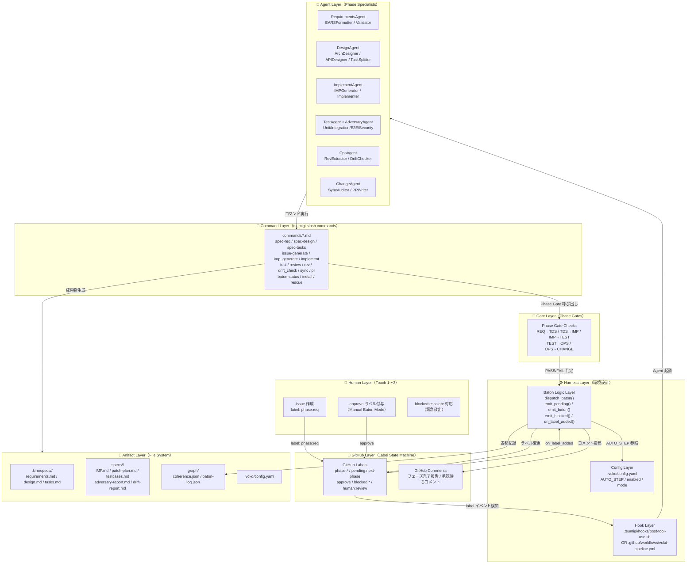
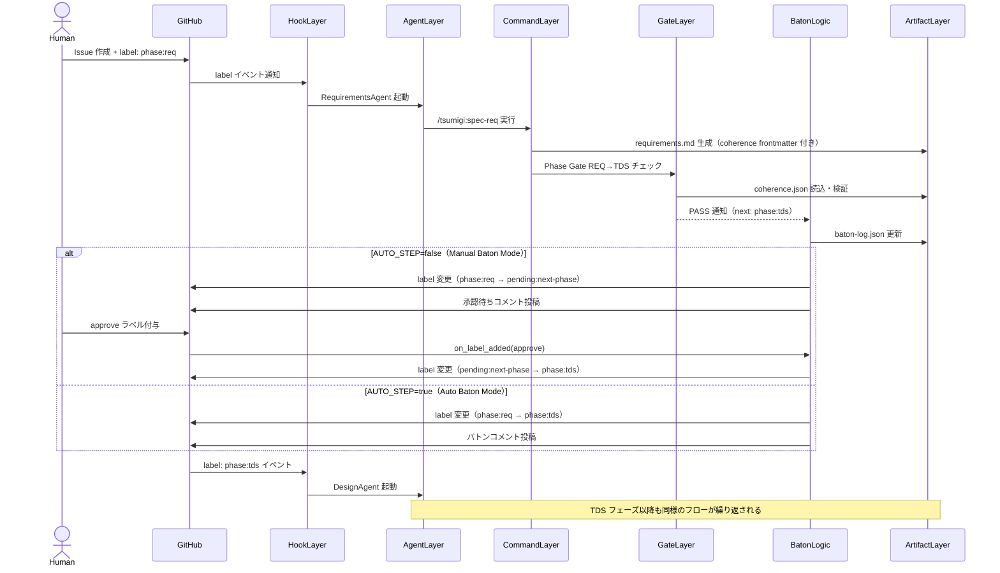
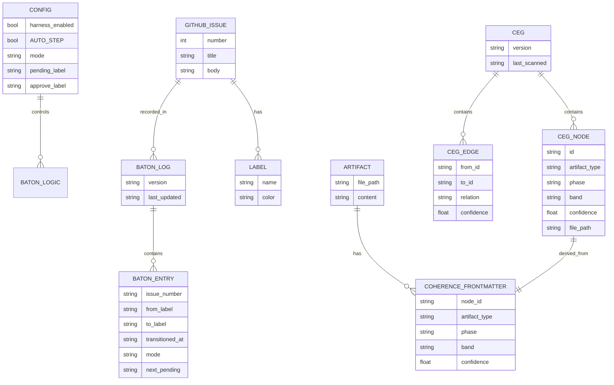
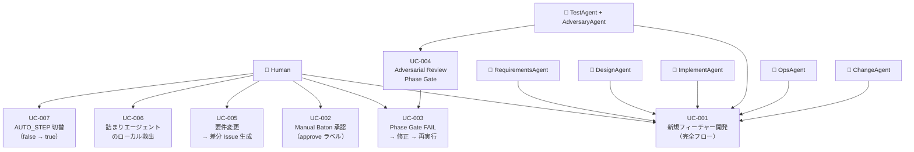
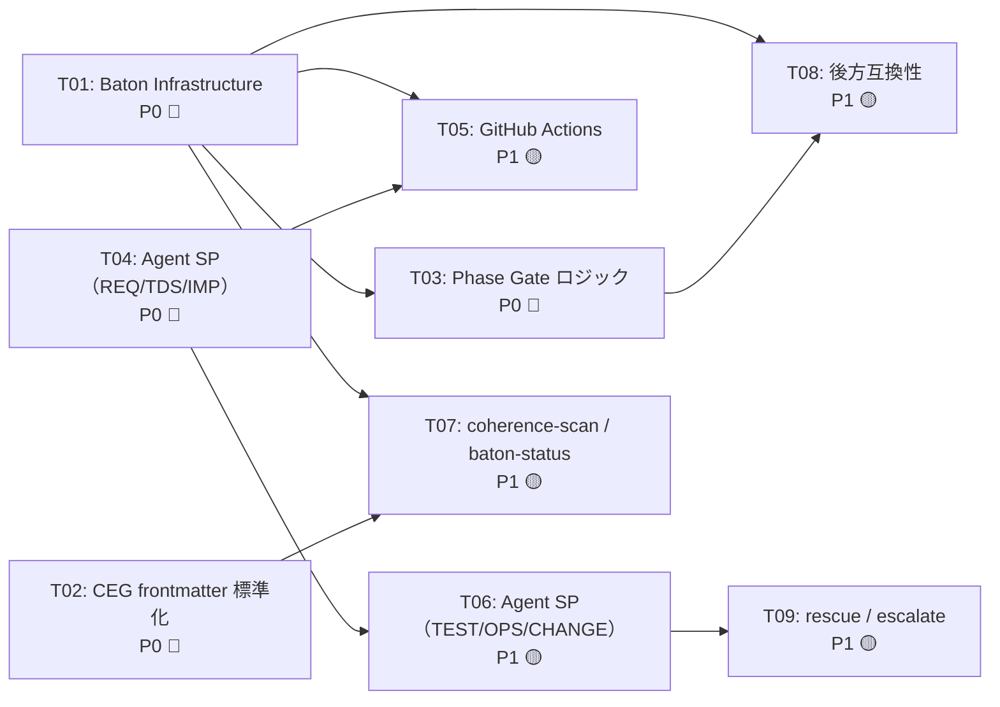

---
tsumigi:
  node_id: "design:tsumigi-v3-harness"
  artifact_type: "design"
  phase: "TDS"
  feature: "tsumigi-v3-harness"
  status: "draft"
  created_at: "2026-04-04T00:00:00Z"
  updated_at: "2026-04-04T00:00:00Z"

coherence:
  id: "design:tsumigi-v3-harness"
  depends_on:
    - id: "req:tsumigi-v3-harness"
      relation: "derives_from"
      confidence: 1.0
      required: true
  modules:
    - "commands"
    - "hooks"
    - "agents"
    - "graph"
    - "config"
  band: "Green"

baton:
  phase: "tds"
  auto_step: false
  pending_label: "pending:next-phase"
  issue_number: null
---

# 技術計画書（TDS）: tsumigi v3.0 Harness Engineering 統合

**Feature**: `tsumigi-v3-harness`  
**フェーズ**: TDS（Technical Design Specification）  
**対象仕様書**: `docs/unified-framework-spec-v2.0.md`（VCKD v2.0）  
**作成日**: 2026-04-04  
**ステータス**: Draft  
**Phase Gate**: TDS→IMP（本書が通過条件を満たすことを確認してから IMP フェーズへ進む）

---

## 0. REQ サマリーと AC 一覧

本 TDS は以下の要件（REQ）を設計に変換する。各 AC は §6「AC トレース表」で実装箇所と対応づける。

| REQ-ID | 機能領域 | AC 件数 |
|--------|---------|--------|
| REQ-001 | Label-Driven Baton（ラベル駆動バトン） | 5 |
| REQ-002 | AUTO_STEP 制御（手動/自動モード切替） | 3 |
| REQ-003 | Phase Gate チェックロジック | 4 |
| REQ-004 | GitHub 可視化（コメント・ログ） | 2 |
| REQ-005 | CEG frontmatter と coherence.json | 2 |
| REQ-006 | 後方互換性（harness.enabled=false） | 2 |
| REQ-007 | Phase Agent 専門化（System Prompt） | 2 |
| REQ-008 | Adversarial Review Phase Gate | 2 |

**合計 AC: 22 件**

---

## 1. アーキテクチャ設計

### 1.1 HLA（High-Level Architecture）図



### 1.2 コンポーネント構造と責務

| コンポーネント | ファイル/ディレクトリ | 責務 | AC トレース |
|--------------|-------------------|------|-----------|
| **Config Layer** | `.vckd/config.yaml` | AUTO_STEP・enabled・mode 等の設定管理 | REQ-002 全 AC |
| **Hook Layer (A)** | `.tsumigi/hooks/post-tool-use.sh` | Claude Code PostToolUse フックでバトン発行 | REQ-001-AC-1 |
| **Hook Layer (B)** | `.github/workflows/vckd-pipeline.yml` | GitHub Actions で label イベントを検知しエージェント起動 | REQ-001-AC-1 |
| **Baton Logic** | `dispatch_baton()` / `emit_pending()` / `emit_baton()` / `on_label_added()` | AUTO_STEP 分岐・ラベル変更・コメント投稿 | REQ-001 全 AC, REQ-002 全 AC |
| **Phase Gate** | `check_phase_gate()` | 成果物確認・CEG チェック・フェーズ固有検証 | REQ-003 全 AC |
| **Command Layer** | `commands/*.md` | 各フェーズの作業実行（slash commands） | REQ-007 全 AC |
| **Agent Layer** | `.tsumigi/agents/*.md` | Phase Agent のシステムプロンプト | REQ-007 全 AC |
| **Artifact Layer** | `specs/`, `.kiro/`, `graph/` | 成果物ファイル・CEG・バトンログの永続化 | REQ-004, REQ-005 全 AC |

### 1.3 レイヤー間のデータフロー



### 1.4 境界（Boundary）定義

```
【tsumigi 責務の境界】
  IN:  GitHub Issue の自然言語説明
  IN:  .vckd/config.yaml の設定
  IN:  Phase Agent のシステムプロンプト（.tsumigi/agents/*.md）
  OUT: .kiro/specs/<feature>/ 以下の成果物ファイル
  OUT: specs/<issue-id>/ 以下の成果物ファイル
  OUT: graph/coherence.json（CEG）
  OUT: graph/baton-log.json（バトン遷移ログ）
  OUT: GitHub Labels の変更
  OUT: GitHub Issue コメント

【tsumigi が担わない責務】
  - AI モデルの API 呼び出し（Claude Code / GitHub Actions が担う）
  - GitHub リポジトリの認証・権限管理
  - 実際のコードのコンパイル・実行
  - CI/CD の本番デプロイ
```

---

## 2. API 設計

### 2.1 CLI API（tsumigi slash commands）

tsumigi の「API」はすべて Claude Code スラッシュコマンドとして提供される。
各コマンドは `commands/*.md` で定義され、引数・出力・Phase Gate 呼び出しを仕様化する。

#### 2.1.1 コマンドインターフェース仕様

```
コマンド基本形式:
  /tsumigi:<command-name> [<issue-id>] [--flag <value>]

引数規則:
  - issue-id: 省略可能（現在のブランチ名から自動推論）
  - フラグ: GNU long option 形式（--adversary, --auto-step, --wave P0）

標準出力形式:
  - 生成ファイルのパスリスト
  - Phase Gate 結果（PASS/FAIL + 根拠）
  - GitHub コメント投稿確認

終了コード規約:
  0: 正常終了（Phase Gate PASS または harness.enabled=false）
  1: Phase Gate FAIL（blocking_issues あり）
  2: 設定エラー（.vckd/config.yaml 不正）
  3: エージェントエスカレーション（blocked:escalate 付与）
```

#### 2.1.2 Phase Gate 結果の構造体

```yaml
# Phase Gate の返却構造（全コマンド共通）
GateResult:
  passed: boolean           # true=PASS, false=FAIL
  mode: "auto|manual|blocked"
  from_phase: "REQ|TDS|IMP|TEST|OPS"
  to_phase: "TDS|IMP|TEST|OPS|CHANGE"
  baton_label: "phase:xxx|pending:next-phase|blocked:xxx"
  blocking_issues:          # FAIL 時のみ
    - type: "missing_artifact|circular_dep|gray_node|phase_specific"
      detail: "<説明>"
      routing: "/tsumigi:<command> --fix"
  next_candidate: "phase:xxx"  # Manual Baton Mode 時のコメント用
```

### 2.2 GitHub API 呼び出し仕様

Baton Logic が使用する GitHub API の仕様を定義する。
すべて `gh` CLI（GitHub CLI）経由で実行する。

```yaml
# ラベル操作
gh_label_add:
  command: "gh issue edit {issue_number} --add-label {label}"
  idempotent: true  # 既存ラベルへの追加は無害

gh_label_remove:
  command: "gh issue edit {issue_number} --remove-label {label}"
  error_handling: "ラベルが存在しない場合は無視（exit 0）"

# コメント投稿
gh_issue_comment:
  command: "gh issue comment {issue_number} --body {body}"
  body_format: "Markdown（GitHub Flavored）"
  max_length: 65536  # GitHub コメントの上限

# ラベル一覧取得
gh_get_labels:
  command: "gh issue view {issue_number} --json labels --jq '.labels[].name'"
  returns: "string[]"
```

### 2.3 エラー仕様

```yaml
# Phase Gate FAIL 時のエラーコメント形式
error_comment_schema:
  header: "🚫 Phase Gate {from_phase}→{to_phase}: FAIL"
  table:
    - column: "問題の種別"
    - column: "詳細"
    - column: "修正コマンド"
  routing_section: "推奨アクション"
  timestamp: "ISO8601"

# blocked:escalate 時のエスカレーションコメント形式
escalate_comment_schema:
  header: "🆘 Agent Escalation: {agent_name}"
  retry_count: integer
  last_error: string
  suggested_action: "ローカルで /tsumigi:rescue を実行してください"
```

---

## 3. DB / スキーマ設計

### 3.1 ER 図（ファイルシステム上の依存関係）



### 3.2 `graph/baton-log.json` スキーマ

```json
{
  "$schema": "http://json-schema.org/draft-07/schema#",
  "title": "BatonLog",
  "type": "object",
  "required": ["version", "transitions", "pending"],
  "properties": {
    "version": { "type": "string", "example": "1.0.0" },
    "last_updated": { "type": "string", "format": "date-time" },
    "transitions": {
      "type": "array",
      "items": {
        "type": "object",
        "required": ["issue_number", "from_label", "to_label", "transitioned_at", "mode"],
        "properties": {
          "issue_number": { "type": "integer" },
          "from_label":   { "type": "string" },
          "to_label":     { "type": "string" },
          "transitioned_at": { "type": "string", "format": "date-time" },
          "mode": { "type": "string", "enum": ["auto", "manual", "blocked"] },
          "triggered_by": { "type": "string", "enum": ["phase_gate", "approve_label", "human"] }
        }
      }
    },
    "pending": {
      "type": "object",
      "description": "AUTO_STEP=false 時の承認待ち状態（key: issue番号）",
      "additionalProperties": {
        "type": "object",
        "required": ["next", "recorded_at"],
        "properties": {
          "next":        { "type": "string", "description": "次フェーズ候補ラベル" },
          "recorded_at": { "type": "string", "format": "date-time" }
        }
      }
    }
  }
}
```

**初期状態**:
```json
{
  "version": "1.0.0",
  "last_updated": "2026-04-04T00:00:00Z",
  "transitions": [],
  "pending": {}
}
```

### 3.3 `graph/coherence.json` スキーマ（抜粋）

```json
{
  "version": "1.0.0",
  "last_scanned": "<ISO8601>",
  "nodes": {
    "<node_id>": {
      "artifact_type": "req|design|imp|impl|test|rev-api|...",
      "phase": "REQ|TDS|IMP|TEST|OPS|CHANGE",
      "band": "Green|Amber|Gray",
      "confidence": 0.95,
      "file": "<relative-path>"
    }
  },
  "edges": [
    {
      "from": "<node_id>",
      "to":   "<node_id>",
      "relation": "implements|derives_from|verifies|constrains|supersedes",
      "confidence": 0.95
    }
  ],
  "summary": {
    "total_nodes": 0,
    "total_edges": 0,
    "green_nodes": 0,
    "amber_nodes": 0,
    "gray_nodes": 0
  }
}
```

### 3.4 `.vckd/config.yaml` スキーマ（完全版）

```yaml
# .vckd/config.yaml（型定義）
harness:
  enabled: bool          # デフォルト: false
  AUTO_STEP: bool        # デフォルト: false
  mode: string           # "claude-code-hooks" | "github-actions"
  baton:
    post_comment: bool   # デフォルト: true
    pending_label: string  # デフォルト: "pending:next-phase"
    approve_label: string  # デフォルト: "approve"

kiro:
  use_cc_sdd: string     # "auto" | "always" | "never"
  kiro_dir: string       # デフォルト: ".kiro"

codd:
  cli_path: string|null  # null = tsumigi 独自実装を使用
```

**デフォルト値の解決順序**（設定がない場合）:
1. `.vckd/config.yaml` の値
2. 環境変数 `VCKD_*`（例: `VCKD_AUTO_STEP=false`）
3. コード内ハードコードデフォルト（最終フォールバック）

### 3.5 マイグレーション方針

```
v1.0 → v2.0（tsumigi v3.0）へのマイグレーション:

1. .tsumigi/config.json が存在する場合:
   → .vckd/config.yaml に自動変換（/tsumigi:install --migrate）
   → 変換後も .tsumigi/config.json は残す（後方互換）

2. 既存 specs/<issue-id>/ のファイルへの baton frontmatter 付与:
   → /tsumigi:coherence-scan --backfill で既存ファイルに追記
   → 既存内容は変更しない（frontmatter を先頭に追加するのみ）

3. graph/ ディレクトリの新規作成:
   → /tsumigi:install --harness で自動作成
   → coherence.json と baton-log.json の初期ファイルを生成
```

---

## 4. ユースケース設計

### 4.1 ユースケース図



### 4.2 主要ユースケースのシナリオフロー

#### UC-001: 新規フィーチャー開発（完全フロー）

```
事前条件:
  - .vckd/config.yaml が存在し harness.enabled=true
  - GitHub リポジトリに phase:* ラベルが作成済み

主フロー（AUTO_STEP=false）:
  1. Human が Issue を作成し、label: phase:req を付与 [REQ-001-AC-1]
  2. HookLayer が phase:req を検知し RequirementsAgent を起動
  3. RequirementsAgent が /tsumigi:spec-req を実行
     → requirements.md（EARS + coherence frontmatter）を生成 [REQ-005-AC-1]
  4. Phase Gate REQ→TDS チェックが実行される [REQ-003-AC-1〜4]
  5. PASS → emit_pending が実行される [REQ-001-AC-2]
     → GitHub コメント「次フェーズ候補: phase:tds」が投稿される [REQ-004-AC-1]
     → baton-log.json に記録される [REQ-004-AC-2]
  6. Human が Issue を確認し approve ラベルを付与 [REQ-001-AC-4]
  7. on_label_added が phase:tds を付与
  8. DesignAgent が起動 → 3〜7 を TDS→IMP で繰り返す
  9. ... （以降 IMP→TEST→OPS→CHANGE と繰り返す）
 10. ChangeAgent が PR を作成し phase:done を付与

代替フロー（AUTO_STEP=true）:
  Step 5 の代わりに: emit_baton が即座に phase:tds を付与 [REQ-001-AC-3]
  Step 6〜7 はスキップ

後条件:
  - PR が作成され phase:done ラベルが付与されている
  - adversary-report.md に PASS 記録がある
  - coherence.json の全ノードが Green または Amber（承認済み）
```

#### UC-002: Manual Baton 承認

```
事前条件:
  - Issue に pending:next-phase ラベルが付いている
  - baton-log.json に pending エントリが存在する

主フロー:
  1. Human が Issue に approve ラベルを付与
  2. on_label_added ハンドラが approve を検知
  3. pending:next-phase が baton-log に存在するか確認
  4. baton-log から next_candidate を取得
  5. approve ラベルを削除
  6. pending:next-phase ラベルを削除
  7. next_candidate ラベルを付与 [REQ-001-AC-4]
  8. GitHub コメント「承認完了 → phase:xxx 起動」を投稿 [REQ-004-AC-1]

例外フロー:
  Step 3 で pending が見つからない場合:
    → エラーコメントを投稿して終了
    → baton-log.json を手動確認するよう Human に促す
```

#### UC-003: Phase Gate FAIL → 修正 → 再実行

```
事前条件:
  - Phase Gate が FAIL し blocked:xxx ラベルが付与されている

主フロー:
  1. Human が Issue の FAIL コメントを確認
  2. 修正コマンドを実行（例: /tsumigi:imp_generate --update）
  3. 成果物を修正
  4. 元のフェーズラベルを再付与（例: phase:imp を再付与）
  5. Phase Agent が再起動し、フェーズを再実行
  6. Phase Gate を再度実行
  7. PASS → emit_pending（または emit_baton）へ

注意:
  blocked:xxx ラベルは手動で削除する（または /tsumigi:rescue が自動削除）
```

#### UC-004: Adversarial Review Phase Gate

```
事前条件:
  - testcases.md が全 AC をカバーしている（coverage = 100%）
  - P0 テストが全件実装されている

主フロー:
  1. TestAgent が /tsumigi:review --adversary を実行
  2. AdversaryAgent がコンテキスト分離モードで起動 [REQ-008-AC-1]
     → IMP.md / 実装コード / testcases.md のみ読む
     → patch-plan.md の説明・drift-report.md は読まない
  3. 5次元バイナリ評価を実行（D1〜D5）
  4a. 全 PASS → emit_pending（AUTO_STEP=false）または emit_baton（AUTO_STEP=true）
  4b. いずれかの次元が FAIL → emit_blocked(blocked:imp) [REQ-008-AC-2]
      → FAIL 次元・根拠・推奨コマンドを Issue コメントに投稿
  5. adversary-report.md を生成

後条件（PASS）:
  - adversary-report.md に "全体判定: PASS" が記録されている
  - 全関連ノードの confidence += 0.05
```

### 4.3 ユースケースと AC の対応表

| UC-ID | 関連 REQ | 関連 AC |
|-------|---------|--------|
| UC-001 | REQ-001, 003, 004, 005, 007 | AC-001-1〜5, 003-1〜4, 004-1〜2, 005-1 |
| UC-002 | REQ-001 | AC-001-4 |
| UC-003 | REQ-001, 003 | AC-001-5, 003-1〜4 |
| UC-004 | REQ-008 | AC-008-1〜2 |
| UC-005 | REQ-001, 005 | AC-001-1, 005-1〜2 |
| UC-006 | REQ-007 | AC-007-2 |
| UC-007 | REQ-002 | AC-002-1〜3 |

---

## 5. タスク分解（P0/P1 波形）

> **前提**: IMP フェーズは Issue 単位で実行される。
> 各タスクは 1 つの GitHub Issue に対応し、1 つの `commands/*.md` または
> 関連ファイル群の実装を担う。

### 5.1 P0 波形（先行・依存なし）

P0 タスクは並列実行可能。相互に依存しない。

#### T01: Baton Infrastructure セットアップ

```
目的: ラベル駆動バトンの基盤（Phase 0 MVP）を構築する
入力:
  - .vckd/config.yaml（スキーマ定義 §3.4）
  - §16.2 Hook 実装仕様
  - §5.4 ラベル完全一覧
出力:
  - .vckd/config.yaml（デフォルト設定）
  - .tsumigi/hooks/post-tool-use.sh（dispatch_baton 実装）
  - .claude/settings.json（PostToolUse hook 設定）
  - graph/baton-log.json（初期ファイル）
  - graph/coherence.json（初期ファイル）
  - commands/install.md（--harness フラグ対応）
  - commands/baton-status.md（新規）
依存: なし
AC: REQ-001-AC-1〜5, REQ-002-AC-1〜3, REQ-004-AC-2
_Requirements: REQ-001, REQ-002, REQ-004_
_Design: design.md#3-db-スキーマ設計, #16-harness-engineering_
_Parallel: P0_
_Est: 2d_
```

#### T02: CEG frontmatter 標準化

```
目的: 全成果物に coherence + baton frontmatter を付与する基盤を作る
入力:
  - §4.2 完全スキーマ定義
  - 既存 commands/{imp_generate,implement,test,rev,drift_check}.md
出力:
  - commands/imp_generate.md（coherence frontmatter 付与ロジック追加）
  - commands/implement.md（coherence frontmatter + baton 付与）
  - commands/rev.md（coherence frontmatter + 信頼度算出）
  - .tsumigi/templates/imp-template.md（frontmatter 込み）
依存: なし（T01 と並列可能）
AC: REQ-005-AC-1
_Requirements: REQ-005_
_Design: design.md#4-統一-frontmatter-スキーマceg_
_Parallel: P0_
_Est: 1d_
```

#### T03: Phase Gate ロジック実装

```
目的: check_phase_gate() と dispatch_baton() を Bash/Python で実装する
入力:
  - §5.2 Phase Gate チェック + バトン発行ロジック（疑似コード）
  - §5.4 ラベル完全一覧
出力:
  - .tsumigi/lib/phase-gate.sh（check_phase_gate, dispatch_baton, emit_pending, emit_baton, emit_blocked）
  - .tsumigi/lib/on-label-added.sh（approve ラベル検知 → バトン発行）
依存: T01（baton-log.json の存在が前提）
AC: REQ-001-AC-2〜4, REQ-002-AC-1〜2, REQ-003-AC-1〜4
_Requirements: REQ-001, REQ-002, REQ-003_
_Design: design.md#2-api-設計, #5-フェーズゲート仕様_
_Parallel: P0_
_Est: 2d_
```

#### T04: Phase Agent システムプロンプト（REQ/TDS/IMP）

```
目的: RequirementsAgent・DesignAgent・ImplementAgent の System Prompt を作成する
入力:
  - §3.4 Phase Agent 専門化マップ（21 エージェント一覧）
  - §16.3 System Prompt 設計ガイドライン
  - commands/spec-req.md, spec-design.md, spec-tasks.md, imp_generate.md, implement.md
出力:
  - .tsumigi/agents/requirements-agent.md
  - .tsumigi/agents/design-agent.md
  - .tsumigi/agents/implement-agent.md
依存: なし
AC: REQ-007-AC-1〜2
_Requirements: REQ-007_
_Design: design.md#3-4-phase-agent-専門化マップ_
_Parallel: P0_
_Est: 2d_
```

---

### 5.2 P1 波形（P0 完了後に開始）

#### T05: GitHub Actions 統合

```
目的: label イベントをトリガーに Phase Agent を起動する GitHub Actions を実装する
入力:
  - §16.2 方式 B: GitHub Actions 仕様
  - .tsumigi/agents/*.md（T04 の成果物）
出力:
  - .github/workflows/vckd-pipeline.yml
依存: T01（.vckd/config.yaml が存在していること）, T04
AC: REQ-001-AC-1
_Requirements: REQ-001_
_Design: design.md#16-2-label-driven-batonの実装方式_
_Parallel: P1_
_Est: 1d_
```

#### T06: Phase Agent システムプロンプト（TEST/OPS/CHANGE）

```
目的: TestAgent・AdversaryAgent・OpsAgent・ChangeAgent の System Prompt を作成する
入力:
  - §3.4 Phase Agent 専門化マップ（#11〜21）
  - §16.3 System Prompt 設計ガイドライン
  - commands/test.md, review.md, rev.md, drift_check.md, sync.md, pr.md
出力:
  - .tsumigi/agents/test-agent.md
  - .tsumigi/agents/adversary-agent.md
  - .tsumigi/agents/ops-agent.md
  - .tsumigi/agents/change-agent.md
依存: T04（設計パターンを継承）
AC: REQ-007-AC-1〜2, REQ-008-AC-1〜2
_Requirements: REQ-007, REQ-008_
_Design: design.md#3-4-phase-agent-専門化マップ_
_Parallel: P1_
_Est: 2d_
```

#### T07: coherence-scan と baton-status コマンド

```
目的: CEG の再構築とバトン状態確認コマンドを実装する
入力:
  - §3.2 CEG の構造（Mermaid 定義）
  - §3.3 baton-log.json スキーマ（§3.2）
  - §13.1 コマンド体系
出力:
  - commands/coherence-scan.md（coherence.json 再構築）
  - commands/baton-status.md（バトン遷移状態表示）
依存: T01, T02
AC: REQ-004-AC-2, REQ-005-AC-2
_Requirements: REQ-004, REQ-005_
_Design: design.md#3-db-スキーマ設計_
_Parallel: P1_
_Est: 1d_
```

#### T08: 後方互換性（harness.enabled=false モード）

```
目的: 全コマンドが harness.enabled=false 時に v1.0 互換で動作することを保証する
入力:
  - §16.6 後方互換性仕様
  - T01〜T03 の実装（フラグ分岐を追加する対象）
出力:
  - .tsumigi/lib/phase-gate.sh（enabled=false 時の早期リターン追加）
  - commands/install.md（--harness フラグなし時は enabled=false で初期化）
依存: T01, T03
AC: REQ-006-AC-1〜2
_Requirements: REQ-006_
_Design: design.md#16-6-v10との後方互換性_
_Parallel: P1_
_Est: 0.5d_
```

#### T09: rescue コマンドと escalate 処理

```
目的: エージェントが手詰まりになったときの救出フローを実装する
入力:
  - §3.4 エスカレーション条件の定義（リトライポリシー）
  - §14.2 Phase 5: Self-Healing
出力:
  - commands/rescue.md（手詰まりエージェントのローカル救出）
  - .tsumigi/agents/ 全ファイルへのリトライロジック追記
依存: T04, T06
AC: REQ-007-AC-2
_Requirements: REQ-007_
_Design: design.md#4-2-uc-006-詰まりエージェントのローカル救出_
_Parallel: P1_
_Est: 1d_
```

### 5.3 タスク依存グラフ



---

## 6. AC トレース表

すべての AC が本設計のいずれかのコンポーネントに対応していることを示す。

| AC-ID | EARS 記法 | テストレイヤー | 実装コンポーネント | 設計セクション |
|-------|----------|--------------|-----------------|-------------|
| **REQ-001-AC-1** | WHEN `phase:xxx` ラベルが Issue に付与される THEN 対応する Phase Agent が起動する | integration | HookLayer（post-tool-use.sh / vckd-pipeline.yml） | §1.2, §16.2 |
| **REQ-001-AC-2** | WHEN Phase Gate が PASS し AUTO_STEP=false THEN `pending:next-phase` ラベルが付与されコメントが投稿される | integration | `emit_pending()` in phase-gate.sh | §2.1.2, §5.2 |
| **REQ-001-AC-3** | WHEN Phase Gate が PASS し AUTO_STEP=true THEN 即座に次フェーズのラベルが付与される | integration | `emit_baton()` in phase-gate.sh | §2.1.2, §5.2 |
| **REQ-001-AC-4** | WHEN `approve` ラベルが Issue に付与される THEN `pending:next-phase` が外れ次フェーズラベルが付与される | integration | `on_label_added()` in on-label-added.sh | §2.1.2, §4.2（UC-002） |
| **REQ-001-AC-5** | WHEN Phase Gate が FAIL THEN `blocked:xxx` ラベルが付与される | integration | `emit_blocked()` in phase-gate.sh | §2.3, §5.1 |
| **REQ-002-AC-1** | IF `.vckd/config.yaml` の `AUTO_STEP: false` THEN `dispatch_baton` は `emit_pending` を呼ぶ | unit | `dispatch_baton()` in phase-gate.sh | §2.1.2, §5.2 |
| **REQ-002-AC-2** | IF `.vckd/config.yaml` の `AUTO_STEP: true` THEN `dispatch_baton` は `emit_baton` を呼ぶ | unit | `dispatch_baton()` in phase-gate.sh | §2.1.2, §5.2 |
| **REQ-002-AC-3** | IF `.vckd/config.yaml` が存在しない THEN `AUTO_STEP=false` として動作する | unit | `dispatch_baton()` のデフォルト値 | §3.4, §5.0 |
| **REQ-003-AC-1** | WHEN Phase Gate が実行される THEN 必須成果物の存在確認が行われる | unit | `check_phase_gate()` Step 1 | §5.2 |
| **REQ-003-AC-2** | WHEN Phase Gate が実行される THEN CEG の循環依存チェックが行われる | unit | `check_phase_gate()` Step 2 | §5.2 |
| **REQ-003-AC-3** | WHEN Phase Gate が実行される THEN フェーズ固有チェックが実行される | unit | `check_phase_gate()` Step 3 | §5.2 |
| **REQ-003-AC-4** | WHEN Phase Gate が実行される THEN Gray ノードがないことが確認される | unit | `check_phase_gate()` Step 4 | §5.2 |
| **REQ-004-AC-1** | WHEN フェーズが完了する THEN GitHub Issue にコメントが投稿される | integration | `emit_pending()` / `emit_baton()` のコメント投稿 | §2.2, §16.4 |
| **REQ-004-AC-2** | WHEN バトン遷移が発生する THEN `graph/baton-log.json` に記録される | unit | `emit_pending()` / `emit_baton()` のログ記録 | §3.2 |
| **REQ-005-AC-1** | WHEN 成果物が生成される THEN coherence frontmatter が付与される | unit | commands/imp_generate.md / implement.md 等 | §4.2, T02 |
| **REQ-005-AC-2** | WHEN `coherence-scan` が実行される THEN `graph/coherence.json` が正確に再構築される | integration | commands/coherence-scan.md | §3.3, T07 |
| **REQ-006-AC-1** | IF `harness.enabled: false` THEN 全コマンドは v1.0 互換モードで動作する | integration | phase-gate.sh の enabled チェック | §3.4, T08 |
| **REQ-006-AC-2** | IF `harness.enabled: false` THEN ラベル変更・GitHub コメントは発生しない | integration | `dispatch_baton()` の enabled ガード | §16.6, T08 |
| **REQ-007-AC-1** | WHEN RequirementsAgent が起動する THEN `spec-req` を実行して `requirements.md` を生成する | e2e | .tsumigi/agents/requirements-agent.md | §4.2（UC-001）, T04 |
| **REQ-007-AC-2** | WHEN エージェントが 3 回リトライして失敗する THEN `blocked:escalate` ラベルを付与する | integration | .tsumigi/agents/*.md のリトライポリシー | §4.2（UC-006）, T09 |
| **REQ-008-AC-1** | WHEN TEST→OPS Phase Gate が実行される THEN Adversarial Review が 5 次元で評価される | integration | .tsumigi/agents/adversary-agent.md + commands/review.md | §4.2（UC-004）, T06 |
| **REQ-008-AC-2** | WHEN Adversarial Review が FAIL THEN 5 次元の根拠が Issue コメントに投稿される | integration | commands/review.md の FAIL 時コメント投稿 | §2.3, §5.5, T06 |

**AC 合計: 22 件（REQ-001〜008）**  
**未対応 AC: 0 件**

---

## 7. Phase Gate TDS→IMP 通過確認

本 TDS が IMP フェーズへ進むための Phase Gate 条件を自己評価する。

```
Phase Gate TDS→IMP チェックリスト:

✅ 全 AC（22 件）が設計の何らかのコンポーネントに対応している（§6 AC トレース表）
✅ 循環依存がない（coherence.depends_on は req: のみを参照するルートノード依存）
✅ 設計の粒度が IMP 生成に十分である（§5 タスク分解で T01〜T09 を具体化）
✅ アーキテクチャ図が存在する（§1.1 HLA 図, §1.3 シーケンス図）
✅ API 仕様が存在する（§2.1 CLI API, §2.2 GitHub API）
✅ スキーマ仕様が存在する（§3.2 baton-log.json, §3.3 coherence.json, §3.4 config.yaml）
✅ ユースケースが存在する（§4.2 UC-001〜007）
✅ タスクに P0/P1 波形・依存関係・見積もりが付与されている（§5.1〜5.3）
✅ AUTO_STEP=false を前提にした設計になっている（§5 全体, §4.2 UC-001）

判定: PASS
次フェーズ候補: phase:imp
```

---

*TDS 生成完了 — 本書を入力として /tsumigi:issue-generate tsumigi-v3-harness --wave P0 を実行し、P0 Issue 群を生成してください。*
