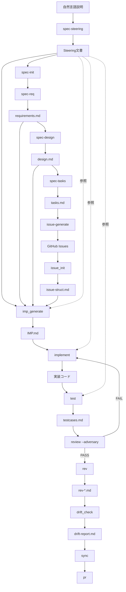

# tsumigi × Kiro（cc-sdd）統合仕様書 v1.0

**対象バージョン**: tsumigi v3.0  
**参照実装**: [gotalab/cc-sdd](https://github.com/gotalab/cc-sdd)  
**作成日**: 2026-04-04  
**ステータス**: Draft

---

## 目次

1. [統合の目的と設計原則](#1-統合の目的と設計原則)
2. [フレームワーク比較と境界定義](#2-フレームワーク比較と境界定義)
3. [全体アーキテクチャ図](#3-全体アーキテクチャ図)
4. [ディレクトリ構造](#4-ディレクトリ構造)
5. [上流工程仕様：Kiro フェーズ](#5-上流工程仕様kiro-フェーズ)
6. [ブリッジ仕様：tasks.md → Issue → IMP](#6-ブリッジ仕様tasksmd--issue--imp)
7. [下流工程仕様：tsumigi フェーズ](#7-下流工程仕様tsumigi-フェーズ)
8. [CLI 拡張案](#8-cli-拡張案)
9. [CoDD・VSDD との三層統合](#9-coddvsdd-との三層統合)
10. [MVP 最小実装セット](#10-mvp-最小実装セット)
11. [移行ガイド](#11-移行ガイド)

---

## 0. 用語定義

| 用語 | 定義 |
|------|------|
| **Spec-first** | 自然言語の要件記述を起点に requirements → design → tasks を生成するアプローチ（Kiro） |
| **Issue-first** | GitHub Issue を起点に IMP → 実装 → テスト を進めるアプローチ（tsumigi） |
| **ブリッジフェーズ** | tasks.md の各タスクを GitHub Issue に変換し、tsumigi のフローに引き渡す統合境界 |
| **Steering** | プロジェクト全体のアーキテクチャ・技術スタック・規約を記述した永続的コンテキスト文書 |
| **EARS 記法** | "WHEN/IF/WHILE/WHERE/THE SYSTEM SHALL" 形式の要件記述標準 |
| **P0/P1 波** | tasks.md での並列実行グループ。P0 が先行、P1 以降は P0 依存 |

---

## 1. 統合の目的と設計原則

### 1.1 なぜ統合するか

tsumigi v2 の出発点は **GitHub Issue が既に存在すること** を前提としている。
しかし実際の開発では「何を作るか」という要件定義からスタートする場面が多く、
Issue 作成自体がボトルネックになる。

cc-sdd（Kiro Claude 版）はこの上流を解決する：
自然言語の説明から `requirements.md → design.md → tasks.md` を自動生成し、
構造化された設計成果物を生み出す。

**統合により実現するフロー**:

```
自然言語の説明（人間）
    ↓ [Kiro フェーズ]
requirements.md（EARS 形式の受け入れ基準）
design.md（アーキテクチャ・技術設計）
tasks.md（並列波形タスク分解）
    ↓ [ブリッジフェーズ]
GitHub Issues（タスクごと）
    ↓ [tsumigi フェーズ]
IMP.md → 実装 → テスト → 逆仕様 → drift_check
```

### 1.2 設計原則

| 原則 | 内容 |
|------|------|
| **境界の明確化** | Kiro は仕様生成、tsumigi は実装管理。境界をまたぐ変換はブリッジコマンドが担う |
| **既存コマンドの不変性** | 既存 tsumigi コマンドへの破壊的変更なし。新規コマンドは `spec:*` / `issue:*` 名前空間に収容 |
| **Steering as Context** | Kiro の Steering 文書は tsumigi の全コマンドからも参照される共有コンテキスト |
| **idempotent** | 全コマンドは再実行安全。既存成果物に差分マージ |
| **Human-in-the-loop** | 各フェーズゲートで人間承認を挟む。`-y` フラグで自動化可能 |

---

## 2. フレームワーク比較と境界定義

### 2.1 責任範囲の対比

| 責任 | cc-sdd（Kiro） | tsumigi | 統合後 |
|------|---------------|---------|--------|
| **要件定義** | ✅ requirements.md（EARS） | ❌ Issue 頼み | Kiro |
| **技術設計** | ✅ design.md（Mermaid付き） | ⚠️ IMP の変更スコープのみ | Kiro |
| **タスク分解** | ✅ tasks.md（P0/P1 波形） | ⚠️ IMP タスク詳細のみ | Kiro → ブリッジ |
| **Issue 生成** | ❌ なし | ❌ 手動 | ブリッジ（新規） |
| **実装管理計画** | ❌ なし | ✅ IMP.md | tsumigi |
| **実装** | ✅ spec-impl（基本） | ✅ implement（IMP 連動） | tsumigi（優先） |
| **テスト生成** | ❌ なし | ✅ test コマンド | tsumigi |
| **逆仕様** | ❌ なし | ✅ rev コマンド | tsumigi |
| **乖離検出** | ❌ なし | ✅ drift_check（+CoDD） | tsumigi |
| **品質ゲート** | ✅ validate-gap/design/impl | ✅ review（+Adversarial） | 両者を組み合わせ |
| **プロジェクトメモリ** | ✅ Steering 文書 | ❌ なし | Kiro → tsumigi が参照 |

### 2.2 統合境界

```
┌─────────────────────────────────────────────────┐
│               Kiro フェーズ（上流）               │
│  steering → spec-init → spec-req → spec-design  │
│              → spec-tasks                        │
└───────────────────┬─────────────────────────────┘
                    │ tasks.md
         ╔══════════╧══════════╗
         ║   ブリッジフェーズ   ║  ← tsumigi:issue-generate
         ║  tasks → Issues     ║     (新規コマンド)
         ╚══════════╤══════════╝
                    │ GitHub Issues
┌───────────────────▼─────────────────────────────┐
│              tsumigi フェーズ（下流）             │
│  issue_init → imp_generate → implement → test   │
│  → rev → drift_check → sync → review → pr       │
└─────────────────────────────────────────────────┘
```

---

## 3. 全体アーキテクチャ図

### 3.1 REQ → TDS → IMP → TEST → OPS → CHANGE フロー

```
╔══════════════════════════════════════════════════════════════════════════════╗
║              tsumigi v3.0 × Kiro（cc-sdd）統合フレームワーク                  ║
╚══════════════════════════════════════════════════════════════════════════════╝

━━━━━━━━━━━━━━━━━━━━━━ REQ フェーズ（要件定義）━━━━━━━━━━━━━━━━━━━━━━━━
[人間] 自然言語での機能説明
  │
  ▼
/tsumigi:spec-steering          → .kiro/steering/{structure,tech,product}.md
  │                                (プロジェクトメモリ: 全フェーズで参照)
  ▼
/tsumigi:spec-init <description>→ .kiro/specs/<feature>/spec.json
  │                                (フィーチャーワークスペース初期化)
  ▼
/tsumigi:spec-req <feature>     → .kiro/specs/<feature>/requirements.md
  │                                (EARS 形式受け入れ基準 + ユーザーストーリー)
  │                          ┌── [Human Gate] 要件承認 ──┐
  ▼                          └──────────────────────────┘

━━━━━━━━━━━━━━━━━━━━━━ TDS フェーズ（技術設計）━━━━━━━━━━━━━━━━━━━━━━━━
/tsumigi:spec-design <feature>  → .kiro/specs/<feature>/research.md（任意）
  │                               .kiro/specs/<feature>/design.md
  │                               （アーキテクチャ・Mermaid図・技術選定）
  │                          ┌── [Human Gate] 設計承認 ──┐
  ▼                          └──────────────────────────┘
/tsumigi:spec-tasks <feature>   → .kiro/specs/<feature>/tasks.md
                                  （P0/P1 波形タスク分解・依存グラフ）
  │                          ┌── [Human Gate] タスク承認 ┐
  ▼                          └──────────────────────────┘

━━━━━━━━━━━━━━━━━━━━━━ ブリッジフェーズ（Spec → Issue）━━━━━━━━━━━━━━━━━
/tsumigi:issue-generate <feature>
  │  tasks.md の各タスクを解析して GitHub Issues を一括生成
  │  → gh issue create × N（タスク数）
  │  → specs/<issue-id>/issue-struct.md を自動生成
  ▼
  GitHub Issues（ISSUE-001, ISSUE-002, ...）+ issue-struct.md

━━━━━━━━━━━━━━━━━━━━━━ IMP フェーズ（実装管理計画）━━━━━━━━━━━━━━━━━━━━━
/tsumigi:imp_generate <issue-id>
  │  requirements.md + design.md + issue-struct.md を統合してIMP生成
  │  → specs/<issue-id>/IMP.md（CoDD frontmatter付き）
  ▼
  IMP.md（単一の真実の源 + 依存グラフノード）

━━━━━━━━━━━━━━━━━━━━━━ TEST フェーズ（実装・検証）━━━━━━━━━━━━━━━━━━━━━
/tsumigi:implement <issue-id>   → specs/<issue-id>/implements/*/patch-plan.md
  │                               + 実装コード
  ▼
/tsumigi:test <issue-id>        → specs/<issue-id>/tests/*/testcases.md
  │                               （V-Model レイヤー対応: unit/integration/e2e）
  ▼
/tsumigi:review <issue-id> --adversary
                                → specs/<issue-id>/adversary-report.md
                                  （5次元バイナリ評価 + 自動ルーティング）

━━━━━━━━━━━━━━━━━━━━━━ OPS フェーズ（逆仕様・同期）━━━━━━━━━━━━━━━━━━━━
/tsumigi:rev <issue-id>         → specs/<issue-id>/rev-{spec,api,schema}.md
  │                               （CoDD frontmatter + depends_on）
  ▼
/tsumigi:drift_check <issue-id> → specs/<issue-id>/drift-report.md
                                  （Green/Amber/Gray バンド分類）

━━━━━━━━━━━━━━━━━━━━━━ CHANGE フェーズ（整合性維持）━━━━━━━━━━━━━━━━━━━━
/tsumigi:sync <issue-id> --audit→ specs/<issue-id>/sync-report.md
  │                               （CoDD audit 統合・影響グラフ絞り込み）
  ▼
/tsumigi:pr <issue-id>          → PR 生成 + レビューチェックリスト

━━━━━━━━━━━━━━━━━━━━━━ FEEDBACK ループ ━━━━━━━━━━━━━━━━━━━━━━━━━━━━━━━
要件変更 → /tsumigi:spec-req --update
             → requirements.md 更新
             → /tsumigi:issue-generate --diff（差分 Issue のみ生成）
             → 影響 IMP の drift_check（CoDD バンド分類）
```

### 3.2 コンポーネント依存グラフ



---

## 4. ディレクトリ構造

### 4.1 統合後のプロジェクト構造

```
project-root/
│
├── .kiro/                              # Kiro フェーズの成果物
│   ├── steering/                       # プロジェクトメモリ（全フェーズで参照）
│   │   ├── structure.md               # アーキテクチャ・ディレクトリ構造・命名規則
│   │   ├── tech.md                    # 技術スタック・フレームワーク・制約
│   │   ├── product.md                 # プロダクト背景・ユーザー・ゴール
│   │   └── custom/                    # ドメイン固有の Steering（任意）
│   │       ├── api-standards.md
│   │       ├── testing.md
│   │       └── security.md
│   │
│   └── specs/                         # フィーチャー単位の Kiro 成果物
│       └── <feature-name>/            # 例: user-auth-oauth
│           ├── spec.json              # フィーチャーメタデータ
│           ├── requirements.md        # EARS 形式の受け入れ基準
│           ├── research.md            # 技術調査メモ（任意）
│           ├── design.md              # 技術設計（Mermaid 図付き）
│           └── tasks.md              # P0/P1 波形タスク分解
│
├── specs/                              # tsumigi フェーズの成果物（Issue 単位）
│   └── <issue-id>/                    # 例: 042-user-auth-login
│       ├── issue-struct.md            # Issue 構造化定義（ブリッジが生成）
│       ├── tasks.md                   # Issue スコープのタスク（kiro tasks から分割）
│       ├── note.md                    # 実装メモ
│       ├── IMP.md                     # 実装管理計画書（単一の真実の源）
│       ├── IMP-checklist.md
│       ├── IMP-risks.md
│       ├── implements/
│       │   └── <task-id>/
│       │       ├── patch-plan.md
│       │       └── impl-memo.md
│       ├── tests/
│       │   └── <task-id>/
│       │       ├── testcases.md       # V-Model レイヤー付き
│       │       ├── test-plan.md
│       │       └── test-results.md
│       ├── rev-spec.md                # CoDD frontmatter 付き逆仕様
│       ├── rev-api.md
│       ├── rev-schema.md
│       ├── rev-requirements.md
│       ├── drift-report.md            # Green/Amber/Gray バンド
│       ├── drift-timeline.md
│       ├── sync-report.md
│       ├── sync-actions.md
│       ├── review-checklist.md
│       ├── adversary-report.md        # VSDD Adversarial Review 結果
│       └── risk-matrix.md
│
├── .tsumigi/                           # tsumigi 設定
│   ├── config.json                    # 統合設定（kiro / codd / vsdd）
│   └── templates/                     # カスタムテンプレート
│       ├── IMP-template.md
│       ├── issue-struct-template.md
│       └── ...
│
└── TSUMIGI.md                          # プロジェクト固有のガイド
```

### 4.2 spec.json スキーマ

```json
{
  "feature": "user-auth-oauth",
  "description": "OAuth 2.0 と JWT による認証機能",
  "status": "tasks_approved",
  "phases": {
    "steering": "completed",
    "requirements": "approved",
    "design": "approved",
    "tasks": "approved",
    "issues_generated": true
  },
  "generated_issues": [
    { "id": "042-user-auth-login", "task_ref": "1.1", "status": "in_progress" },
    { "id": "043-user-auth-jwt", "task_ref": "1.2", "status": "pending" },
    { "id": "044-user-auth-oauth", "task_ref": "2.1", "status": "pending" }
  ],
  "wave_config": {
    "P0": ["1.1", "1.2"],
    "P1": ["2.1"],
    "P2": ["3.1", "3.2"]
  },
  "created_at": "2026-04-04T00:00:00Z",
  "updated_at": "2026-04-04T00:00:00Z"
}
```

### 4.3 .tsumigi/config.json の拡張

```json
{
  "tsumigi_version": "3.0.0",
  "project": {
    "name": "my-project",
    "language": "ja",
    "created_at": "2026-04-04T00:00:00Z"
  },
  "integrations": {
    "kiro": {
      "enabled": true,
      "kiro_dir": ".kiro",
      "specs_dir": ".kiro/specs",
      "steering_dir": ".kiro/steering",
      "auto_steering_on_init": true,
      "human_gates": {
        "requirements": true,
        "design": true,
        "tasks": true
      }
    },
    "codd": {
      "enabled": "auto",
      "config_dir": ".codd",
      "fallback_to_tsumigi": true
    },
    "github": {
      "enabled": true,
      "issue_prefix": "GH",
      "auto_create_issues": false
    }
  },
  "drift_check": {
    "threshold": 20,
    "auto_run_after_implement": true,
    "band_classification": true
  },
  "review": {
    "default_personas": ["arch", "security", "qa"],
    "adversary_on_release": true
  }
}
```

---

## 5. 上流工程仕様：Kiro フェーズ

### 5.1 `tsumigi:spec-steering`

```markdown
---
description: プロジェクトのアーキテクチャ・技術スタック・規約を Steering 文書として生成します。
             全 tsumigi コマンドが参照する共有コンテキストになります。
allowed-tools: Read, Glob, Grep, Write, Edit, Bash, AskUserQuestion, TodoWrite
argument-hint: "[--update] [--custom <domain>]"
---
```

**処理フロー**:

```
step1: 既存 Steering の確認
  - .kiro/steering/ 以下のファイルを確認する
  - 存在する場合: "--update モードで実行します" と表示して差分更新
  - 存在しない場合: 新規生成

step2: コードベース分析
  - Glob で src/ / app/ / lib/ の構造を把握する
  - package.json / pyproject.toml / go.mod を Read して技術スタックを特定する
  - 既存の README / CLAUDE.md / TSUMIGI.md を Read してプロダクトコンテキストを取得する

step3: Steering 文書の生成
  .kiro/steering/structure.md — アーキテクチャパターン・ディレクトリ構成・命名規則
  .kiro/steering/tech.md      — 技術スタック・フレームワーク・バージョン・制約
  .kiro/steering/product.md   — プロダクト目的・ユーザー・ビジネスコンテキスト

step4: カスタム Steering（--custom <domain> 指定時）
  利用可能なドメイン: api-standards / testing / security / database / deployment
  → .kiro/steering/custom/<domain>.md を生成

step5: 完了通知
  生成されたファイル一覧と、各 tsumigi コマンドでの参照方法を表示する
```

**Steering 文書の tsumigi への統合**:

全 tsumigi コマンドの step2（前提チェック）に以下を追加する:

```
Steering コンテキストの読み込み（全コマンド共通）:
  - .kiro/steering/structure.md を存在する場合に Read する
  - .kiro/steering/tech.md を存在する場合に Read する
  - .kiro/steering/product.md を存在する場合に Read する
  → 読み込んだ内容は IMP 生成・レビュー・テスト戦略の判断に使用する
```

### 5.2 `tsumigi:spec-init`

```markdown
---
description: フィーチャーの仕様ワークスペースを初期化します。
             自然言語の説明から feature-name を生成し、.kiro/specs/ にディレクトリを作成します。
allowed-tools: Read, Glob, Write, Bash, AskUserQuestion, TodoWrite
argument-hint: "<feature-description>"
---
```

**処理フロー**:

```
step1: フィーチャー名の生成
  - $ARGUMENTS から説明文を取得する
  - 説明文を kebab-case の feature-name に変換する
    例: "OAuth 2.0 認証機能" → "user-auth-oauth"
  - .kiro/specs/<feature-name>/ が既に存在する場合は確認を求める

step2: ワークスペース初期化
  - .kiro/specs/<feature-name>/ を作成する
  - spec.json を以下の初期値で Write する:
    { "feature": "...", "status": "init", "phases": { "steering": "..." } }

step3: 要件スタブの生成
  - .kiro/specs/<feature-name>/requirements.md を空のテンプレートで生成する
  - Steering 文書を参照して、プロダクトコンテキストを埋め込む

step4: 完了通知
  次のステップ: /tsumigi:spec-req <feature-name>
```

### 5.3 `tsumigi:spec-req`

```markdown
---
description: EARS 形式の要件定義書（requirements.md）を生成します。
             Steering 文書とフィーチャー説明をもとに受け入れ基準を構造化します。
allowed-tools: Read, Glob, Write, Edit, AskUserQuestion, TodoWrite
argument-hint: "<feature-name> [-y]"
---
```

**requirements.md の構造**:

```markdown
# Requirements Document: <feature-name>

## Introduction
[フィーチャーの目的・対象ユーザー・ビジネスインパクト]

## Requirements

### Requirement 1: <機能名>
**Objective**: As a <role>, I want <action>, so that <benefit>.

#### Acceptance Criteria
1. WHEN <条件> THEN <システム名> SHALL <動作>
2. IF <条件> THEN <システム名> SHALL <動作>
3. WHILE <状態> THE <システム名> SHALL <動作>

### Requirement 2: ...

## Non-Functional Requirements
- パフォーマンス: ...
- セキュリティ: ...
- 可用性: ...
```

**処理フロー**:

```
step1: コンテキスト収集
  - .kiro/specs/<feature-name>/spec.json を Read する
  - .kiro/steering/*.md を全て Read する（プロダクトコンテキスト）
  - 既存コードベースの関連部分を Glob で確認する

step2: 要件の対話的精緻化（-y なし時）
  - フィーチャーの主要ユーザーストーリーを 3〜5 件提示する
  - AskUserQuestion で追加・修正を確認する
  - EARS 記法に変換する

step3: requirements.md の生成
  - 各受け入れ基準に一意の AC-ID（REQ-NNN-AC-MM）を付与する
  - 非機能要件セクションを Steering の tech.md から自動推論する

step4: Human Gate（-y なし時）
  - requirements.md をユーザーに確認させる
  - 承認後に spec.json の phases.requirements を "approved" に更新する

step5: 完了通知
  次のステップ: /tsumigi:spec-design <feature-name>
```

### 5.4 `tsumigi:spec-design`

```markdown
---
description: 技術設計書（design.md）を生成します。
             要件定義を受けて、アーキテクチャ・API設計・DB設計・コンポーネント設計を生成します。
allowed-tools: Read, Glob, Grep, Write, Edit, Bash, AskUserQuestion, TodoWrite
argument-hint: "<feature-name> [-y]"
---
```

**design.md の構造**:

```markdown
# Technical Design Document: <feature-name>

## Overview
**Purpose**: [設計の目的]
**Users**: [影響を受けるユーザー]
**Impact**: [システムへの影響]

### Goals / Non-Goals

## Architecture

### High-Level Architecture
\`\`\`mermaid
graph TB
  ...（Mermaid図）
\`\`\`

**Architecture Integration**: [既存パターンとの整合性]
**Technology Stack**: [技術選定と理由]

## API Design
| Method | Path | 説明 | Auth |
|--------|------|------|------|

## Database Design
\`\`\`mermaid
erDiagram
  ...
\`\`\`

## Component Design
[コンポーネント・モジュール構成]

## Security Considerations
[認証・認可・入力バリデーション]

## Error Handling
[エラー戦略・ログ設計]
```

**処理フロー**:

```
step1: コンテキスト収集
  - requirements.md を Read する（承認済みであること確認）
  - .kiro/steering/*.md を Read する
  - 既存コードの関連実装を Glob/Grep で調査する

step2: 技術調査（複雑な場合のみ）
  - 未知の技術選択肢がある場合 research.md を生成する
  - Steering の tech.md と照合して技術選定を行う

step3: design.md の生成
  - Mermaid 図（HLA / ER 図 / シーケンス図）を生成する
  - Steering の structure.md と architecture.md に準拠させる

step4: Human Gate（-y なし時）
  - 設計の主要判断（技術選定・アーキテクチャ）を要約して確認する
  - 承認後に spec.json の phases.design を "approved" に更新する

step5: 完了通知
  次のステップ: /tsumigi:spec-tasks <feature-name>
```

### 5.5 `tsumigi:spec-tasks`

```markdown
---
description: design.md を実装タスクに分解します（P0/P1 波形 + 依存関係グラフ付き）。
             各タスクは後続の GitHub Issue 生成の入力になります。
allowed-tools: Read, Write, Edit, AskUserQuestion, TodoWrite
argument-hint: "<feature-name> [-y]"
---
```

**tasks.md の構造**:

```markdown
# Implementation Plan: <feature-name>

## Task List

- [ ] 1. インフラストラクチャ基盤の整備           [P0]
- [ ] 1.1 データベーススキーマの設計と実装
  - users テーブルの作成（id, email, password_hash, created_at）
  - OAuth tokens テーブルの作成
  - インデックス設計とマイグレーション
  - _Requirements: REQ-001-AC-1, REQ-001-AC-2_
  - _Parallel: P0（依存なし）_

- [ ] 1.2 認証ミドルウェアの実装                [P0]
  - JWT 生成・検証ロジック
  - 認証ガード実装
  - _Requirements: REQ-002-AC-1_
  - _Parallel: P0（依存なし）_

- [ ] 2. OAuth 2.0 フロー実装                   [P1]
- [ ] 2.1 Google OAuth Provider の実装          [P1]
  - _Requirements: REQ-003-AC-1, REQ-003-AC-2_
  - _Parallel: P1（依存: 1.1, 1.2）_

## Dependency Graph

\`\`\`mermaid
graph TD
  T1_1[1.1 DBスキーマ] --> T2_1[2.1 OAuth]
  T1_2[1.2 認証MW] --> T2_1
\`\`\`

## Parallel Execution Waves

| Wave | Tasks | 前提条件 |
|------|-------|---------|
| P0 | 1.1, 1.2 | なし |
| P1 | 2.1 | P0 完了 |
```

**処理フロー**:

```
step1: コンテキスト収集
  - requirements.md と design.md を Read する
  - .kiro/steering/structure.md を Read して実装パターンを確認する

step2: タスク分解
  - design.md のコンポーネント・API・DB 設計を実装タスクに変換する
  - 各タスクに要件 AC-ID を紐付ける（トレーサビリティ確保）
  - 並列実行可能なタスクを識別して P0/P1/P2... 波形を設定する
  - 依存グラフ（Mermaid）を生成する

step3: Human Gate（-y なし時）
  - タスク一覧と波形・依存関係を確認する
  - 承認後に spec.json の phases.tasks を "approved" に更新する

step4: GitHub Issue への変換準備
  - 各タスクに gh_issue_title と gh_issue_body_template を付与する
  - spec.json の wave_config を更新する

step5: 完了通知
  次のステップ: /tsumigi:issue-generate <feature-name>
```

---

## 6. ブリッジ仕様：tasks.md → Issue → IMP

### 6.1 `tsumigi:issue-generate`

```markdown
---
description: tasks.md の各タスクを GitHub Issue に変換します。
             生成した Issue を tsumigi:issue_init で構造化し、
             IMP.md 生成の準備を整えます。
allowed-tools: Read, Write, Edit, Bash, AskUserQuestion, TodoWrite
argument-hint: "<feature-name> [--wave <P0|P1|...>] [--dry-run] [--diff]"
---
```

**処理フロー**:

```
step1: 引数解析
  - feature-name を取得する
  - --wave: 指定波形のみ生成（デフォルト: P0 のみ）
  - --dry-run: Issue を実際に作成せず内容を表示のみ
  - --diff: 新規タスクのみ生成（要件変更時の差分対応）

step2: tasks.md の解析
  - .kiro/specs/<feature-name>/tasks.md を Read する
  - --wave で指定した波形のタスクを抽出する
  - 各タスクの requirements トレースリンク（AC-ID）を収集する

step3: Issue コンテンツの生成
  各タスクに対して以下の Issue 本文を生成する:

  タイトル: [<feature>] <task-description>
  本文:
    ## 概要
    <task の説明>

    ## 受け入れ基準（requirements.md より）
    - <AC-ID>: <EARS 記法の受け入れ基準>

    ## 関連設計
    - 設計書: .kiro/specs/<feature>/design.md
    - 関連セクション: <design.md の該当セクション>

    ## 実装メモ
    <task の実装要件>

    ## 依存関係
    - 依存する Issue: <先行タスクの Issue 番号>
    - 並列実行波形: <P0/P1/P2>

    ## tsumigi リンク
    - フィーチャー仕様: .kiro/specs/<feature>/
    - IMP 生成: `/tsumigi:imp_generate <issue-id>`

step4: Human Gate（--dry-run なし時）
  - 生成する Issue の一覧をプレビュー表示する
  - AskUserQuestion で確認を求める
  - 承認後に gh issue create を実行する

step5: GitHub Issue の作成
  Bash で以下を実行する:
    gh issue create \
      --title "<title>" \
      --body "<body>" \
      --label "tsumigi,<feature>" \
      --milestone "<feature>" \
  生成された Issue URL と Issue 番号を取得する

step6: issue-struct.md の自動生成
  各 Issue に対して:
  - issue-id = "<Issue番号>-<kebab-case-title>" を生成する
  - specs/<issue-id>/ ディレクトリを作成する
  - specs/<issue-id>/issue-struct.md を生成する:
    * 受け入れ基準は requirements.md から転写（AC-ID リンク付き）
    * 設計参照は design.md の該当セクションへのリンク
    * tasks.md の元タスクへのトレースリンク

step7: spec.json の更新
  .kiro/specs/<feature>/spec.json の generated_issues を更新する:
    { "id": "<issue-id>", "gh_number": <N>, "task_ref": "<task>", "status": "pending" }

step8: 完了通知
  生成した Issue 一覧（番号・タイトル・wave）を表示する

  次のステップ（P0 のタスクから順に）:
    /tsumigi:imp_generate <issue-id-1>
    /tsumigi:imp_generate <issue-id-2>
    ...
```

### 6.2 tasks.md → issue-struct.md の変換ルール

| tasks.md フィールド | issue-struct.md フィールド | 変換ルール |
|---|---|---|
| タスク説明 | `## 概要` | そのまま転写 |
| `_Requirements: REQ-NNN-AC-MM_` | `## 受け入れ基準` | requirements.md から該当 AC を展開 |
| 実装ステップ（箇条書き） | `## タスク一覧` | そのまま転写 |
| `_Parallel: P0_` | `## 依存関係` | 先行タスクの Issue 番号に解決 |
| design.md セクション参照 | `## 設計参照` | design.md へのリンクを付与 |

### 6.3 IMP.md における Kiro 成果物の参照

`imp_generate` は Kiro 成果物を新たな入力ソースとして使用する:

```
imp_generate v3.0 の変更点:

step5（関連コンテキストの収集）に追加:
  - .kiro/specs/<feature>/requirements.md を Read する（AC の完全版）
  - .kiro/specs/<feature>/design.md を Read する（設計の全体像）
  - .kiro/steering/*.md を Read する（技術スタック・規約）

IMP.md への追加セクション:
  ## 仕様参照（Kiro）
  - 要件定義: .kiro/specs/<feature>/requirements.md
  - 技術設計: .kiro/specs/<feature>/design.md
  - 関連タスク: tasks.md#<task-ref>

  ## 受け入れ基準（requirements.md から転写）
  [既存の EARS 記法 AC を requirements.md から引用。IMP 固有の制約を追記]
```

---

## 7. 下流工程仕様：tsumigi フェーズ

### 7.1 既存コマンドへの Kiro コンテキスト注入

既存の tsumigi コマンド（`implement`, `test`, `rev`, `drift_check`, `sync`）に
以下の共通処理を追加する:

```markdown
## Kiro コンテキスト読み込み（全コマンド共通 step1.5）

IMP.md の「仕様参照（Kiro）」セクションから feature-name を取得する。
以下をオプショナルで Read する（存在する場合のみ）:
  - .kiro/specs/<feature>/requirements.md
  - .kiro/specs/<feature>/design.md
  - .kiro/steering/tech.md

読み込んだ内容は以下の判断に使用する:
  - implement: Steering の tech.md に沿った実装パターンの選択
  - test: requirements.md の AC を V-Model レイヤーに分類
  - rev: 逆仕様と requirements.md の AC との照合
  - drift_check: requirements.md の AC を D1 次元の基準として使用
```

### 7.2 `tsumigi:test` の要件トレーサビリティ強化

requirements.md の AC-ID をテストに紐付けることで、要件カバレッジを追跡する:

```markdown
## testcases.md の拡張（v3.0）

各テストケースに requirements.md の AC-ID を付与する:

| TC-ID | AC-ID（Kiro） | テスト名 | レイヤー | P |
|-------|-------------|---------|---------|---|
| TC-001 | REQ-001-AC-1 | WHEN user submits valid credentials THEN JWT is returned | integration | P0 |
| TC-002 | REQ-001-AC-2 | IF invalid password THEN 401 Unauthorized | integration | P0 |

## 要件カバレッジマトリクス

| AC-ID | 要件 | TC 件数 | レイヤー | カバー状況 |
|-------|------|---------|---------|----------|
| REQ-001-AC-1 | WHEN 認証成功... | 2 | integration | ✅ |
| REQ-002-AC-3 | IF セッション切れ... | 0 | e2e | ❌ 未カバー |
```

### 7.3 `tsumigi:drift_check` の requirements.md 統合

drift_check の D1（機能仕様の乖離検出）を requirements.md の AC と照合する:

```
D1 次元の拡張:
  現行: IMP.md の AC と実装を照合
  v3.0: requirements.md の AC → IMP.md の AC → 実装 の3層照合

  REQ-001-AC-1（requirements.md）
    └─ AC-001（IMP.md）          ← 転写確認
         └─ 実装コード            ← 実装確認
              └─ testcases.md    ← テスト確認

  3層のいずれかが欠けている場合:
    - requirements.md AC が IMP に転写されていない → CRITICAL (score += 10)
    - IMP の AC が実装にない → CRITICAL（現行と同じ）
    - 実装の AC がテストにない → WARNING（現行と同じ）
```

---

## 8. CLI 拡張案

### 8.1 新規コマンド一覧

```
tsumigi v3.0 新規コマンド:

上流（Kiro フェーズ）:
  /tsumigi:spec-steering [--update] [--custom <domain>]
  /tsumigi:spec-init <feature-description>
  /tsumigi:spec-req <feature-name> [-y]
  /tsumigi:spec-design <feature-name> [-y]
  /tsumigi:spec-tasks <feature-name> [-y]

ブリッジ:
  /tsumigi:issue-generate <feature-name> [--wave P0|P1|all] [--dry-run] [--diff]

既存コマンド（変更なし、コンテキスト注入のみ追加）:
  /tsumigi:issue_init
  /tsumigi:imp_generate
  /tsumigi:implement
  /tsumigi:test
  /tsumigi:rev
  /tsumigi:drift_check
  /tsumigi:sync
  /tsumigi:review [--adversary]
  /tsumigi:pr

ユーティリティ:
  /tsumigi:spec-status <feature-name>   （Kiro の spec-status 相当）
  /tsumigi:spec-validate <feature-name> （requirements / design の品質チェック）
```

### 8.2 `tsumigi:install` の拡張

```markdown
## step5.5（追加）: Kiro 統合のセットアップ

- .kiro/ ディレクトリの存在を確認する
- 存在しない場合: `npx cc-sdd@latest --claude --lang ja` の実行を案内する
  - AskUserQuestion で実行するか確認する
  - 実行する場合: Bash で npx cc-sdd@latest --claude --lang ja を実行する
- 存在する場合: Kiro 統合有効と判定する

- .tsumigi/config.json に integrations.kiro を設定する:
  {
    "enabled": true,
    "kiro_dir": ".kiro",
    "human_gates": { "requirements": true, "design": true, "tasks": true }
  }
```

### 8.3 コマンドフロー早見表

```
【フルフロー（新規フィーチャー）】
/tsumigi:spec-steering          ← 初回のみ（プロジェクトメモリ構築）
/tsumigi:spec-init <description>
/tsumigi:spec-req <feature>
[Human Gate: 要件承認]
/tsumigi:spec-design <feature>
[Human Gate: 設計承認]
/tsumigi:spec-tasks <feature>
[Human Gate: タスク承認]
/tsumigi:issue-generate <feature> --wave P0
[P0 のタスクが Issue に変換される]

--- P0 Issues を並列実装 ---
/tsumigi:imp_generate <issue-id-01>
/tsumigi:implement <issue-id-01>
/tsumigi:test <issue-id-01>
/tsumigi:review <issue-id-01> --adversary
/tsumigi:rev <issue-id-01>
/tsumigi:drift_check <issue-id-01>
/tsumigi:pr <issue-id-01>

/tsumigi:issue-generate <feature> --wave P1  ← P0 完了後
--- P1 Issues を並列実装 ---

【既存フィーチャーへの追加（brownfield）】
/tsumigi:spec-validate <feature>  ← 既存コードとの GAP 分析
/tsumigi:spec-design <feature>    ← 既存設計を考慮した設計生成
/tsumigi:spec-tasks <feature>
/tsumigi:issue-generate <feature> --diff  ← 新規タスクのみ

【要件変更対応（CHANGE フェーズ）】
/tsumigi:spec-req <feature> --update
[Human Gate: 変更要件承認]
/tsumigi:issue-generate <feature> --diff  ← 差分 Issue のみ生成
/tsumigi:drift_check <affected-issue-id>  ← CoDD バンド分類
```

### 8.4 `tsumigi:cli` の拡張（自然言語ルーティング）

```markdown
## 自然言語の例とルーティング追加（cli.md）

"新機能を作りたい" → /tsumigi:spec-init
"要件を整理したい" → /tsumigi:spec-req
"設計書を作りたい" → /tsumigi:spec-design
"タスクに分解したい" → /tsumigi:spec-tasks
"Issue を作りたい" → /tsumigi:issue-generate
"仕様はある、Issueから始めたい" → /tsumigi:issue_init
"プロジェクトの状況を確認したい" → /tsumigi:spec-status
```

---

## 9. CoDD・VSDD との三層統合

### 9.1 三層の責任分担

```
Layer 1: Kiro（cc-sdd）— 何を作るかを決める（Spec-first）
  requirements.md / design.md / tasks.md
  担当: 仕様の生成・承認・トレーサビリティ

Layer 2: tsumigi — どう作るかを管理する（Issue-first）
  IMP.md / implements / tests / rev
  担当: 実装管理・品質保証・逆仕様

Layer 3: CoDD — 変更時に何が壊れるかを検知する（Coherence）
  依存グラフ / Green/Amber/Gray / audit
  担当: 変更伝播・整合性維持・影響分析

横断: VSDD Adversarial Review — 本当に正しいかを確認する（Quality Gate）
  adversary-report.md / 5次元バイナリ評価
  担当: 実装品質の独立検証
```

### 9.2 三層統合アーキテクチャ

```
自然言語説明
    │
    ▼
┌─────────────────────────────────────────┐
│ Layer 1: Kiro フェーズ                   │
│                                         │
│ Steering → spec-init → spec-req         │
│         → spec-design → spec-tasks      │
│                                         │
│ 成果物: requirements.md / design.md     │
│         tasks.md / Steering文書         │
└──────────────────┬──────────────────────┘
                   │ issue-generate（ブリッジ）
                   ▼
┌─────────────────────────────────────────┐
│ Layer 2: tsumigi フェーズ                │
│                                         │
│ issue_init → imp_generate → implement   │
│           → test → rev                 │
│                                         │
│ 成果物: IMP.md / patch-plan / testcases │
│         rev-*.md（CoDD frontmatter付き） │
└──────────────────┬──────────────────────┘
                   │ drift_check / sync
                   ▼
┌─────────────────────────────────────────┐
│ Layer 3: CoDD フェーズ                   │
│                                         │
│ 依存グラフ（depends_on frontmatter）     │
│ Green/Amber/Gray バンド分類              │
│ codd audit（--audit フラグ時）           │
│                                         │
│ 成果物: drift-report.md / sync-report   │
│         codd-audit-report.json          │
└─────────────────────────────────────────┘
                   │
    ┌──────────────┴─────────────┐
    │  VSDD Adversarial Review   │
    │  （横断的品質ゲート）        │
    │  review --adversary        │
    │  5次元バイナリ PASS/FAIL    │
    └────────────────────────────┘
```

### 9.3 トレーサビリティチェーン

```
requirements.md (REQ-001-AC-1)
    │ issue-generate が転写
    ▼
issue-struct.md (AC-001)
    │ imp_generate が参照
    ▼
IMP.md (AC-001 + tsumigi frontmatter node_id)
    │ implement が実装
    ▼
実装コード (src/auth/login.ts)
    │ test が検証
    ▼
testcases.md (TC-001, vmodel_layer: integration)
    │ rev が逆生成
    ▼
rev-api.md (CoDD depends_on: imp:042-user-auth)
    │ drift_check が照合
    ▼
drift-report.md (Green/Amber/Gray)
    │ Adversarial Review が独立検証
    ▼
adversary-report.md (PASS/FAIL + ルーティング)
```

---

## 10. MVP 最小実装セット

### 10.1 MVP の選定基準

「Spec-first から Issue-first への接続を最小コストで実現する」

```
MVP = spec-steering + spec-init + spec-req + spec-tasks + issue-generate

理由:
  - spec-design は Mermaid 図生成が複雑で MVP 外（Phase 2 へ）
  - 既存 tsumigi コマンドは変更不要（Kiro コンテキスト注入は Phase 2）
  - ブリッジ（issue-generate）が最も重要：これがなければ統合の意味がない
```

### 10.2 MVP フェーズ計画

#### Phase 1: ブリッジの確立（3〜4日）🔴 MUST

**目標**: 自然言語 → GitHub Issues の最短経路を作る

| # | 作成ファイル | 内容 |
|---|---|---|
| 1 | `commands/spec-steering.md` | Steering 文書生成コマンド |
| 2 | `commands/spec-init.md` | フィーチャーワークスペース初期化 |
| 3 | `commands/spec-req.md` | EARS 形式要件定義生成 |
| 4 | `commands/spec-tasks.md` | P0/P1 波形タスク分解 |
| 5 | `commands/issue-generate.md` | tasks.md → GitHub Issues 変換 |
| 6 | `templates/requirements-template.md` | requirements.md テンプレート |
| 7 | `templates/tasks-template.md` | tasks.md テンプレート |

**Phase 1 完了の検証基準**:
```
1. /tsumigi:spec-steering で .kiro/steering/*.md が生成される
2. /tsumigi:spec-init "認証機能" で .kiro/specs/user-auth/ が作成される
3. /tsumigi:spec-req user-auth で EARS 形式の requirements.md が生成される
4. /tsumigi:spec-tasks user-auth で P0/P1 付き tasks.md が生成される
5. /tsumigi:issue-generate user-auth --dry-run で Issue 内容がプレビューされる
6. /tsumigi:issue-generate user-auth で GitHub Issues が作成され
   specs/<issue-id>/issue-struct.md が自動生成される
```

#### Phase 2: 設計生成と Kiro コンテキスト注入（2〜3日）🟡 SHOULD

| # | 作成/変更ファイル | 内容 |
|---|---|---|
| 8 | `commands/spec-design.md` | design.md 生成（Mermaid 付き） |
| 9 | `commands/imp_generate.md` | Kiro 成果物参照の追加（step5 拡張） |
| 10 | `commands/test.md` | AC-ID トレーサビリティの追加 |
| 11 | `templates/design-template.md` | design.md テンプレート |
| 12 | `templates/issue-struct-template.md` | Kiro 参照付き issue-struct テンプレート |

#### Phase 3: 要件トレーサビリティと drift 統合（2日）🟡 SHOULD

| # | 変更ファイル | 内容 |
|---|---|---|
| 13 | `commands/drift_check.md` | D1 次元に requirements.md 3層照合を追加 |
| 14 | `commands/spec-status.md` | 新規コマンド（フィーチャー進捗確認） |
| 15 | `.tsumigi/config.json` テンプレート | integrations.kiro フィールドを追加 |

#### Phase 4: CHANGE フローの完成（1〜2日）🟢 NICE

| # | 変更ファイル | 内容 |
|---|---|---|
| 16 | `commands/issue-generate.md` | `--diff` フラグ（差分 Issue 生成）を追加 |
| 17 | `commands/spec-req.md` | `--update` フラグ（要件変更対応）を追加 |
| 18 | `commands/spec-validate.md` | 新規コマンド（brownfield GAP 分析） |

### 10.3 依存関係グラフ（実装順序）

```
[Day 1] spec-steering（前提知識なし）
    ↓
[Day 2] spec-init（spec-steering に依存）
    ↓
[Day 3] spec-req（spec-init + requirements テンプレートに依存）
    ↓
[Day 4] spec-tasks（spec-req + tasks テンプレートに依存）
    ↓
[Day 5] issue-generate（spec-tasks + gh CLI に依存） ← MVP 完成
    ↓
[Day 6-7] spec-design（spec-req + design テンプレートに依存）
    ↓
[Day 8-9] imp_generate 拡張 / test 拡張（Kiro コンテキスト注入）
    ↓
[Day 10] drift_check 拡張（requirements.md 3層照合）
```

### 10.4 Kiro（cc-sdd）との依存関係の扱い

```
選択肢 A: cc-sdd を前提とする（推奨しない）
  - npx cc-sdd のインストールを必須にする
  - tsumigi が cc-sdd に依存する構造
  - cc-sdd のアップデートで tsumigi が壊れるリスク

選択肢 B: 独立実装（推奨）
  - tsumigi の spec-* コマンドは cc-sdd と独立して実装する
  - requirements.md / design.md / tasks.md のフォーマットを
    cc-sdd 互換にすることで、cc-sdd を使うこともできる
  - cc-sdd がインストールされている場合は cc-sdd コマンドに委譲する
    （フォールバック付き）

実装方針:
  - tsumigi の spec-* コマンドは cc-sdd の kiro:spec-* と
    同じフォーマットの成果物を生成する
  - ただし cc-sdd に依存せず tsumigi 単体で動作する
  - cc-sdd 検出時はオプションで cc-sdd コマンドに委譲する:
    .tsumigi/config.json: "kiro": { "use_cc_sdd": "auto" }
```

---

## 11. 移行ガイド

### 11.1 新規プロジェクト（フルフロー）

```bash
# 1. tsumigi v3 と cc-sdd をインストール
bash setup.sh
npx cc-sdd@latest --claude --lang ja  # オプション

# 2. tsumigi を初期化
/tsumigi:install my-project

# 3. Kiro フェーズ（仕様生成）
/tsumigi:spec-steering
/tsumigi:spec-init "OAuth 2.0 と JWT による認証機能"
/tsumigi:spec-req user-auth-oauth
# [要件を確認・承認]
/tsumigi:spec-design user-auth-oauth
# [設計を確認・承認]
/tsumigi:spec-tasks user-auth-oauth
# [タスクを確認・承認]

# 4. ブリッジフェーズ（Issue 生成）
/tsumigi:issue-generate user-auth-oauth --wave P0

# 5. tsumigi フェーズ（実装）
/tsumigi:imp_generate 042-user-auth-login
/tsumigi:implement 042-user-auth-login
/tsumigi:test 042-user-auth-login
/tsumigi:review 042-user-auth-login --adversary
/tsumigi:rev 042-user-auth-login
/tsumigi:drift_check 042-user-auth-login
/tsumigi:pr 042-user-auth-login
```

### 11.2 既存プロジェクト（Issue-first のまま継続）

```bash
# 既存の tsumigi ワークフローは変更不要
# 必要な時だけ Kiro コマンドを使う

# 新機能の場合: Kiro フェーズから開始
/tsumigi:spec-init "新機能の説明"
...

# 既存 Issue の場合: そのまま tsumigi を使う
/tsumigi:imp_generate 042-existing-issue
...
```

### 11.3 後方互換性の保証

- 既存の tsumigi コマンドへの破壊的変更なし
- `.kiro/` ディレクトリがない場合は Kiro フェーズをスキップ
- Kiro コンテキスト注入は `.kiro/` 存在チェック後に実行（存在しなければスキップ）
- `spec-*` コマンドは cc-sdd がなくても動作する（独立実装）

---

## 付録 A: 変更・新規ファイル一覧

```
新規コマンド（commands/）:
  spec-steering.md      Steering 文書生成
  spec-init.md          フィーチャーワークスペース初期化
  spec-req.md           EARS 形式要件定義生成
  spec-design.md        技術設計書生成（Phase 2）
  spec-tasks.md         P0/P1 波形タスク分解
  spec-status.md        フィーチャー進捗確認（Phase 3）
  spec-validate.md      brownfield GAP 分析（Phase 4）
  issue-generate.md     tasks.md → GitHub Issues 変換

既存コマンド（拡張）:
  imp_generate.md       Kiro コンテキスト参照を step5 に追加
  test.md               AC-ID トレーサビリティを追加
  drift_check.md        D1 次元に 3 層照合を追加
  install.md            Kiro 統合セットアップを追加
  cli.md                自然言語ルーティングに Kiro コマンドを追加

新規テンプレート（templates/）:
  requirements-template.md
  design-template.md
  tasks-template.md
  issue-struct-kiro-template.md  （Kiro 参照付き）

設定:
  .tsumigi/config.json テンプレート  integrations.kiro フィールドを追加
```

## 付録 B: cc-sdd 参照リンク

- cc-sdd リポジトリ: [gotalab/cc-sdd](https://github.com/gotalab/cc-sdd)
- コマンドリファレンス: `docs/guides/command-reference.md`
- Spec-Driven ガイド: `docs/guides/spec-driven.md`
- インストール: `npx cc-sdd@latest --claude --lang ja`

## 付録 C: 関連仕様書

- [tsumigi × CoDD 統合仕様書 v1.0](tsumigi-codd-integration-spec-v1.0.md)
- VSDD Adversarial Review: `commands/review.md` (`--adversary` フラグ)
