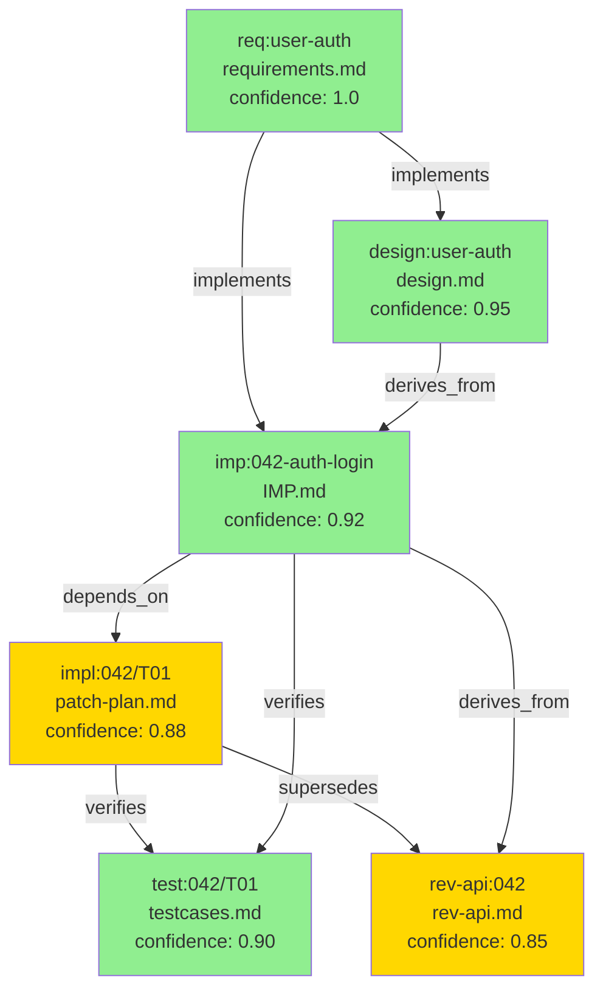

# VSDD × CoDD × Kiro × tsumigi 統合フレームワーク仕様書 v1.0

**フレームワーク名**: **VCKD**（Verified Coherence Kiro-Driven Development）  
**対象バージョン**: tsumigi v3.0  
**作成日**: 2026-04-04  
**ステータス**: Draft  
**参照仕様書**:
- [tsumigi × CoDD 統合仕様書 v1.0](tsumigi-codd-integration-spec-v1.0.md)
- [tsumigi × Kiro 統合仕様書 v1.0](tsumigi-kiro-integration-spec-v1.0.md)

---

## 目次

1. [統合の目的と核心的設計決定](#1-統合の目的と核心的設計決定)
2. [4フレームワークの責任マッピング](#2-4フレームワークの責任マッピング)
3. [VSDD 価値ストリームと全体アーキテクチャ図](#3-vsdd-価値ストリームと全体アーキテクチャ図)
4. [統一 frontmatter スキーマ（CEG）](#4-統一-frontmatter-スキーマceg)
5. [フェーズゲート仕様](#5-フェーズゲート仕様)
6. [REQ フェーズ仕様：Kiro による要件定義](#6-req-フェーズ仕様kiro-による要件定義)
7. [TDS フェーズ仕様：Kiro による技術設計](#7-tds-フェーズ仕様kiro-による技術設計)
8. [IMP フェーズ仕様：tsumigi による実装管理](#8-imp-フェーズ仕様tsumigi-による実装管理)
9. [TEST フェーズ仕様：V-Model + Adversarial Gate](#9-test-フェーズ仕様v-model--adversarial-gate)
10. [OPS フェーズ仕様：CoDD による整合性確認](#10-ops-フェーズ仕様codd-による整合性確認)
11. [CHANGE フェーズ仕様：変更伝播と影響分析](#11-change-フェーズ仕様変更伝播と影響分析)
12. [ディレクトリ構造](#12-ディレクトリ構造)
13. [CLI 設計（tsumigi v3.0）](#13-cli-設計tsumigi-v30)
14. [MVP 最小実装セット](#14-mvp-最小実装セット)
15. [付録](#15-付録)

---

## 0. 用語定義

| 用語 | 定義 |
|------|------|
| **VCKD** | 本統合フレームワークの名称。VSDD + CoDD + Kiro + tsumigi の統合 |
| **CEG** | Conditioned Evidence Graph。frontmatter `coherence:` から構築される有向グラフ |
| **信頼度スコア** | ノード間の依存が「意図通りに実装されている」確率（0.0〜1.0） |
| **Green Band** | 信頼度 ≥ 0.9。AI 自動修正可能 |
| **Amber Band** | 信頼度 0.5〜0.89。人間レビュー必要 |
| **Gray Band** | 信頼度 < 0.5。要再設計 |
| **Phase Gate** | 次フェーズ進行前の自動整合性チェック。違反時はブロック |
| **Adversarial Review** | コンテキスト分離した独立評価（Builder の文脈を持たない） |
| **EARS 記法** | WHEN/IF/WHILE/WHERE/SHALL 形式の要件記述標準 |
| **P0/P1 波形** | 並列実行グループ。P0 先行、P1 以降は依存波 |
| **Value Stream** | VSDD の価値流動モデル。REQ→TDS→IMP→TEST→OPS→CHANGE |

---

## 1. 統合の目的と核心的設計決定

### 1.1 解決する問題

| 問題 | 根本原因 | 解決するフレームワーク |
|------|---------|---------------------|
| AIスロップ（一見正しいが隠れた欠陥） | Builder が自己評価する同調バイアス | VSDD Adversarial Review |
| 要件と実装の乖離 | Issue が要件定義と接続されていない | Kiro → tsumigi ブリッジ |
| 変更時の連鎖影響が見えない | 成果物間の依存グラフが存在しない | CoDD CEG（依存グラフ） |
| 整合性チェックがオプション | フェーズゲートが人間の手動作業 | Phase Gate 自動ブロック |
| フローが途中から始まる | 上流（要件定義）が手動 | Kiro Spec-first フェーズ |

### 1.2 核心的設計決定

**決定 1: VSDD を骨格とする**  
REQ→TDS→IMP→TEST→OPS→CHANGE の価値ストリームに、他 3 フレームワークを乗せる。

**決定 2: CEG を全フレームワークの接着剤とする**  
全成果物ファイルが `coherence:` frontmatter を持ち、CEG が自動構築される。
これにより Kiro の requirements.md と CoDD の依存グラフが同じ基盤を共有する。

**決定 3: Phase Gate を整合性の強制機構とする**  
次フェーズへの進行は「コヒーレンスチェックの通過」を必須条件とする。
チェックに失敗した場合、AIが自動的に前フェーズへルーティングする（ブロック）。

**決定 4: Adversarial Review を Phase Gate に組み込む**  
TEST フェーズの Phase Gate が Adversarial Review（コンテキスト分離・5次元バイナリ評価）を実行する。
FAIL = Phase Gate ブロック = 実装フェーズへ差し戻し。

**決定 5: 独立動作を保証する**  
各フレームワーク（Kiro / tsumigi / CoDD）は単独でも動作する。
統合は opt-in であり、一部が欠如してもフォールバックで継続可能。

---

## 2. 4フレームワークの責任マッピング

### 2.1 Value Stream への配置

```
Value Stream:  REQ ──────► TDS ──────► IMP ──────► TEST ──────► OPS ──────► CHANGE
                │            │            │            │            │            │
Kiro:     spec-req      spec-design   (bridge)        ─            ─            ─
          spec-init     spec-tasks   issue-gen
          steering

tsumigi:      ─            ─         imp_gen       implement     rev         drift_check
                                     issue_init    test          sync        sync --audit
                                                   review

CoDD:         ─            ─         frontmatter   coherence    extract      impact
                                     node_id       gate check   rev compat   audit

VSDD:         ─            ─            ─          adversary    validate     ─
                                                   review       converge
```

### 2.2 フレームワーク責任マトリクス

| 責任 | Kiro | tsumigi | CoDD | VSDD |
|------|------|---------|------|------|
| 要件定義（EARS） | ✅ | ─ | ─ | ─ |
| 技術設計（Mermaid） | ✅ | ─ | ─ | ─ |
| タスク分解（波形） | ✅ | ─ | ─ | ─ |
| Issue 生成 | (bridge) | ✅ | ─ | ─ |
| 実装計画（IMP） | ─ | ✅ | ─ | ─ |
| 実装管理 | ─ | ✅ | ─ | ─ |
| テスト生成（V-Model） | ─ | ✅ | ─ | ─ |
| 敵対的レビュー | ─ | ✅ | ─ | ✅ |
| 逆仕様生成 | ─ | ✅ | ✅ | ─ |
| 依存グラフ（CEG） | ─ | ─ | ✅ | ─ |
| 変更影響分析 | ─ | ✅ | ✅ | ─ |
| 整合性検証（audit） | ─ | ✅ | ✅ | ─ |
| フェーズゲート（自動） | ─ | ✅ | ✅ | ✅ |
| プロジェクトメモリ | ✅ | ─ | ─ | ─ |

---

## 3. VSDD 価値ストリームと全体アーキテクチャ図

### 3.1 統合アーキテクチャ全体図

```
╔══════════════════════════════════════════════════════════════════════════════════════╗
║          VCKD — Verified Coherence Kiro-Driven Development フレームワーク             ║
║          VSDD × CoDD × Kiro × tsumigi 統合 v1.0                                     ║
╚══════════════════════════════════════════════════════════════════════════════════════╝

 [人間] 自然言語での機能説明
        │
━━━━━━━━▼━━━━━━━━━━━━━━━━━━━━━━━━━━━━━━━━━━━━━━━━━━━━━━━━━━━━━━━━━━
 REQ    │ ← Kiro フェーズ ─────────────────────────────────────────
━━━━━━━━━━━━━━━━━━━━━━━━━━━━━━━━━━━━━━━━━━━━━━━━━━━━━━━━━━━━━━━━━━━━
        │
        ├── /tsumigi:spec-steering   → .kiro/steering/{structure,tech,product}.md
        │                              [プロジェクトメモリ: 全フェーズで参照]
        │
        ├── /tsumigi:spec-init       → .kiro/specs/<feature>/spec.json
        │                              [CEG ルートノード初期化]
        │
        └── /tsumigi:spec-req        → .kiro/specs/<feature>/requirements.md
                                       [EARS 形式 AC + coherence frontmatter]
                                       [node_id: req:<feature>]
        │
        ▼
 ╔══════════════════════════════════╗
 ║ Phase Gate REQ→TDS               ║ ← CoDD coherence validate
 ║ requirements.md の整合性チェック  ║   循環依存・未定義ノード検出
 ║ PASS → TDS へ / FAIL → REQ 差戻  ║   FAIL = ブロック（自動）
 ╚══════════════════════════════════╝
        │
━━━━━━━━▼━━━━━━━━━━━━━━━━━━━━━━━━━━━━━━━━━━━━━━━━━━━━━━━━━━━━━━━━━━
 TDS    │ ← Kiro フェーズ（続き）──────────────────────────────────
━━━━━━━━━━━━━━━━━━━━━━━━━━━━━━━━━━━━━━━━━━━━━━━━━━━━━━━━━━━━━━━━━━━━
        │
        ├── /tsumigi:spec-design     → .kiro/specs/<feature>/design.md
        │                              [Mermaid HLA/ER/Sequence + coherence]
        │                              [node_id: design:<feature>]
        │                              [depends_on: req:<feature>]
        │
        └── /tsumigi:spec-tasks      → .kiro/specs/<feature>/tasks.md
                                       [P0/P1 波形 + 依存グラフ]
                                       [各タスクに AC-ID トレースリンク]
        │
        ▼
 ╔══════════════════════════════════╗
 ║ Phase Gate TDS→IMP               ║ ← CoDD coherence validate
 ║ design.md が requirements.md の  ║   全 AC が設計にトレースされているか
 ║ 全 AC をカバーしているか確認      ║   FAIL = ブロック（自動）
 ╚══════════════════════════════════╝
        │
        │ [ブリッジ]
        ├── /tsumigi:issue-generate  → GitHub Issues × N（タスク数）
        │                              specs/<issue-id>/issue-struct.md
        │                              [coherence frontmatter + req トレース]
━━━━━━━━▼━━━━━━━━━━━━━━━━━━━━━━━━━━━━━━━━━━━━━━━━━━━━━━━━━━━━━━━━━━
 IMP    │ ← tsumigi フェーズ ────────────────────────────────────────
━━━━━━━━━━━━━━━━━━━━━━━━━━━━━━━━━━━━━━━━━━━━━━━━━━━━━━━━━━━━━━━━━━━━
        │
        ├── /tsumigi:imp_generate    → specs/<issue-id>/IMP.md
        │                              [coherence frontmatter]
        │                              [node_id: imp:<issue-id>]
        │                              [depends_on: req:<feature>, design:<feature>]
        │
        └── /tsumigi:implement       → 実装コード + patch-plan.md
                                       [node_id: impl:<issue-id>/<task-id>]
                                       [depends_on: imp:<issue-id>]
        │
        ▼
 ╔══════════════════════════════════╗
 ║ Phase Gate IMP→TEST              ║ ← CoDD coherence validate
 ║ IMP.md の全 AC が実装に対応する  ║   patch-plan の変更ファイルが
 ║ patch-plan を持つか確認          ║   IMP のスコープと一致するか
 ╚══════════════════════════════════╝
        │
━━━━━━━━▼━━━━━━━━━━━━━━━━━━━━━━━━━━━━━━━━━━━━━━━━━━━━━━━━━━━━━━━━━━
 TEST   │ ← tsumigi + VSDD フェーズ ───────────────────────────────
━━━━━━━━━━━━━━━━━━━━━━━━━━━━━━━━━━━━━━━━━━━━━━━━━━━━━━━━━━━━━━━━━━━━
        │
        ├── /tsumigi:test            → testcases.md（V-Model レイヤー付き）
        │                              [node_id: test:<issue-id>/<task-id>]
        │                              [depends_on: imp:<issue-id>, verifies]
        │                              [vmodel_layer: unit|integration|e2e]
        │
        └── /tsumigi:review          → adversary-report.md
            --adversary                [5次元バイナリ PASS/FAIL]
                                       [コンテキスト分離実行]
        │
        ▼
 ╔══════════════════════════════════╗
 ║ Phase Gate TEST→OPS（Adversarial）║ ← VSDD Adversarial Review
 ║ 5次元バイナリ評価                 ║   Spec Fidelity / Edge Case /
 ║ 1次元でも FAIL → IMP 差し戻し    ║   Correctness / Integrity / Verif.
 ╚══════════════════════════════════╝
        │
━━━━━━━━▼━━━━━━━━━━━━━━━━━━━━━━━━━━━━━━━━━━━━━━━━━━━━━━━━━━━━━━━━━━
 OPS    │ ← tsumigi + CoDD フェーズ ────────────────────────────────
━━━━━━━━━━━━━━━━━━━━━━━━━━━━━━━━━━━━━━━━━━━━━━━━━━━━━━━━━━━━━━━━━━━━
        │
        ├── /tsumigi:rev             → rev-{spec,api,schema}.md
        │   [CoDD extract 互換]        [coherence frontmatter]
        │                              [node_id: rev-api:<issue-id>]
        │                              [depends_on: imp:<issue-id>, impl:..., verifies]
        │
        └── /tsumigi:drift_check     → drift-report.md
            [CoDD impact 互換]          [Green/Amber/Gray バンド]
                                       [D1-D5 + 信頼度スコア]
        │
        ▼
 ╔══════════════════════════════════╗
 ║ Phase Gate OPS→CHANGE            ║ ← drift スコア + CEG 信頼度
 ║ drift スコア ≤ threshold AND     ║   Green のみ自動進行
 ║ Amber ノード 0 件                 ║   Amber あり = 人間確認待ち
 ╚══════════════════════════════════╝
        │
━━━━━━━━▼━━━━━━━━━━━━━━━━━━━━━━━━━━━━━━━━━━━━━━━━━━━━━━━━━━━━━━━━━━
 CHANGE │ ← tsumigi + CoDD フェーズ ────────────────────────────────
━━━━━━━━━━━━━━━━━━━━━━━━━━━━━━━━━━━━━━━━━━━━━━━━━━━━━━━━━━━━━━━━━━━━
        │
        ├── /tsumigi:sync            → sync-report.md + sync-actions.md
        │   --audit                    [CoDD audit 統合]
        │                              [Amber ノードを sync-actions に記録]
        │
        ├── /tsumigi:pr              → PR + review-checklist.md
        │
        └── [要件変更時]
            /tsumigi:spec-req --update
            → requirements.md 更新
            → CEG 再構築（codd scan）
            → 影響ノード特定（BFS）
            → /tsumigi:issue-generate --diff（差分 Issue 生成）
            → 影響 IMP への drift_check
```

### 3.2 CEG（依存グラフ）の構造



---

## 4. 統一 frontmatter スキーマ（CEG）

### 4.1 設計原則

> **一つの frontmatter が CEG のノードを定義する。**
> `tsumigi:` ブロックが tsumigi 固有のメタデータを、
> `coherence:` ブロックが CoDD 互換の依存グラフを管理する。
> 両者は同じ `node_id` で結合される。

### 4.2 完全スキーマ定義

```yaml
---
# ━━ tsumigi メタデータ ━━━━━━━━━━━━━━━━━━━━━━━━━━━━━━━━━━━━━━━━━━
tsumigi:
  node_id: "<type>:<scope>"          # グローバルユニーク識別子
  artifact_type: "req|design|imp|impl|test|rev-api|rev-schema|rev-spec"
  phase: "REQ|TDS|IMP|TEST|OPS|CHANGE"
  issue_id: "NNN-kebab-case"         # tsumigi Issue ID（IMP 以降）
  feature: "feature-name"            # Kiro フィーチャー名（REQ/TDS）
  imp_version: "1.0.0"               # IMP バージョン（IMP 以降）
  vmodel_layer: "unit|integration|e2e|security"  # テスト専用
  status: "draft|approved|active|deprecated"
  created_at: "2026-04-04T00:00:00Z"
  updated_at: "2026-04-04T00:00:00Z"
  drift_baseline: "abc1234"          # 生成時の git commit hash

# ━━ CoDD 互換 CEG（Conditioned Evidence Graph）━━━━━━━━━━━━━━━━━━
coherence:
  id: "<type>:<scope>"               # tsumigi.node_id と同値
  depends_on:
    - id: "<type>:<scope>"
      relation: "implements|derives_from|verifies|constrains|supersedes"
      confidence: 0.95               # 0.0 - 1.0（依存が意図通りに機能している信頼度）
      required: true                 # false = 参照のみ（影響グラフに含まれる）
  modules: ["auth", "api", "db"]     # 関連ソースコードモジュール
  band: "Green|Amber|Gray"           # 最終 drift_check / impact 結果
  last_validated: "2026-04-04T10:00:00Z"
---
```

### 4.3 artifact_type ごとの標準 frontmatter

#### requirements.md（REQ フェーズ）

```yaml
---
tsumigi:
  node_id: "req:user-auth-oauth"
  artifact_type: "req"
  phase: "REQ"
  feature: "user-auth-oauth"
  status: "approved"
  created_at: "2026-04-04T09:00:00Z"
  updated_at: "2026-04-04T09:00:00Z"
coherence:
  id: "req:user-auth-oauth"
  depends_on: []                     # REQ はルートノード
  modules: ["auth", "api"]
  band: "Green"
---
```

#### design.md（TDS フェーズ）

```yaml
---
tsumigi:
  node_id: "design:user-auth-oauth"
  artifact_type: "design"
  phase: "TDS"
  feature: "user-auth-oauth"
  status: "approved"
coherence:
  id: "design:user-auth-oauth"
  depends_on:
    - id: "req:user-auth-oauth"
      relation: "implements"
      confidence: 0.95
      required: true
  modules: ["auth", "api", "db"]
  band: "Green"
---
```

#### IMP.md（IMP フェーズ）

```yaml
---
tsumigi:
  node_id: "imp:042-user-auth-login"
  artifact_type: "imp"
  phase: "IMP"
  issue_id: "042-user-auth-login"
  feature: "user-auth-oauth"
  imp_version: "1.2.0"
  status: "active"
  drift_baseline: "abc1234"
coherence:
  id: "imp:042-user-auth-login"
  depends_on:
    - id: "req:user-auth-oauth"
      relation: "implements"
      confidence: 0.92
      required: true
    - id: "design:user-auth-oauth"
      relation: "derives_from"
      confidence: 0.90
      required: true
  modules: ["auth", "api"]
  band: "Green"
---
```

#### testcases.md（TEST フェーズ）

```yaml
---
tsumigi:
  node_id: "test:042-user-auth-login/T01"
  artifact_type: "testcases"
  phase: "TEST"
  issue_id: "042-user-auth-login"
  task_id: "T01"
  imp_version: "1.2.0"
  vmodel_layer: "integration"
coherence:
  id: "test:042-user-auth-login/T01"
  depends_on:
    - id: "imp:042-user-auth-login"
      relation: "verifies"
      confidence: 0.90
      required: true
    - id: "impl:042-user-auth-login/T01"
      relation: "verifies"
      confidence: 0.88
      required: false
  modules: ["auth"]
  band: "Green"
---
```

#### rev-api.md（OPS フェーズ）

```yaml
---
tsumigi:
  node_id: "rev-api:042-user-auth-login"
  artifact_type: "rev-api"
  phase: "OPS"
  issue_id: "042-user-auth-login"
  imp_version: "1.2.0"
  drift_baseline: "def5678"
coherence:
  id: "rev-api:042-user-auth-login"
  depends_on:
    - id: "imp:042-user-auth-login"
      relation: "derives_from"
      confidence: 0.85
      required: true
    - id: "impl:042-user-auth-login/T01"
      relation: "verifies"
      confidence: 0.88
      required: false
  modules: ["api"]
  band: "Amber"
---
```

### 4.4 信頼度スコアの計算と更新

```
信頼度スコアの初期値:
  新規生成時: 0.95（AI が正確に生成したと仮定）

信頼度スコアの更新トリガー:
  1. 上流ノードが変更された時: confidence × 0.85（減衰）
  2. drift_check で WARNING が検出された時: confidence × 0.80
  3. drift_check で CRITICAL が検出された時: confidence × 0.50
  4. Adversarial Review で FAIL が出た時: confidence = 0.0（Gray 強制）
  5. 人間が承認した時: min(confidence + 0.10, 1.0)（上限あり）
  6. テストが全件 PASS した時: min(confidence + 0.05, 1.0)

バンド判定:
  confidence ≥ 0.90: Green  → AI 自動修正可能
  confidence ≥ 0.50: Amber  → 人間レビュー必要
  confidence < 0.50: Gray   → 要再設計
```

### 4.5 グローバル CEG の永続化

```json
// graph/coherence.json（プロジェクトレベルの CEG）
{
  "version": "1.0.0",
  "last_scanned": "2026-04-04T10:00:00Z",
  "nodes": {
    "req:user-auth-oauth": {
      "artifact_type": "req",
      "phase": "REQ",
      "band": "Green",
      "confidence": 1.0,
      "file": ".kiro/specs/user-auth-oauth/requirements.md"
    },
    "design:user-auth-oauth": {
      "artifact_type": "design",
      "phase": "TDS",
      "band": "Green",
      "confidence": 0.95,
      "file": ".kiro/specs/user-auth-oauth/design.md"
    },
    "imp:042-user-auth-login": {
      "artifact_type": "imp",
      "phase": "IMP",
      "band": "Green",
      "confidence": 0.92,
      "file": "specs/042-user-auth-login/IMP.md"
    }
  },
  "edges": [
    {
      "from": "design:user-auth-oauth",
      "to": "req:user-auth-oauth",
      "relation": "implements",
      "confidence": 0.95
    }
  ],
  "summary": {
    "total_nodes": 12,
    "total_edges": 18,
    "green_nodes": 9,
    "amber_nodes": 2,
    "gray_nodes": 1
  }
}
```

---

## 5. フェーズゲート仕様

### 5.1 全フェーズゲート一覧

| ゲート | 条件 | チェック内容 | FAIL 時の挙動 |
|--------|------|------------|--------------|
| **REQ→TDS** | spec-req 完了 | 循環依存なし / AC に WHEN/SHALL 形式 | REQ 差し戻し（spec-req --fix） |
| **TDS→IMP** | spec-design 完了 | 全 AC が design に対応するセクションを持つ | TDS 差し戻し（spec-design --fix） |
| **IMP→TEST** | implement 完了 | 全 IMP タスクに patch-plan.md あり | IMP 差し戻し（implement --missing） |
| **TEST→OPS** | test + review 完了 | Adversarial Review PASS | IMP 差し戻し（自動ルーティング） |
| **OPS→CHANGE** | rev + drift 完了 | drift スコア ≤ threshold かつ Gray ノードなし | OPS 差し戻し（rev --update） |

### 5.2 フェーズゲートの実装仕様

```python
def check_phase_gate(from_phase, to_phase, context):
    """
    フェーズゲートの汎用チェック関数
    Returns: GateResult(passed: bool, blocking_issues: list, routing: str)
    """

    # Step 1: 現フェーズの必須成果物が存在するか
    required_artifacts = get_required_artifacts(from_phase, context)
    missing = [a for a in required_artifacts if not exists(a)]
    if missing:
        return GateResult(
            passed=False,
            blocking_issues=[f"必須成果物が不足: {m}" for m in missing],
            routing=f"/tsumigi:{get_fix_command(from_phase)}"
        )

    # Step 2: CEG の整合性チェック
    ceg = load_ceg(context)
    circular_deps = detect_circular_dependencies(ceg)
    if circular_deps:
        return GateResult(
            passed=False,
            blocking_issues=[f"循環依存を検出: {d}" for d in circular_deps],
            routing="/tsumigi:coherence-fix"
        )

    # Step 3: フェーズ固有チェック
    phase_specific_result = check_phase_specific(from_phase, to_phase, context)
    if not phase_specific_result.passed:
        return phase_specific_result

    # Step 4: 信頼度スコアのチェック
    gray_nodes = [n for n in ceg.nodes if n.band == "Gray"]
    if gray_nodes:
        return GateResult(
            passed=False,
            blocking_issues=[f"Gray ノードが存在: {g}" for g in gray_nodes],
            routing="/tsumigi:drift_check --fix"
        )

    return GateResult(passed=True, blocking_issues=[], routing=None)
```

### 5.3 TEST→OPS ゲート（Adversarial Review）の詳細

```
TEST→OPS Phase Gate = Adversarial Review（VSDD Phase 3 相当）

実行条件:
  - testcases.md が全 AC をカバーしている（coverage = 100%）
  - P0 テストが全件実装されている

Adversary の入力（コンテキスト分離）:
  読む:    IMP.md / 実装コード / testcases.md
  読まない: patch-plan.md の説明 / drift-report.md / 以前のレビュー

判定:
  5次元バイナリ評価（各次元 PASS/FAIL）
  1次元でも FAIL → 全体 FAIL → ゲートブロック

FAIL 時の自動ルーティング:
  Spec Fidelity FAIL    → /tsumigi:implement --update
  Edge Case FAIL        → /tsumigi:test [issue] [task]
  Correctness FAIL      → /tsumigi:implement --update
  Structural FAIL       → /tsumigi:imp_generate --update
  Verif. Readiness FAIL → /tsumigi:test [issue] [task]

信頼度更新:
  PASS: 全ノードの confidence += 0.05（上限 1.0）
  FAIL: 対象ノードの confidence = 0.0（Gray 強制）
```

---

## 6. REQ フェーズ仕様：Kiro による要件定義

### 6.1 成果物と CEG ノード

| 成果物 | node_id | CoDD ノード種別 | 依存 |
|--------|---------|---------------|------|
| `.kiro/steering/structure.md` | `steering:structure` | — | なし |
| `.kiro/steering/tech.md` | `steering:tech` | — | なし |
| `.kiro/steering/product.md` | `steering:product` | — | なし |
| `.kiro/specs/<f>/requirements.md` | `req:<f>` | req | なし（ルート） |

### 6.2 requirements.md の生成仕様

**構造**:

```markdown
---
[§4.3 の frontmatter]
---

# Requirements Document: <feature>

## Introduction
[目的・対象ユーザー・ビジネスインパクト]

## Requirements

### REQ-001: <機能名>
**Objective**: As a <role>, I want <action>, so that <benefit>.

#### Acceptance Criteria
| AC-ID | 記述（EARS 形式） | テストレイヤー |
|-------|----------------|--------------|
| REQ-001-AC-1 | WHEN ユーザーが正しい認証情報を送信する THEN システムは JWT を返す | integration |
| REQ-001-AC-2 | IF パスワードが不正 THEN システムは 401 を返す | integration |
| REQ-001-AC-3 | WHILE セッション有効期間内 THE システムはトークンを受理する | unit |

### REQ-002: ...

## Non-Functional Requirements
| NFR-ID | 分類 | 要件 | 根拠（Steering 参照） |
|--------|------|------|---------------------|
| NFR-001 | Performance | レスポンス < 200ms | tech.md §2 |
```

**AC-ID 体系**: `<REQ-NNN>-<AC-MM>`（グローバルユニーク）  
**テストレイヤー**: requirements.md で AC ごとに事前分類する（V-Model の根拠）

### 6.3 Phase Gate REQ→TDS のチェックリスト

```
✅ 全 AC が EARS 記法（WHEN/IF/WHILE/WHERE + SHALL）
✅ AC-ID が重複なく採番されている
✅ NFR が Steering.tech.md の制約と矛盾しない
✅ requirements.md に coherence frontmatter が存在する
✅ 循環依存なし（ルートノードなので depends_on は空）
```

---

## 7. TDS フェーズ仕様：Kiro による技術設計

### 7.1 成果物と CEG ノード

| 成果物 | node_id | 依存 |
|--------|---------|------|
| `.kiro/specs/<f>/research.md` | `research:<f>` | `req:<f>` |
| `.kiro/specs/<f>/design.md` | `design:<f>` | `req:<f>` |
| `.kiro/specs/<f>/tasks.md` | `tasks:<f>` | `design:<f>` |

### 7.2 design.md の生成仕様

**必須セクション**:

```markdown
## Architecture
  - High-Level Architecture（Mermaid graph）
  - Technology Stack と選定理由
  - Steering.structure.md との整合性

## API Design
  - エンドポイント一覧（Method / Path / Auth）
  - REQ AC-ID とのトレースリンク

## Database Design
  - ER 図（Mermaid erDiagram）
  - REQ AC-ID とのトレースリンク

## Security Considerations
  - 認証・認可・入力バリデーション
  - Steering.custom/security.md との整合性
```

**Phase Gate TDS→IMP のチェック**:

```
全 REQ-NNN の AC が design.md のいずれかのセクションで言及されているか
  → REQ-001-AC-1 → API Design のエンドポイントに対応するものがあるか
  → 対応なし → FAIL（spec-design --fix でセクション追加を促す）
```

### 7.3 tasks.md の生成仕様

**タスク構造と必須フィールド**:

```markdown
- [ ] 1.1 <タスク説明>                                    [P0]
  <実装ステップの箇条書き>
  _Requirements: REQ-001-AC-1, REQ-001-AC-2_             ← トレースリンク（必須）
  _Design: design.md#api-design_                         ← 設計参照（必須）
  _Parallel: P0_                                         ← 実行波形（必須）
  _Est: 2h_                                              ← 見積もり（任意）
```

**P 波形の自動決定**:

```
依存タスクがない → P0
依存タスクが全て P0 → P1
依存タスクに P1 あり → P2
（以下繰り返し）
```

---

## 8. IMP フェーズ仕様：tsumigi による実装管理

### 8.1 ブリッジ：tasks.md → GitHub Issues

**`tsumigi:issue-generate` の変換ルール**:

```
tasks.md の各タスク:
  タスク説明        → Issue タイトル: "[<feature>] <タスク説明>"
  _Requirements:_  → issue-struct.md の受け入れ基準セクション
                    （requirements.md から AC 全文を展開）
  _Design:_        → issue-struct.md の設計参照セクション
  依存タスク       → 先行 Issue 番号（生成後に解決）
  _Parallel:_      → milestone / label に P0/P1 を付与

coherence frontmatter の自動付与:
  node_id: "issue:<NNN>-<kebab>"
  depends_on:
    - id: "req:<feature>"     relation: "implements"  confidence: 0.95
    - id: "design:<feature>"  relation: "derives_from" confidence: 0.90
    - id: "tasks:<feature>"   relation: "derives_from" confidence: 0.95
```

### 8.2 IMP.md の生成仕様（v3.0 拡張）

**Kiro 成果物の取り込み**:

```
imp_generate v3.0 の入力ソース（優先順位順）:
  1. specs/<issue-id>/issue-struct.md（必須）
  2. .kiro/specs/<feature>/requirements.md（AC の完全版）
  3. .kiro/specs/<feature>/design.md（設計の全体像）
  4. .kiro/steering/*.md（技術スタック・規約）
  5. 依存する他 IMP の frontmatter（blocked_by 関係）

追加セクション（v3.0 新規）:
  ## 仕様参照（Kiro トレースリンク）
  - 要件定義: .kiro/specs/<feature>/requirements.md
  - 技術設計: .kiro/specs/<feature>/design.md
  - 対応タスク: tasks.md#<task-ref>（P0/P1 波形）

  ## 受け入れ基準（AC-ID トレースリンク付き）
  | AC-ID | EARS 記法 | テストレイヤー | 実装ステータス |
  |-------|----------|--------------|--------------|
  | REQ-001-AC-1 | WHEN... THEN... | integration | pending |
```

---

## 9. TEST フェーズ仕様：V-Model + Adversarial Gate

### 9.1 V-Model と AC-ID のマッピング

```
requirements.md の AC → V-Model レイヤーへの自動分類

分類ルール（AC のキーワードベース）:
  "ユーザーが" / "AS A user" → e2e（受け入れ基準 = ユーザー観点）
  "API が" / "エンドポイントが" → integration
  "関数が" / "モジュールが" → unit
  "WHEN 認証" / "IF 権限" → security（+ integration）
  "3秒以内" / "200ms 以下" → performance（+ integration）

testcases.md の構造（AC-ID 付き）:
| TC-ID | AC-ID | テスト名 | レイヤー | P | 状態 |
|-------|-------|---------|---------|---|------|
| TC-001 | REQ-001-AC-1 | POST /auth/login 正常系 | integration | P0 | - |
| TC-002 | REQ-001-AC-2 | POST /auth/login 不正パスワード | integration | P0 | - |

要件カバレッジマトリクス:
  全 AC: N 件
  TC カバー: N 件（100% 必須、Phase Gate 条件）
```

### 9.2 Adversarial Review の Phase Gate 実装

```
[TEST→OPS Phase Gate の実行フロー]

Step 1: カバレッジチェック（Adversary 起動前）
  - 全 AC-ID に TC が存在するか確認
  - P0 TC が全て実装されているか確認
  - カバレッジ < 100% → ゲートブロック（review --adversary を実行させない）

Step 2: Adversarial Review の起動（コンテキスト分離）
  読む（Adversary の入力）:
    ✅ specs/<issue-id>/IMP.md
    ✅ 実装コード（patch-plan.md から変更ファイルのパスのみ取得、説明は読まない）
    ✅ specs/<issue-id>/tests/*/testcases.md
  読まない（Builder のコンテキスト）:
    ❌ patch-plan.md の理由・背景
    ❌ drift-report.md
    ❌ 以前の review-checklist.md
    ❌ impl-memo.md

Step 3: 5次元バイナリ判定
  D1 Spec Fidelity: IMP.md の全 AC が実装を持つか
  D2 Edge Case Coverage: 異常系・境界値テストが十分か
  D3 Implementation Correctness: 論理バグ・型エラーがないか
  D4 Structural Integrity: 既存アーキテクチャと整合するか
  D5 Verification Readiness: テストが実行可能で正しい仕様を検証するか

Step 4: 信頼度スコアの更新
  PASS → 全関連ノードの confidence += 0.05（上限 1.0）
  FAIL → 対象ノードの confidence = 0.0（Gray 強制、ゲートブロック）

Step 5: ゲート結果の記録
  adversary-report.md に判定結果・指摘・ルーティング先を Write する
  coherence.json を更新する
```

---

## 10. OPS フェーズ仕様：CoDD による整合性確認

### 10.1 `tsumigi:rev`（CoDD extract 互換）

**処理の拡張**:

```
rev v3.0 の追加処理:

1. Kiro 参照の照合
   requirements.md の AC と逆生成した仕様を照合する
   一致しない AC を ⚠️ フラグ付きで rev-requirements.md に記録する

2. CoDD extract との互換出力
   rev-*.md に coherence frontmatter を付与する
   codd CLI が存在する場合: codd extract と差分比較する

3. 信頼度スコアの算出
   requirements.md との一致率 → rev ノードの confidence を設定する
   confidence = (一致 AC 件数 / 全 AC 件数) × 0.95

4. CEG の更新
   codd scan（または tsumigi 独自のグラフ構築）を実行する
   graph/coherence.json を更新する
```

### 10.2 `tsumigi:drift_check`（CoDD impact 互換）

**Green/Amber/Gray バンド分類の全アルゴリズム**:

```
Input:
  - 変更されたファイル（git diff --name-only {baseline}..HEAD）
  - CEG（graph/coherence.json または frontmatter から構築）

Step 1: 変更ノードの特定
  変更ファイルのパスを modules フィールドで逆引きする
  → 変更されたノード集合 C を取得

Step 2: BFS 影響伝播
  affected = BFS(C, CEG.edges, max_hops=3)
  （depends_on の逆方向: C に依存するノードを収集）

Step 3: D1〜D5 スコアリング（影響ノードのみ）
  D1 機能仕様: requirements.md AC → IMP.md AC → 実装の3層照合
  D2 API 契約: IMP API 仕様 vs 実装エンドポイント
  D3 スキーマ: IMP スキーマ仕様 vs マイグレーション
  D4 テストカバレッジ: IMP テスト戦略 vs testcases.md
  D5 タスク完了: IMP タスク一覧 vs patch-plan チェックリスト

Step 4: バンド分類
  各影響ノードに対して:
    confidence の更新:
      CRITICAL 検出: confidence × 0.50
      WARNING 検出:  confidence × 0.80
      PASS（検出なし）: confidence（変化なし）

    バンド判定:
      confidence ≥ 0.90 → Green（AI 自動修正）
      confidence ≥ 0.50 → Amber（人間レビュー必要）
      confidence < 0.50 → Gray（要再設計）

    未影響ノード: band = 変化なし（前回の値を維持）

Step 5: drift レポートの生成
  drift スコア = D1-D5 の合計（CRITICAL×10 + WARNING×3 + INFO×1）
  バンド別サマリー + 各ノードの詳細 + 自動ルーティング
```

### 10.3 `tsumigi:sync`（CoDD audit 互換）

```
sync v3.0 = 整合性スコア（tsumigi） + CEG 構造検証（CoDD audit）

--audit フラグ時の追加処理:
  codd CLI が存在する場合:
    codd audit --skip-review --path . → codd-audit-report.json
    verdict (APPROVE/CONDITIONAL/REJECT) を sync-report.md に埋め込む

  codd CLI が存在しない場合:
    graph/coherence.json を読み込んで独自に audit を実行する:
      - Gray ノードが存在するか
      - 循環依存がないか
      - depends_on の参照先が全て存在するか
      - 全ノードの band が Green（APPROVE）または Amber（CONDITIONAL）か
```

---

## 11. CHANGE フェーズ仕様：変更伝播と影響分析

### 11.1 要件変更フロー

```
[要件変更の検出と伝播]

1. 要件変更の入力
   /tsumigi:spec-req <feature> --update
   → requirements.md に変更差分を適用

2. 影響分析
   変更された AC-ID を起点に CEG を BFS 走査:
   変更 AC-ID → design.md → IMP.md → testcases.md → rev-*.md
   各ノードの confidence を減衰させる（× 0.85）

3. バンド更新
   減衰後の confidence でバンドを再分類する
   Green → 自動更新候補
   Amber → 人間確認待ち
   Gray → 再設計が必要

4. 差分 Issue 生成
   /tsumigi:issue-generate <feature> --diff
   新規 AC に対応するタスクのみ Issue として生成する
   既存 Issue の AC が変更された場合:
     → 既存 Issue に追記コメントを投稿する（gh issue comment）

5. 連鎖 drift_check
   影響を受けた IMP.md に対して自動的に drift_check を実行する
   /tsumigi:drift_check <affected-issue-id> --auto
```

### 11.2 CHANGE フェーズのゲート

```
PR マージ前チェック（/tsumigi:pr の内部処理）:

1. CEG の最終状態確認
   - Gray ノードが 0 件であること（必須）
   - Amber ノードが人間承認済みであること（必須）
   - drift スコアが threshold 以下であること（必須）

2. Adversarial Review 済み確認
   - adversary-report.md に PASS 記録があること
   - PASS が最新の実装コミット以降に取得されたものであること

3. 要件カバレッジ確認
   - 全 AC-ID に対して TC が存在すること（100%）
   - 全 AC-ID が rev-requirements.md に反映されていること

4. PR へのエビデンス添付
   - adversary-report.md のサマリーをコメントとして投稿
   - coherence.json のサマリー（Green/Amber/Gray 件数）を投稿
   - drift スコアを投稿
```

---

## 12. ディレクトリ構造

### 12.1 統合後の完全ディレクトリ構造

```
project-root/
│
├── .kiro/                              # Kiro/Steering（上流・フィーチャー仕様）
│   ├── steering/                       # プロジェクトメモリ（全フェーズで参照）
│   │   ├── structure.md               # アーキテクチャ・命名規則
│   │   ├── tech.md                    # 技術スタック・制約
│   │   ├── product.md                 # プロダクト背景・ゴール
│   │   └── custom/
│   │       ├── api-standards.md
│   │       ├── testing.md
│   │       └── security.md
│   │
│   └── specs/                         # フィーチャー単位
│       └── <feature>/
│           ├── spec.json              # フェーズ状態管理
│           ├── requirements.md        # [coherence: node_id="req:<feature>"]
│           ├── research.md            # [coherence: node_id="research:<feature>"]
│           ├── design.md              # [coherence: node_id="design:<feature>"]
│           └── tasks.md               # [coherence: node_id="tasks:<feature>"]
│
├── specs/                              # tsumigi（Issue 単位の成果物）
│   └── <issue-id>/
│       ├── issue-struct.md            # [coherence: node_id="issue:<issue-id>"]
│       ├── IMP.md                     # [coherence: node_id="imp:<issue-id>"]
│       ├── IMP-checklist.md
│       ├── IMP-risks.md
│       ├── implements/
│       │   └── <task-id>/
│       │       ├── patch-plan.md      # [coherence: node_id="impl:<issue-id>/<task-id>"]
│       │       └── impl-memo.md
│       ├── tests/
│       │   └── <task-id>/
│       │       ├── testcases.md       # [coherence: node_id="test:<issue-id>/<task-id>"]
│       │       ├── test-plan.md
│       │       └── test-results.md
│       ├── rev-spec.md                # [coherence: node_id="rev-spec:<issue-id>"]
│       ├── rev-api.md                 # [coherence: node_id="rev-api:<issue-id>"]
│       ├── rev-schema.md              # [coherence: node_id="rev-schema:<issue-id>"]
│       ├── rev-requirements.md        # [coherence: node_id="rev-req:<issue-id>"]
│       ├── drift-report.md
│       ├── drift-timeline.md
│       ├── sync-report.md
│       ├── sync-actions.md
│       ├── adversary-report.md        # VSDD Adversarial Review 結果
│       ├── review-checklist.md
│       └── risk-matrix.md
│
├── graph/                              # CEG（プロジェクトレベルの依存グラフ）
│   ├── coherence.json                 # CoDD 互換グローバル CEG
│   ├── impact-cache.json              # BFS 影響範囲のキャッシュ
│   └── history/
│       └── coherence-<timestamp>.json # 履歴（スナップショット）
│
└── .tsumigi/                           # tsumigi 設定
    ├── config.json                    # 統合設定
    └── templates/
        ├── IMP-template.md
        ├── requirements-template.md
        ├── design-template.md
        ├── tasks-template.md
        └── adversary-report-template.md
```

### 12.2 node_id と ファイルパスの対応表

| node_id パターン | ファイルパス |
|-----------------|------------|
| `req:<feature>` | `.kiro/specs/<feature>/requirements.md` |
| `design:<feature>` | `.kiro/specs/<feature>/design.md` |
| `tasks:<feature>` | `.kiro/specs/<feature>/tasks.md` |
| `issue:<id>` | `specs/<id>/issue-struct.md` |
| `imp:<id>` | `specs/<id>/IMP.md` |
| `impl:<id>/<task>` | `specs/<id>/implements/<task>/patch-plan.md` |
| `test:<id>/<task>` | `specs/<id>/tests/<task>/testcases.md` |
| `rev-api:<id>` | `specs/<id>/rev-api.md` |
| `rev-schema:<id>` | `specs/<id>/rev-schema.md` |
| `rev-spec:<id>` | `specs/<id>/rev-spec.md` |

---

## 13. CLI 設計（tsumigi v3.0）

### 13.1 コマンド体系

```
tsumigi v3.0 コマンド体系

━━ REQ フェーズ（Kiro）━━━━━━━━━━━━━━━━━━━━━━━━━━━━━━━━━━━━━━━━━━━━
/tsumigi:spec-steering [--update] [--custom <domain>]
  → .kiro/steering/*.md の生成・更新

/tsumigi:spec-init <feature-description>
  → .kiro/specs/<feature>/spec.json の初期化

/tsumigi:spec-req <feature> [-y] [--update]
  → requirements.md（EARS + coherence frontmatter）

━━ TDS フェーズ（Kiro）━━━━━━━━━━━━━━━━━━━━━━━━━━━━━━━━━━━━━━━━━━━━
/tsumigi:spec-design <feature> [-y]
  → design.md（Mermaid + coherence frontmatter）

/tsumigi:spec-tasks <feature> [-y]
  → tasks.md（P0/P1 波形 + AC-ID トレースリンク）

━━ ブリッジ ━━━━━━━━━━━━━━━━━━━━━━━━━━━━━━━━━━━━━━━━━━━━━━━━━━━━━━
/tsumigi:issue-generate <feature> [--wave P0|P1|all] [--dry-run] [--diff]
  → GitHub Issues 一括生成 + issue-struct.md 自動生成
  → coherence.json に新規ノードを追加

━━ IMP フェーズ（tsumigi）━━━━━━━━━━━━━━━━━━━━━━━━━━━━━━━━━━━━━━━━━
/tsumigi:issue_init <issue-id>
  → 既存動作 + coherence frontmatter の付与

/tsumigi:imp_generate <issue-id> [--update] [--reviewer arch|security|qa]
  → IMP.md（Kiro 参照 + coherence frontmatter）

/tsumigi:implement <issue-id> [task-id]
  → patch-plan.md + 実装コード + coherence frontmatter

━━ TEST フェーズ（tsumigi + VSDD）━━━━━━━━━━━━━━━━━━━━━━━━━━━━━━━━━
/tsumigi:test <issue-id> [task-id] [--vmodel unit|integration|e2e|all]
  → testcases.md（V-Model + AC-ID トレースリンク + coherence frontmatter）

/tsumigi:review <issue-id> [--adversary] [--persona arch|security|qa]
  --adversary: Phase Gate TEST→OPS を実行
               コンテキスト分離 + 5次元バイナリ評価 + 信頼度更新

━━ OPS フェーズ（tsumigi + CoDD）━━━━━━━━━━━━━━━━━━━━━━━━━━━━━━━━━
/tsumigi:rev <issue-id> [--target api|schema|spec|all] [--codd-extract]
  → rev-*.md（coherence frontmatter + 信頼度算出）
  → coherence.json 更新（codd scan）

/tsumigi:drift_check <issue-id> [--since <commit>] [--band green|amber|all]
  → drift-report.md（Green/Amber/Gray + 信頼度更新）
  → coherence.json 更新

━━ CHANGE フェーズ（tsumigi + CoDD）━━━━━━━━━━━━━━━━━━━━━━━━━━━━━━━
/tsumigi:sync <issue-id> [--fix] [--audit] [--affected-only]
  → sync-report.md + sync-actions.md
  → codd audit（--audit 時）

/tsumigi:pr <issue-id> [--post-checklist]
  → PR 生成 + エビデンス添付（adversary-report / coherence サマリー）

━━ ユーティリティ ━━━━━━━━━━━━━━━━━━━━━━━━━━━━━━━━━━━━━━━━━━━━━━━━
/tsumigi:impact <issue-id> [--node <node_id>]
  → BFS 影響分析（Green/Amber/Gray 表示）

/tsumigi:spec-status <feature>
  → フェーズ進捗 + CEG サマリー

/tsumigi:coherence-scan [--path .]
  → graph/coherence.json の再構築（codd scan 相当）

/tsumigi:help
/tsumigi:cli                             # 自然言語ルーティング
```

### 13.2 フルフロー早見表

```
【新規フィーチャー開発（完全フロー）】

# 上流フェーズ（Kiro）
/tsumigi:spec-steering              ← 初回のみ
/tsumigi:spec-init "OAuth 2.0 認証"
/tsumigi:spec-req user-auth-oauth   ← [Human Gate: 要件承認]
/tsumigi:spec-design user-auth-oauth ← [Human Gate: 設計承認]
/tsumigi:spec-tasks user-auth-oauth  ← [Human Gate: タスク承認]

# [Phase Gate REQ→TDS、TDS→IMP を通過]

# ブリッジ
/tsumigi:issue-generate user-auth-oauth --wave P0

# P0 Issues 並列実装（各 Issue で以下を繰り返す）
/tsumigi:imp_generate 042-user-auth-login
/tsumigi:implement 042-user-auth-login

# [Phase Gate IMP→TEST を通過]

/tsumigi:test 042-user-auth-login --vmodel all
/tsumigi:review 042-user-auth-login --adversary  ← [Phase Gate TEST→OPS]

# PASS の場合のみ OPS フェーズへ
/tsumigi:rev 042-user-auth-login --target all
/tsumigi:drift_check 042-user-auth-login

# [Phase Gate OPS→CHANGE を通過]

/tsumigi:sync 042-user-auth-login --audit
/tsumigi:pr 042-user-auth-login

# P0 完了後に P1 を開始
/tsumigi:issue-generate user-auth-oauth --wave P1
```

### 13.3 `tsumigi:cli`（自然言語ルーティング）の拡張

```
新機能を作りたい               → spec-steering → spec-init → spec-req
要件を整理したい                → spec-req [--update]
設計を作りたい                 → spec-design
タスクに分解したい              → spec-tasks
Issue を作りたい               → issue-generate
実装計画を立てたい              → imp_generate
実装を進めたい                 → implement
テストを書きたい                → test
品質を厳しくチェックしたい       → review --adversary
逆仕様を生成したい              → rev
乖離を確認したい               → drift_check
影響範囲を確認したい            → impact
全体を同期したい               → sync --audit
PR を出したい                 → pr
フィーチャーの進捗を確認したい   → spec-status
依存グラフを更新したい          → coherence-scan
```

---

## 14. MVP 最小実装セット

### 14.1 MVP 選定の基準

```
MVP の優先基準:
  1. 「ブリッジの確立」— Spec-first から Issue-first へ繋ぐ
  2. 「Phase Gate の最小実装」— 整合性違反の自動検出
  3. 「CEG の基盤」— frontmatter 標準化（他全ての前提）
```

### 14.2 フェーズ計画

#### Phase 1: CEG 基盤 + ブリッジ確立（4〜5日）🔴 MUST

**目標**: 自然言語 → GitHub Issues、全成果物に coherence frontmatter

| # | ファイル | 内容 |
|---|---|---|
| 1 | `commands/spec-steering.md` | Steering 文書生成 |
| 2 | `commands/spec-init.md` | フィーチャーワークスペース初期化 |
| 3 | `commands/spec-req.md` | EARS + coherence frontmatter 生成 |
| 4 | `commands/spec-tasks.md` | P0/P1 波形タスク分解 |
| 5 | `commands/issue-generate.md` | tasks.md → GitHub Issues + coherence |
| 6 | `commands/imp_generate.md` | Kiro 参照 + coherence frontmatter 付与（拡張） |
| 7 | `commands/rev.md` | coherence frontmatter 付与（拡張） |
| 8 | `templates/requirements-template.md` | coherence frontmatter 付き |
| 9 | `templates/tasks-template.md` | AC-ID トレースリンク付き |

**Phase 1 完了の検証基準**:
```
1. /tsumigi:spec-req で requirements.md に coherence frontmatter が含まれる
2. /tsumigi:issue-generate で GitHub Issues が作成され issue-struct.md が生成される
3. /tsumigi:imp_generate で IMP.md に Kiro 参照セクションが含まれる
4. /tsumigi:rev で rev-*.md に coherence frontmatter が含まれる
5. 全成果物の frontmatter から graph/coherence.json を構築できる
```

#### Phase 2: Phase Gate + Adversarial Review（3〜4日）🔴 MUST

**目標**: TEST→OPS ゲート（Adversarial Review）を動作させる

| # | ファイル | 内容 |
|---|---|---|
| 10 | `commands/review.md` | --adversary フラグは実装済み → Phase Gate 呼び出しを追加 |
| 11 | `commands/test.md` | AC-ID トレーサビリティ + V-Model レイヤー（拡張） |
| 12 | `commands/drift_check.md` | 信頼度スコア更新 + Green/Amber/Gray（拡張） |
| 13 | `commands/coherence-scan.md` | coherence.json の再構築（新規） |
| 14 | `templates/adversary-report-template.md` | 5次元 + Phase Gate 記録 |

#### Phase 3: spec-design + 全 Phase Gate 実装（3〜4日）🟡 SHOULD

| # | ファイル | 内容 |
|---|---|---|
| 15 | `commands/spec-design.md` | design.md 生成（Mermaid 付き） |
| 16 | `commands/impact.md` | BFS 影響分析コマンド |
| 17 | `commands/sync.md` | --audit フラグ + coherence audit（拡張） |
| 18 | Phase Gate ロジック | 全 5 ゲートの実装（各コマンドに埋め込み） |

#### Phase 4: CHANGE フロー + PR エビデンス（2〜3日）🟡 SHOULD

| # | ファイル | 内容 |
|---|---|---|
| 19 | `commands/pr.md` | エビデンス添付（adversary + coherence サマリー）（拡張） |
| 20 | `commands/spec-req.md` | --update フラグ（要件変更伝播）（拡張） |
| 21 | `commands/issue-generate.md` | --diff フラグ（差分 Issue 生成）（拡張） |
| 22 | `commands/spec-status.md` | フィーチャー進捗 + CEG サマリー（新規） |

#### Phase 5: CoDD CLI 統合（1〜2日）🟢 NICE

| # | ファイル | 内容 |
|---|---|---|
| 23 | `commands/install.md` | codd CLI 検出 + 統合設定（拡張） |
| 24 | 全コマンド | codd CLI 存在時の委譲処理 |

### 14.3 依存関係と実装順序

```
実装順序の制約:

coherence frontmatter 標準化（#1-9）
  ↓ 前提
Phase Gate + Adversarial Review（#10-14）
  ↓ 前提
spec-design + 全 Phase Gate（#15-18）
  ↓ 前提
CHANGE フロー（#19-22）
  ↓ 前提（任意）
CoDD CLI 統合（#23-24）
```

### 14.4 Kiro（cc-sdd）との依存関係の扱い

```
選択: 独立実装（cc-sdd に依存しない）

理由:
  cc-sdd のアップデートで tsumigi が壊れるリスクを排除する
  tsumigi の spec-* コマンドは cc-sdd と同じフォーマットの成果物を生成する

実装方針:
  1. tsumigi の spec-* コマンドが requirements.md / design.md / tasks.md を
     cc-sdd 互換フォーマットで生成する
  2. cc-sdd が存在する場合は .tsumigi/config.json の設定に従って委譲可能
  3. cc-sdd が存在しない場合は tsumigi 単体で動作する（フォールバック）

設定:
  .tsumigi/config.json:
    "kiro": {
      "use_cc_sdd": "auto",    // "auto" | "always" | "never"
      "kiro_dir": ".kiro"
    }
```

---

## 15. 付録

### 付録 A: フレームワーク対応表

| 概念 | VSDD 用語 | CoDD 用語 | Kiro 用語 | tsumigi 用語 |
|------|----------|----------|----------|-------------|
| 要件定義 | Spec Crystallization | — | requirements.md | issue-struct.md |
| 技術設計 | — | — | design.md | IMP.md（変更スコープ） |
| 依存グラフ | Chainlink | CEG / coherence.json | — | coherence frontmatter |
| 影響分類 | — | Green/Amber/Gray | — | drift-report.md バンド |
| 品質ゲート | Phase 3 Adversarial | coherence validate | — | review --adversary |
| 逆仕様 | — | extract | — | rev コマンド |
| 整合性検証 | — | audit | validate-impl | sync コマンド |
| 変更追跡 | — | impact | — | drift_check + impact |

### 付録 B: 変更・新規ファイル一覧（v3.0 全体）

```
新規コマンド:
  spec-steering.md, spec-init.md, spec-req.md, spec-design.md
  spec-tasks.md, spec-status.md, issue-generate.md
  impact.md, coherence-scan.md

既存コマンド（拡張）:
  review.md          --adversary Phase Gate 統合（実装済み）
  imp_generate.md    Kiro 参照 + coherence frontmatter
  implement.md       coherence frontmatter 付与
  test.md            AC-ID トレース + V-Model
  rev.md             coherence frontmatter + 信頼度算出
  drift_check.md     信頼度スコア + Green/Amber/Gray
  sync.md            --audit + coherence audit
  pr.md              エビデンス添付
  install.md         Kiro/CoDD 検出

新規テンプレート:
  requirements-template.md, design-template.md
  tasks-template.md, adversary-report-template.md
  issue-struct-kiro-template.md

設定:
  .tsumigi/config.json（kiro + codd + vsdd 統合設定）
```

### 付録 C: 関連仕様書・参照リンク

| 仕様書 | 内容 |
|--------|------|
| [tsumigi × CoDD 統合仕様書 v1.0](tsumigi-codd-integration-spec-v1.0.md) | frontmatter スキーマ・バンド分類の詳細 |
| [tsumigi × Kiro 統合仕様書 v1.0](tsumigi-kiro-integration-spec-v1.0.md) | Kiro フェーズ・ブリッジの詳細 |
| [gotalab/cc-sdd](https://github.com/gotalab/cc-sdd) | Kiro Claude 版の実装 |
| [yohey-w/codd-dev](https://github.com/yohey-w/codd-dev) | CoDD CLI の実装 |
| [VCSDD 記事](https://zenn.dev/sc30gsw/articles/bbb8b3c2fff1f6) | VSDD × CoDD 統合の実践例 |
| [VSDD 記事](https://zenn.dev/sc30gsw/articles/1373752d9713b3) | Adversarial Review の詳細 |
