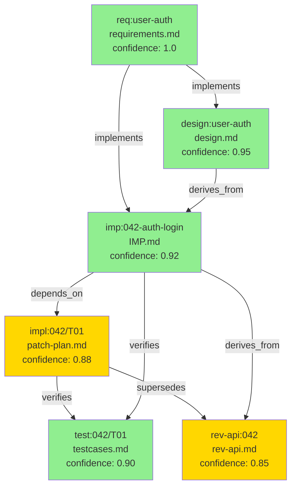

# VSDD × CoDD × Kiro × tsumigi 統合フレームワーク仕様書 v2.0

**フレームワーク名**: **VCKD**（Verified Coherence Kiro-Driven Development）  
**対象バージョン**: tsumigi v3.0  
**作成日**: 2026-04-04  
**ステータス**: Draft  
**v1.0 からの主要変更**:
- ハーネスエンジニアリング原則に基づく **Label-Driven Baton Architecture** を追加（§3.3）
- **Phase Agent 専門化マップ**（21 エージェント）を追加（§3.4）
- **人間の役割を要件定義のみに再定義**（§1.3）
- **Phase Gate がバトン信号を発行**する仕様に更新（§5）
- **自律パイプライン実装仕様**（Claude Code hooks / GitHub Actions）を追加（§16）
- MVP に **Phase 0: Baton Infrastructure** を追加（§14）

**参照仕様書**:
- [tsumigi × CoDD 統合仕様書 v1.0](tsumigi-codd-integration-spec-v1.0.md)
- [tsumigi × Kiro 統合仕様書 v1.0](tsumigi-kiro-integration-spec-v1.0.md)
- [ハーネスエンジニアリング記事](https://zenn.dev/aicon_kato/articles/harness-engineering-startup)

---

## 目次

1. [統合の目的と核心的設計決定](#1-統合の目的と核心的設計決定)
2. [4フレームワークの責任マッピング](#2-4フレームワークの責任マッピング)
3. [VSDD 価値ストリームと全体アーキテクチャ図](#3-vsdd-価値ストリームと全体アーキテクチャ図)
4. [統一 frontmatter スキーマ（CEG）](#4-統一-frontmatter-スキーマceg)
5. [フェーズゲート仕様](#5-フェーズゲート仕様)
6. [REQ フェーズ仕様：Kiro による要件定義](#6-req-フェーズ仕様kiro-による要件定義)
7. [TDS フェーズ仕様：Kiro による技術設計](#7-tds-フェーズ仕様kiro-による技術設計)
8. [IMP フェーズ仕様：tsumigi による実装管理](#8-imp-フェーズ仕様tsumigi-による実装管理)
9. [TEST フェーズ仕様：V-Model + Adversarial Gate](#9-test-フェーズ仕様v-model--adversarial-gate)
10. [OPS フェーズ仕様：CoDD による整合性確認](#10-ops-フェーズ仕様codd-による整合性確認)
11. [CHANGE フェーズ仕様：変更伝播と影響分析](#11-change-フェーズ仕様変更伝播と影響分析)
12. [ディレクトリ構造](#12-ディレクトリ構造)
13. [CLI 設計（tsumigi v3.0）](#13-cli-設計tsumigi-v30)
14. [MVP 最小実装セット](#14-mvp-最小実装セット)
15. [付録](#15-付録)
16. [Harness Engineering 統合：自律パイプライン実装仕様](#16-harness-engineering-統合自律パイプライン実装仕様)

---

## 0. 用語定義

| 用語 | 定義 |
|------|------|
| **VCKD** | 本統合フレームワークの名称。VSDD + CoDD + Kiro + tsumigi の統合 |
| **CEG** | Conditioned Evidence Graph。frontmatter `coherence:` から構築される有向グラフ |
| **信頼度スコア** | ノード間の依存が「意図通りに実装されている」確率（0.0〜1.0） |
| **Green Band** | 信頼度 ≥ 0.9。AI 自動修正可能 |
| **Amber Band** | 信頼度 0.5〜0.89。人間レビュー必要 |
| **Gray Band** | 信頼度 < 0.5。要再設計 |
| **Phase Gate** | 次フェーズ進行前の自動整合性チェック。PASS 時はバトン信号を発行、FAIL 時はブロック |
| **Adversarial Review** | コンテキスト分離した独立評価（Builder の文脈を持たない） |
| **EARS 記法** | WHEN/IF/WHILE/WHERE/SHALL 形式の要件記述標準 |
| **P0/P1 波形** | 並列実行グループ。P0 先行、P1 以降は依存波 |
| **Value Stream** | VSDD の価値流動モデル。REQ→TDS→IMP→TEST→OPS→CHANGE |
| **Label Baton** | GitHub Issue ラベルによるエージェント間バトン渡し機構。ラベル変更が次の Phase Agent を起動する |
| **Phase Agent** | フェーズ専門の AI エージェント。特化したシステムプロンプトを持ち、自律的にフェーズを完了させる |
| **Autonomous Loop** | Issue 作成 → エージェント起動 → Phase Gate → ラベル変更 → 次エージェント起動 の自律サイクル |
| **Baton Signal** | Phase Gate PASS 時に発行される「次フェーズへ進め」という信号。GitHub ラベル変更として実装される |
| **Human Gate** | 人間の承認が必要なチェックポイント。`human:review` ラベルが付与されたときのみ発生 |
| **System Prompt Skill** | 各 Phase Agent に付与される専門性定義。エージェントの出力品質はこの精度で決まる |
| **Harness** | エージェントが動作する環境（ルール・制約・フィードバックループ）の設計。コードではなく環境を書く |

---

## 1. 統合の目的と核心的設計決定

### 1.1 解決する問題

| 問題 | 根本原因 | 解決するフレームワーク |
|------|---------|---------------------|
| AIスロップ（一見正しいが隠れた欠陥） | Builder が自己評価する同調バイアス | VSDD Adversarial Review |
| 要件と実装の乖離 | Issue が要件定義と接続されていない | Kiro → tsumigi ブリッジ |
| 変更時の連鎖影響が見えない | 成果物間の依存グラフが存在しない | CoDD CEG（依存グラフ） |
| 整合性チェックがオプション | フェーズゲートが人間の手動作業 | Phase Gate 自動ブロック |
| フローが途中から始まる | 上流（要件定義）が手動 | Kiro Spec-first フェーズ |
| **人間がボトルネックになる** | **フェーズ間の引き継ぎが手動コマンド** | **Label-Driven Baton（v2.0）** |
| **パイプライン状態が不透明** | **進捗がローカルファイルに閉じている** | **GitHub-Centric Visibility（v2.0）** |

### 1.2 核心的設計決定

**決定 1: VSDD を骨格とする**  
REQ→TDS→IMP→TEST→OPS→CHANGE の価値ストリームに、他フレームワークを乗せる。

**決定 2: CEG を全フレームワークの接着剤とする**  
全成果物ファイルが `coherence:` frontmatter を持ち、CEG が自動構築される。

**決定 3: Phase Gate を整合性の強制機構とする**  
次フェーズへの進行は「コヒーレンスチェックの通過」を必須条件とする。

**決定 4: Adversarial Review を Phase Gate に組み込む**  
TEST フェーズの Phase Gate が Adversarial Review を実行する。FAIL = ゲートブロック。

**決定 5: 独立動作を保証する**  
各フレームワークは単独でも動作する。統合は opt-in。

**決定 6: Label-Driven Baton を自律実行の基盤とする（v2.0 新規）**  
Phase Gate の PASS は「バトン信号」として GitHub ラベル変更を発行する。
ラベル変更が次の Phase Agent を自律起動する。人間はコマンドを叩かない。

```
Phase Gate PASS → ラベル: phase:X → Agent X が自律起動
Phase Gate FAIL → ラベル: blocked:X + human:review → 人間に通知（必要時）
```

**決定 7: GitHub を唯一の可視化レイヤーとする（v2.0 新規）**  
全フェーズの進捗・判定・成果物サマリーが GitHub Issue/PR コメントとして投稿される。
「今エージェントが何をしているか」が常に GitHub で確認できる。

**決定 8: プロセスを細粒度に分解する（v2.0 新規）**  
ハーネスエンジニアリング原則に従い、各ステップを独立して検証可能な単位に分解する。
細粒度の分解により AI 品質劣化を防ぎ、フィードバックループを短縮する。

### 1.3 人間の役割の再定義（v2.0 核心）

> **理想**: 人間の役割は要件定義のみ。以降は AI エージェントが自律実行する。

```
【人間が行う作業（3 タッチのみ）】
  Touch 1: GitHub Issue を作成し、機能の意図・背景・制約を自然言語で記述する
           → ラベル phase:req を付与する（または自動付与設定）
  Touch 2: human:review ラベルが付与されたときに承認/差し戻しを判断する
           （設計の大きな方向転換、Amber ノードの解消判断）
  Touch 3: blocked:escalate ラベルのときに詰まったエージェントをローカルで救出する

【AI エージェントが行う作業（全フェーズ自律実行）】
  EARS 要件整理 → 技術設計 → タスク分解 → Issue 生成
  → IMP 生成 → 実装 → テスト → Adversarial Review
  → 逆仕様生成 → 乖離チェック → PR 作成 + エビデンス添付
```

---

## 2. 4フレームワークの責任マッピング

### 2.1 Value Stream への配置

```
Value Stream:  REQ ──────► TDS ──────► IMP ──────► TEST ──────► OPS ──────► CHANGE
                │            │            │            │            │            │
Kiro:     spec-req      spec-design   (bridge)        ─            ─            ─
          spec-init     spec-tasks   issue-gen
          steering

tsumigi:      ─            ─         imp_gen       implement     rev         drift_check
                                     issue_init    test          sync        sync --audit
                                                   review

CoDD:         ─            ─         frontmatter   coherence    extract      impact
                                     node_id       gate check   rev compat   audit

VSDD:         ─            ─            ─          adversary    validate     ─
                                                   review       converge

Harness:  label:req    label:tds    label:imp    label:test   label:ops   label:change
          [Agent: R]   [Agent: D]   [Agent: I]   [Agent: T]   [Agent: O]  [Agent: C]
```

### 2.2 フレームワーク責任マトリクス

| 責任 | Kiro | tsumigi | CoDD | VSDD | Harness |
|------|------|---------|------|------|---------|
| 要件定義（EARS） | ✅ | ─ | ─ | ─ | ─ |
| 技術設計（Mermaid） | ✅ | ─ | ─ | ─ | ─ |
| タスク分解（波形） | ✅ | ─ | ─ | ─ | ─ |
| Issue 生成 | (bridge) | ✅ | ─ | ─ | ─ |
| 実装計画（IMP） | ─ | ✅ | ─ | ─ | ─ |
| 実装管理 | ─ | ✅ | ─ | ─ | ─ |
| テスト生成（V-Model） | ─ | ✅ | ─ | ─ | ─ |
| 敵対的レビュー | ─ | ✅ | ─ | ✅ | ─ |
| 逆仕様生成 | ─ | ✅ | ✅ | ─ | ─ |
| 依存グラフ（CEG） | ─ | ─ | ✅ | ─ | ─ |
| 変更影響分析 | ─ | ✅ | ✅ | ─ | ─ |
| 整合性検証（audit） | ─ | ✅ | ✅ | ─ | ─ |
| フェーズゲート（自動） | ─ | ✅ | ✅ | ✅ | ─ |
| **バトン信号（Label）** | ─ | ─ | ─ | ─ | **✅** |
| **エージェント起動** | ─ | ─ | ─ | ─ | **✅** |
| **GitHub 可視化** | ─ | ─ | ─ | ─ | **✅** |
| プロジェクトメモリ | ✅ | ─ | ─ | ─ | ─ |

---

## 3. VSDD 価値ストリームと全体アーキテクチャ図

### 3.1 統合アーキテクチャ全体図

```
╔══════════════════════════════════════════════════════════════════════════════════════╗
║          VCKD v2.0 — Verified Coherence Kiro-Driven Development                      ║
║          VSDD × CoDD × Kiro × tsumigi × Harness Engineering 統合                     ║
╚══════════════════════════════════════════════════════════════════════════════════════╝

 [人間] GitHub Issue に自然言語で機能説明を記述（Touch 1）
        │  label: phase:req を付与
        │
━━━━━━━━▼━━━━━━━━━━━━━━━━━━━━━━━━━━━━━━━━━━━━━━━━━━━━━━━━━━━━━━━━━━
 REQ    │ ← Phase Agent: RequirementsAgent ─────────────────────────
━━━━━━━━━━━━━━━━━━━━━━━━━━━━━━━━━━━━━━━━━━━━━━━━━━━━━━━━━━━━━━━━━━━━
        │  [ラベル検知で自律起動]
        │
        ├── spec-steering   → .kiro/steering/*.md
        │                     [Issue コメント: Steering 完了報告]
        ├── spec-init       → .kiro/specs/<feature>/spec.json
        └── spec-req        → requirements.md（EARS + coherence）
                              [Issue コメント: 要件サマリー投稿]
        │
        ▼
 ╔══════════════════════════════════╗
 ║ Phase Gate REQ→TDS               ║ PASS → label: phase:tds
 ║ EARS 整合性・AC 採番チェック      ║ FAIL → label: human:review
 ╚══════════════════════════════════╝       + blocked:req
        │ [Baton Signal → phase:tds]
        │
━━━━━━━━▼━━━━━━━━━━━━━━━━━━━━━━━━━━━━━━━━━━━━━━━━━━━━━━━━━━━━━━━━━━
 TDS    │ ← Phase Agent: DesignAgent ───────────────────────────────
━━━━━━━━━━━━━━━━━━━━━━━━━━━━━━━━━━━━━━━━━━━━━━━━━━━━━━━━━━━━━━━━━━━━
        │  [phase:tds を検知して自律起動]
        │
        ├── spec-design     → design.md（Mermaid + coherence）
        └── spec-tasks      → tasks.md（P0/P1 + AC-ID リンク）
                              [Issue コメント: タスク一覧投稿]
        │
        ▼
 ╔══════════════════════════════════╗
 ║ Phase Gate TDS→IMP               ║ PASS → label: phase:imp
 ║ 全 AC が design に対応するか      ║ FAIL → label: human:review
 ╚══════════════════════════════════╝       + blocked:tds
        │ [Baton Signal → phase:imp]
        │
        ├── issue-generate  → GitHub Issues × N（タスク数）
        │                     各 Issue に label: phase:imp を付与
        │
━━━━━━━━▼━━━━━━━━━━━━━━━━━━━━━━━━━━━━━━━━━━━━━━━━━━━━━━━━━━━━━━━━━━
 IMP    │ ← Phase Agent: ImplementAgent（Issue 単位・並列実行）────
━━━━━━━━━━━━━━━━━━━━━━━━━━━━━━━━━━━━━━━━━━━━━━━━━━━━━━━━━━━━━━━━━━━━
        │  [各 Issue の phase:imp を検知して自律起動]
        │  [P0 完了後に P1 の label を自動付与]
        │
        ├── imp_generate    → IMP.md（coherence + Kiro 参照）
        └── implement       → 実装コード + patch-plan.md
                              [Issue コメント: 実装サマリー投稿]
        │
        ▼
 ╔══════════════════════════════════╗
 ║ Phase Gate IMP→TEST              ║ PASS → label: phase:test
 ║ 全タスクに patch-plan.md あり    ║ FAIL → label: blocked:imp
 ╚══════════════════════════════════╝
        │ [Baton Signal → phase:test]
        │
━━━━━━━━▼━━━━━━━━━━━━━━━━━━━━━━━━━━━━━━━━━━━━━━━━━━━━━━━━━━━━━━━━━━
 TEST   │ ← Phase Agent: TestAgent + AdversaryAgent ────────────────
━━━━━━━━━━━━━━━━━━━━━━━━━━━━━━━━━━━━━━━━━━━━━━━━━━━━━━━━━━━━━━━━━━━━
        │  [phase:test を検知して自律起動]
        │
        ├── test            → testcases.md（V-Model + AC-ID）
        └── review          → adversary-report.md
            --adversary       [コンテキスト分離 + 5次元バイナリ]
                              [Issue コメント: 判定結果投稿]
        │
        ▼
 ╔══════════════════════════════════╗
 ║ Phase Gate TEST→OPS（Adversarial）║ PASS → label: phase:ops
 ║ 5次元バイナリ全 PASS 必須        ║ FAIL → label: blocked:imp
 ╚══════════════════════════════════╝       （FAIL 次元別ルーティング）
        │ [Baton Signal → phase:ops]
        │
━━━━━━━━▼━━━━━━━━━━━━━━━━━━━━━━━━━━━━━━━━━━━━━━━━━━━━━━━━━━━━━━━━━━
 OPS    │ ← Phase Agent: OpsAgent ──────────────────────────────────
━━━━━━━━━━━━━━━━━━━━━━━━━━━━━━━━━━━━━━━━━━━━━━━━━━━━━━━━━━━━━━━━━━━━
        │  [phase:ops を検知して自律起動]
        │
        ├── rev             → rev-{spec,api,schema}.md（coherence）
        └── drift_check     → drift-report.md（Green/Amber/Gray）
                              [Issue コメント: drift サマリー投稿]
        │
        ▼
 ╔══════════════════════════════════╗
 ║ Phase Gate OPS→CHANGE            ║ Green → label: phase:change
 ║ drift スコア ≤ threshold         ║ Amber → label: human:review (Touch 2)
 ║ Gray ノード 0 件                  ║ Gray  → label: blocked:ops
 ╚══════════════════════════════════╝
        │ [Baton Signal → phase:change or human:review]
        │
━━━━━━━━▼━━━━━━━━━━━━━━━━━━━━━━━━━━━━━━━━━━━━━━━━━━━━━━━━━━━━━━━━━━
 CHANGE │ ← Phase Agent: ChangeAgent ────────────────────────────────
━━━━━━━━━━━━━━━━━━━━━━━━━━━━━━━━━━━━━━━━━━━━━━━━━━━━━━━━━━━━━━━━━━━━
        │  [phase:change を検知して自律起動]
        │
        ├── sync --audit    → sync-report.md + sync-actions.md
        └── pr              → PR 作成 + エビデンス添付
                              label: phase:done
```

### 3.2 CEG（依存グラフ）の構造



### 3.3 Label-Driven Baton Architecture（v2.0 新規）

#### ラベル一覧と状態遷移

```
━━━━━━━━━━━━━━━━━━━━━━━━━━━━━━━━━━━━━━━━━━━━━━━━━━━━━━━━━━━━━━━━━━━
ラベル名              意味                       発行者
━━━━━━━━━━━━━━━━━━━━━━━━━━━━━━━━━━━━━━━━━━━━━━━━━━━━━━━━━━━━━━━━━━━
phase:req             RequirementsAgent 起動     人間（初回）/ 自動フック
phase:tds             DesignAgent 起動          Phase Gate REQ→TDS PASS
phase:imp             ImplementAgent 起動       Phase Gate TDS→IMP PASS
phase:test            TestAgent 起動            Phase Gate IMP→TEST PASS
phase:ops             OpsAgent 起動             Phase Gate TEST→OPS PASS
phase:change          ChangeAgent 起動          Phase Gate OPS→CHANGE PASS
phase:done            完了                      ChangeAgent（PR 作成後）

blocked:req           REQ で FAIL                Phase Gate REQ→TDS FAIL
blocked:tds           TDS で FAIL                Phase Gate TDS→IMP FAIL
blocked:imp           IMP または Adversarial FAIL Phase Gate IMP→TEST / TEST→OPS FAIL
blocked:ops           OPS で FAIL                Phase Gate OPS→CHANGE FAIL
blocked:escalate      エージェントが手詰まり      エージェント自身（N 回リトライ後）
human:review          人間承認待ち               Phase Gate（設計方針判断が必要な場合）
```

#### ラベル状態機械（FSM）

```
                    ┌──────────────────────────────────────────────┐
                    │  GitHub Issue: フィーチャー Feature FSM        │
                    └──────────────────────────────────────────────┘

  【AUTO_STEP=false: Manual Baton Mode】

  [作成]
     │ label: phase:req
     ▼
  [REQ 処理中]
     │ PASS
     ▼
  [pending:next-phase] ◄─── ★ 止まる（次候補: phase:tds をコメント記録）
     │ 人間: approve ラベル付与
     ▼
  [phase:tds] → PASS → [pending:next-phase] → approve → [phase:imp]
     → PASS → [pending] → approve → [phase:test]
     → PASS → [pending] → approve → [phase:ops]
     → PASS → [pending] → approve → [phase:change] → [phase:done]

  FAIL 時（共通）: [blocked:xxx]  ← AUTO_STEP に関わらず同一

  【AUTO_STEP=true: Auto Baton Mode】

  [作成]
     │ label: phase:req
     ▼
  [REQ 処理中] ── PASS ──► [phase:tds] ── PASS ──► [phase:imp]
     │                          │                        │
   FAIL                       FAIL                     PASS
     │                          │                        │
  [blocked:req]           [blocked:tds]            [phase:test]
                                                        │ PASS
                                                   [phase:ops]
                                                        │ Green PASS
                                                   [phase:change]
                                                        │ Amber PASS
                                                   [human:review]
                                                        │ 人間承認
                                                   [phase:change]
                                                        │
                                                   [phase:done]
```

#### Phase Gate → ラベル更新の実装パターン

```bash
# Phase Gate が発行するバトン信号の実装例（Bash）

# ── AUTO_STEP=true: 即座にラベル変更 ──────────────────────────────
emit_baton() {
  local issue_number=$1
  local from_label=$2
  local to_label=$3

  gh issue edit "$issue_number" --remove-label "$from_label"
  gh issue edit "$issue_number" --add-label "$to_label"
  gh issue comment "$issue_number" \
    --body "⚡ Baton: \`$from_label\` → \`$to_label\`  $(date -u +%Y-%m-%dT%H:%M:%SZ)"
}

# ── AUTO_STEP=false: pending 状態へ遷移し承認を待つ ─────────────────
emit_pending() {
  local issue_number=$1
  local current_label=$2    # 例: phase:imp
  local next_candidate=$3   # 例: phase:test

  local pending_label
  pending_label=$(yq '.harness.baton.pending_label' .vckd/config.yaml 2>/dev/null \
                  || echo "pending:next-phase")

  # 現在のラベルを pending に変更
  gh issue edit "$issue_number" \
    --remove-label "$current_label" \
    --add-label "$pending_label"

  # baton-log に次フェーズ候補を記録
  local log=graph/baton-log.json
  jq --arg issue "$issue_number" --arg next "$next_candidate" \
     --arg ts "$(date -u +%Y-%m-%dT%H:%M:%SZ)" \
     '.pending[$issue] = {next: $next, recorded_at: $ts}' "$log" \
     > "${log}.tmp" && mv "${log}.tmp" "$log"

  # 承認待ちコメントを投稿
  gh issue comment "$issue_number" --body \
"✅ **Phase Gate PASS** — 次フェーズへの進行が承認待ちです

| 項目 | 内容 |
|------|------|
| 完了フェーズ | \`$current_label\` |
| 次フェーズ候補 | \`$next_candidate\` |
| 承認方法 | Issue に \`approve\` ラベルを付与してください |
| 却下/修正 | このコメントに返信し、\`$current_label\` ラベルを再付与してください |

> 🔒 **Manual Baton Mode** が有効です（AUTO_STEP=false）。
> 自動では次フェーズに進みません。
$(date -u +%Y-%m-%dT%H:%M:%SZ)"
}

# ── 呼び出し元: Phase Gate の判定後に AUTO_STEP を見て分岐 ───────────
dispatch_baton() {
  local issue_number=$1
  local current_label=$2
  local next_label=$3

  local auto_step
  auto_step=$(yq '.harness.AUTO_STEP' .vckd/config.yaml 2>/dev/null || echo "false")

  if [ "$auto_step" = "true" ]; then
    emit_baton "$issue_number" "$current_label" "$next_label"
  else
    emit_pending "$issue_number" "$current_label" "$next_label"
  fi
}

# 使用例: Phase Gate IMP→TEST PASS
dispatch_baton 42 "phase:imp" "phase:test"
```

### 3.4 Phase Agent 専門化マップ（v2.0 新規）

> ハーネスエンジニアリングの教訓：「各エージェントに正しいスキル（システムプロンプト）を与えること」が成功の鍵。
> 汎用エージェントに何でもやらせると品質が下がる。専門化で精度が上がる。

#### 全 Phase Agent 一覧（21 エージェント）

| # | Agent 名 | フェーズ | 専門スキル（System Prompt の核心） | 起動トリガー |
|---|---------|---------|--------------------------------|------------|
| 1 | **RequirementsInterviewer** | REQ | 曖昧な要求を 5W1H で分解・掘り下げ | phase:req + Issue に AC が 3 件未満 |
| 2 | **EARSFormatter** | REQ | 自然言語 → EARS 記法（WHEN/IF/SHALL）変換 | phase:req |
| 3 | **RequirementsValidator** | REQ | AC-ID 採番・EARS 整合性チェック・循環依存検出 | spec-req 完了後（Gate 前） |
| 4 | **ArchitectureDesigner** | TDS | HLA 図（Mermaid）・レイヤー設計・Steering 整合 | phase:tds |
| 5 | **SchemaDesigner** | TDS | ER 図・データモデル・マイグレーション方針 | phase:tds（DBあり） |
| 6 | **APIDesigner** | TDS | OpenAPI 仕様・エンドポイント設計・AC トレースリンク | phase:tds（API あり） |
| 7 | **TaskSplitter** | TDS | P0/P1 波形でタスク分解・依存グラフ構築・見積もり | spec-design 完了後 |
| 8 | **IssueGenerator** | Bridge | tasks.md → GitHub Issues 一括生成・coherence 付与 | Phase Gate TDS→IMP PASS |
| 9 | **IMPGenerator** | IMP | IMP.md 生成（Kiro 参照 + AC トレースリンク + 波形） | phase:imp |
| 10 | **Implementer** | IMP | タスク単位で patch-plan.md + 実装コード生成 | phase:imp（IMPあり） |
| 11 | **UnitTestWriter** | TEST | 関数・モジュール単位の単体テスト生成 | phase:test（unit layer） |
| 12 | **IntegrationTestWriter** | TEST | API エンドポイント・DB 連携テスト生成 | phase:test（integration layer） |
| 13 | **E2ETestWriter** | TEST | ユーザーシナリオベースの E2E テスト生成 | phase:test（e2e layer） |
| 14 | **SecurityTestWriter** | TEST | 認証/認可・OWASP テストケース生成 | phase:test（security layer） |
| 15 | **ArchReviewer** | TEST | 設計整合性・依存方向・YAGNI レビュー | review --persona arch |
| 16 | **SecurityReviewer** | TEST | OWASP Top 10 / 認証認可 / 機密情報レビュー | review --persona security |
| 17 | **QAReviewer** | TEST | カバレッジ・非機能要件・テスト独立性レビュー | review --persona qa |
| 18 | **Adversary** | TEST | コンテキスト分離・5次元バイナリ評価・強制否定バイアス | review --adversary |
| 19 | **RevExtractor** | OPS | 実装 → 逆仕様・API ドキュメント生成・CEG 更新 | phase:ops |
| 20 | **DriftChecker** | OPS | BFS 影響伝播・D1-D5 スコアリング・バンド分類 | phase:ops（rev 完了後） |
| 21 | **PRWriter** | CHANGE | sync + PR 作成 + エビデンス（adversary/coherence/drift）添付 | phase:change |

#### Agent のシステムプロンプト設計原則

```
1. 単一責任: 1 つの Agent は 1 種類の成果物しか生成しない
   NG: "実装してテストも書いて"（Implementer + TestWriter の混在）
   OK: ImplementerAgent はコードを書く。TestAgent はテストを書く。

2. コンテキスト制限: Agent が読む情報を明示的に制限する
   例: AdversaryAgent は patch-plan の説明を読まない（コンテキスト分離）

3. 判断基準の明示: PASS/FAIL の判定ロジックを System Prompt に埋め込む
   例: "AC に対応する実装が見つからない場合は FAIL と判定せよ"

4. 出力フォーマットの固定: 次の Agent が機械的に読める形式を指定する
   例: "adversary-report.md は §adv5 のテンプレートに厳密に従え"

5. エスカレーション条件の定義: 手詰まり時の動作を明示する
   例: "3 回リトライしても IMP.md が見つからない場合は
         label: blocked:escalate を付与してコメントに理由を書け"
```

---

## 4. 統一 frontmatter スキーマ（CEG）

### 4.1 設計原則

> **一つの frontmatter が CEG のノードを定義する。**
> `tsumigi:` ブロックが tsumigi 固有のメタデータを、
> `coherence:` ブロックが CoDD 互換の依存グラフを管理する。
> `baton:` ブロックが Harness のラベル状態を記録する（v2.0 追加）。

### 4.2 完全スキーマ定義

```yaml
---
# ━━ tsumigi メタデータ ━━━━━━━━━━━━━━━━━━━━━━━━━━━━━━━━━━━━━━━
tsumigi:
  node_id: "<type>:<scope>"
  artifact_type: "req|design|imp|impl|test|rev-api|rev-schema|rev-spec"
  phase: "REQ|TDS|IMP|TEST|OPS|CHANGE"
  issue_id: "NNN-kebab-case"
  feature: "feature-name"
  imp_version: "1.0.0"
  vmodel_layer: "unit|integration|e2e|security"
  status: "draft|approved|active|deprecated"
  created_at: "2026-04-04T00:00:00Z"
  updated_at: "2026-04-04T00:00:00Z"
  drift_baseline: "abc1234"

# ━━ CoDD 互換 CEG ━━━━━━━━━━━━━━━━━━━━━━━━━━━━━━━━━━━━━━━━━━━━
coherence:
  id: "<type>:<scope>"
  depends_on:
    - id: "<type>:<scope>"
      relation: "implements|derives_from|verifies|constrains|supersedes"
      confidence: 0.95
      required: true
  modules: ["auth", "api", "db"]
  band: "Green|Amber|Gray"
  last_validated: "2026-04-04T10:00:00Z"

# ━━ Harness バトン状態（v2.0 追加）━━━━━━━━━━━━━━━━━━━━━━━━━━━
baton:
  issue_number: 42
  current_label: "phase:test"
  prev_label: "phase:imp"
  transitioned_at: "2026-04-04T11:00:00Z"
  agent: "TestAgent"
  retries: 0
---
```

### 4.3 信頼度スコアの計算と更新

```
信頼度スコアの初期値:
  新規生成時: 0.95

信頼度スコアの更新トリガー:
  1. 上流ノードが変更された時:         confidence × 0.85
  2. drift_check で WARNING 検出:      confidence × 0.80
  3. drift_check で CRITICAL 検出:     confidence × 0.50
  4. Adversarial Review で FAIL:       confidence = 0.0（Gray 強制）
  5. 人間が承認（human:review 解消）:  min(confidence + 0.10, 1.0)
  6. テスト全件 PASS:                  min(confidence + 0.05, 1.0)

バンド判定:
  confidence ≥ 0.90 → Green（AI 自動修正可能）
  confidence ≥ 0.50 → Amber（人間レビュー必要）
  confidence < 0.50 → Gray（要再設計）
```

---

## 5. フェーズゲート仕様

### 5.0 AUTO_STEP フラグ：自動進行の制御（v2.0 追加）

#### 概念

Phase Gate が PASS した後、次フェーズへ **自動で** 進むかどうかを制御するフラグ。

> **デフォルトは `AUTO_STEP: false`（Manual Baton Mode）**
>
> AI の暴走・高額 API 請求・誤った自動進行を防ぐため、
> デフォルトでは Phase Gate が PASS しても次フェーズへ自動遷移しない。
> 人間が明示的に承認したときのみバトン信号が発行される。

```yaml
# .vckd/config.yaml
harness:
  enabled: true
  AUTO_STEP: false              # デフォルト: false（Manual Baton Mode）
  mode: "claude-code-hooks"     # "claude-code-hooks" | "github-actions"
  baton:
    auto_emit: false            # AUTO_STEP と連動（直接変更しない）
    post_comment: true          # フェーズ完了時の GitHub コメント投稿
    pending_label: "pending:next-phase"  # AUTO_STEP=false 時の待機ラベル
    approve_label: "approve"             # 人間が承認に使うラベル
```

#### 動作モードの比較

| 項目 | Manual Baton Mode<br>(`AUTO_STEP: false`) | Auto Baton Mode<br>(`AUTO_STEP: true`) |
|------|------------------------------------------|---------------------------------------|
| **デフォルト** | ✅ はい | ─ いいえ |
| **Phase Gate PASS 後の動作** | `pending:next-phase` ラベルを付与してコメント投稿 | 即座に `phase:xxx` ラベルに変更 |
| **次フェーズ起動の条件** | 人間が `approve` ラベルを付与 | 自動（人間の操作不要） |
| **Human Gate の発動条件** | **全フェーズ**で発動（Approve 待ちが必ず発生） | **Amber/Gray 時のみ**発動 |
| **AI コスト管理** | ✅ フェーズ単位で止められる | ⚠️ 全フェーズが連続して自動実行 |
| **推奨環境** | 導入初期・コスト管理が必要な場面 | 品質が検証された本番パイプライン |
| **誤った自動進行リスク** | 低（人間が都度確認） | 高（Phase Gate の品質に依存） |

---

### 5.1 全フェーズゲート一覧（AUTO_STEP 対応版）

| ゲート | チェック内容 | PASS 時（AUTO_STEP=false） | PASS 時（AUTO_STEP=true） | FAIL 時 |
|--------|------------|--------------------------|--------------------------|--------|
| **REQ→TDS** | EARS 整合性・AC-ID 採番・循環依存なし | `pending:next-phase` + コメント | `phase:tds` を付与 | `blocked:req` |
| **TDS→IMP** | 全 AC が design に対応セクションを持つ | `pending:next-phase` + コメント | `phase:imp` + issue-generate 起動 | `blocked:tds` |
| **IMP→TEST** | 全 IMP タスクに patch-plan.md あり | `pending:next-phase` + コメント | `phase:test` を付与 | `blocked:imp` |
| **TEST→OPS** | Adversarial Review 5次元全 PASS | `pending:next-phase` + コメント | `phase:ops` を付与 | `blocked:imp`（次元別ルーティング）|
| **OPS→CHANGE** | drift スコア ≤ threshold かつ Gray 0 件 | `pending:next-phase` + コメント | Green: `phase:change` / Amber: `human:review` | `blocked:ops` |

> **注意**: FAIL 時の動作は `AUTO_STEP` の値に関わらず同一。
> FAIL は「進めない」であり、人間の操作の有無は関係ない。

---

### 5.2 バトン信号の発行条件（AUTO_STEP による分岐）

#### Phase Gate チェック + バトン発行ロジック

```python
def check_phase_gate(from_phase, to_phase, context):
    """
    フェーズゲートチェック + AUTO_STEP に応じたバトン制御
    Returns: GateResult(passed, blocking_issues, baton_label, mode)
    """
    config = load_vckd_config()
    auto_step = config.harness.AUTO_STEP  # デフォルト: False

    # Step 1: 必須成果物の存在確認
    missing = [a for a in get_required_artifacts(from_phase, context)
               if not exists(a)]
    if missing:
        emit_blocked(context.issue_number, from_phase, missing)
        return GateResult(passed=False, mode="blocked")

    # Step 2: CEG 整合性チェック
    ceg = load_ceg(context)
    if circular_deps := detect_circular_dependencies(ceg):
        emit_blocked(context.issue_number, from_phase, circular_deps)
        return GateResult(passed=False, mode="blocked")

    # Step 3: フェーズ固有チェック
    result = check_phase_specific(from_phase, to_phase, context)
    if not result.passed:
        emit_blocked(context.issue_number, from_phase, result.issues)
        return result

    # Step 4: Gray ノードチェック
    if gray_nodes := [n for n in ceg.nodes if n.band == "Gray"]:
        emit_blocked(context.issue_number, from_phase, gray_nodes)
        return GateResult(passed=False, mode="blocked")

    # PASS 確定 ─────────────────────────────────────────────────────

    next_label = f"phase:{to_phase.lower()}"

    if auto_step:
        # ── Auto Baton Mode: 即座にラベル変更 ──
        emit_baton(context.issue_number,
                   f"phase:{from_phase.lower()}",
                   next_label)
        post_gate_comment(context.issue_number, from_phase, to_phase,
                          verdict="PASS", mode="auto")
        return GateResult(passed=True, baton_label=next_label, mode="auto")

    else:
        # ── Manual Baton Mode: pending 状態で待機 ──
        pending_label = config.harness.baton.pending_label  # "pending:next-phase"
        emit_pending(context.issue_number,
                     f"phase:{from_phase.lower()}",
                     pending_label,
                     next_label)
        post_gate_comment(context.issue_number, from_phase, to_phase,
                          verdict="PASS", mode="manual",
                          next_candidate=next_label)
        return GateResult(passed=True, baton_label=pending_label, mode="manual")
```

#### `emit_pending()` の動作（Manual Baton Mode 専用）

```python
def emit_pending(issue_number, current_label, pending_label, next_candidate):
    """
    Phase Gate PASS 後に pending 状態へ遷移し、承認待ちコメントを投稿する
    """
    # 現在のフェーズラベルを pending に変更
    gh_label_replace(issue_number, current_label, pending_label)

    # 次フェーズ候補を baton-log に記録
    baton_log_record_pending(issue_number, next_candidate)

    # 承認待ちコメントを投稿（人間向けアクションガイド）
    gh_issue_comment(issue_number, f"""
✅ **Phase Gate PASS** — 次フェーズへの進行が承認待ちです

| 項目 | 内容 |
|------|------|
| 完了フェーズ | `{current_label}` |
| 次フェーズ候補 | `{next_candidate}` |
| 承認方法 | Issue に `approve` ラベルを付与してください |
| 却下/修正 | このコメントに返信し、`{current_label}` ラベルを再付与してください |

> 🔒 **Manual Baton Mode** が有効です（AUTO_STEP=false）。
> 自動では次フェーズに進みません。
""")
```

#### `approve` ラベル検知によるバトン発行

```python
def on_label_added(issue_number, label_name):
    """
    Issue に approve ラベルが付与されたときに呼ばれるハンドラ
    （GitHub Actions の issues: [labeled] イベント、または Claude Code フックで検知）
    """
    config = load_vckd_config()
    approve_label = config.harness.baton.approve_label  # "approve"
    pending_label = config.harness.baton.pending_label  # "pending:next-phase"

    if label_name != approve_label:
        return  # approve 以外のラベルは無視

    # pending:next-phase ラベルが付いているか確認
    if pending_label not in gh_get_labels(issue_number):
        return  # 承認待ち状態でなければ無視

    # baton-log から「次フェーズ候補」を取得
    next_candidate = baton_log_get_pending_next(issue_number)
    if not next_candidate:
        gh_issue_comment(issue_number,
            "⚠️ 次フェーズ候補が見つかりません。baton-log.json を確認してください。")
        return

    # approve と pending を外し、次フェーズラベルを付与
    gh_label_remove(issue_number, approve_label)
    gh_label_remove(issue_number, pending_label)
    gh_label_add(issue_number, next_candidate)

    gh_issue_comment(issue_number, f"""
🚀 **承認完了** — 次フェーズを開始します

`{pending_label}` → `{next_candidate}`

> Phase Agent が自動起動します。
""")
```

---

### 5.3 Human Gate との統合（AUTO_STEP による違い）

#### Human Gate の発動条件

```
AUTO_STEP=false（Manual Baton Mode）:
  全フェーズが実質的に Human Gate を通過する。
  Phase Gate PASS → pending:next-phase → [人間: approve] → 次フェーズ起動
  ※ すべてのフェーズ遷移に人間の承認が必要

AUTO_STEP=true（Auto Baton Mode）:
  Human Gate は以下のケースのみ発動:
    - OPS→CHANGE で Amber ノードが存在する場合
    - エージェントが blocked:escalate になった場合
  それ以外のフェーズは人間の操作なしで自動遷移する
```

#### Human Touch Point の比較

| フェーズ遷移 | AUTO_STEP=false | AUTO_STEP=true |
|-------------|:---------------:|:--------------:|
| REQ→TDS PASS | ✋ approve 必要 | ✅ 自動 |
| TDS→IMP PASS | ✋ approve 必要 | ✅ 自動 |
| IMP→TEST PASS | ✋ approve 必要 | ✅ 自動 |
| TEST→OPS PASS | ✋ approve 必要 | ✅ 自動 |
| OPS→CHANGE PASS（Green） | ✋ approve 必要 | ✅ 自動 |
| OPS→CHANGE PASS（Amber） | ✋ approve 必要（内容確認込み） | ✋ human:review 必要 |
| いずれかのフェーズ FAIL | ✋ 修正 + 再起動 | ✋ 修正 + 再起動 |

> **設計の意図**: `AUTO_STEP=false` は「AI を信頼しきらない段階での安全装置」。
> ハーネスの品質（System Prompt の精度・Phase Gate の条件）が十分に検証された後に
> `AUTO_STEP=true` へ移行するのが推奨パス。

---

### 5.4 ラベル状態遷移（FSM）の更新

#### AUTO_STEP=false（Manual Baton Mode）

```
  [Issue 作成]
       │ label: phase:req
       ▼
  [REQ 処理中]
       │ Phase Gate PASS
       ▼
  [pending:next-phase] ◄─── ★ ここで止まる（次フェーズ候補: phase:tds をコメント記録）
       │ 人間が approve ラベルを付与
       ▼
  [phase:tds]
       │ Phase Gate PASS
       ▼
  [pending:next-phase] ◄─── ★ また止まる（次フェーズ候補: phase:imp）
       │ 人間が approve
       ▼
  [phase:imp] ──(各遷移で pending を経由し approve を待つ)──► [phase:done]

  FAIL 時（AUTO_STEP に関わらず共通）:
  [任意フェーズ] → Phase Gate FAIL → [blocked:xxx]
```

#### AUTO_STEP=true（Auto Baton Mode）

```
  [Issue 作成]
       │ label: phase:req
       ▼
  [REQ] → PASS → [phase:tds] → PASS → [phase:imp] → PASS → [phase:test]
       → PASS → [phase:ops]
       → PASS(Green)  → [phase:change] → [phase:done]
       → PASS(Amber)  → [human:review] → 人間承認 → [phase:change]

  FAIL 時: [blocked:xxx]（同上）
```

#### ラベル完全一覧（AUTO_STEP 対応）

```
━━━━━━━━━━━━━━━━━━━━━━━━━━━━━━━━━━━━━━━━━━━━━━━━━━━━━━━━━━━━━━━━━━━━━━
ラベル名                意味                            対応モード
━━━━━━━━━━━━━━━━━━━━━━━━━━━━━━━━━━━━━━━━━━━━━━━━━━━━━━━━━━━━━━━━━━━━━━
phase:req               RequirementsAgent 起動          両モード共通
phase:tds               DesignAgent 起動               両モード共通
phase:imp               ImplementAgent 起動            両モード共通
phase:test              TestAgent 起動                 両モード共通
phase:ops               OpsAgent 起動                  両モード共通
phase:change            ChangeAgent 起動               両モード共通
phase:done              完了                           両モード共通
──────────────────────────────────────────────────────────────────────
pending:next-phase      Phase Gate PASS 後の承認待ち    AUTO_STEP=false のみ
approve                 人間が承認（バトン発行トリガー） AUTO_STEP=false のみ
──────────────────────────────────────────────────────────────────────
human:review            Amber ノード等で人間確認待ち    AUTO_STEP=true で主に発動
                        （Manual Mode では pending で代替）
──────────────────────────────────────────────────────────────────────
blocked:req             REQ Phase Gate FAIL            両モード共通
blocked:tds             TDS Phase Gate FAIL            両モード共通
blocked:imp             IMP/TEST Phase Gate FAIL       両モード共通
blocked:ops             OPS Phase Gate FAIL            両モード共通
blocked:escalate        エージェント手詰まり             両モード共通
━━━━━━━━━━━━━━━━━━━━━━━━━━━━━━━━━━━━━━━━━━━━━━━━━━━━━━━━━━━━━━━━━━━━━━
```

---

### 5.5 TEST→OPS ゲート（Adversarial Review）の詳細

```
TEST→OPS Phase Gate = Adversarial Review（コンテキスト分離・5次元バイナリ）

実行条件:
  - testcases.md が全 AC をカバー（coverage = 100%）
  - P0 テスト全件実装済み

Adversary の入力（コンテキスト分離）:
  読む:    IMP.md / 実装コード / testcases.md
  読まない: patch-plan.md の説明 / drift-report.md / 以前のレビュー

判定: 5次元バイナリ評価（PASS/FAIL のみ、WARNING なし）

PASS 後の動作（AUTO_STEP に従う）:
  AUTO_STEP=false → pending:next-phase + 承認待ちコメント（5次元全 PASS の根拠付き）
  AUTO_STEP=true  → emit_baton(issue, "phase:test", "phase:ops")

FAIL 後の動作（両モード共通）:
  emit_blocked(issue, "phase:test", "blocked:imp")
  FAIL 次元ごとの推奨コマンドを Issue コメントに投稿

信頼度更新:
  PASS: 全ノードの confidence += 0.05
  FAIL: 対象ノードの confidence = 0.0（Gray 強制）
```

---

### 5.6 AUTO_STEP の運用推奨フロー

```
【推奨: ハーネス成熟度に応じた段階的 AUTO_STEP 移行】

Stage 1: 導入期（AUTO_STEP=false）
  全フェーズを人間が確認しながら運用する。
  エージェントが詰まる箇所・Phase Gate の精度不足を観察し、
  System Prompt と Gate 条件を改善する。

  以下の KPI を満たしたら Stage 2 への移行を検討する:
    ✅ blocked:escalate 発生率 < 5%
    ✅ Phase Gate 自動通過率 > 80%
    ✅ approve 時に人間が「問題なし」と判断できる割合 > 90%

Stage 2: 部分自動化（AUTO_STEP=false のまま approve を省略し始める）
  信頼性が高いフェーズは承認を即時実行する運用に慣れる。
  （例: REQ→TDS は必ず確認するが、IMP→TEST は速攻で approve）

Stage 3: 本番運用（AUTO_STEP=true）
  全フェーズゲートの品質が確認できたら AUTO_STEP=true に切り替える。
  Amber ノードと blocked:escalate の監視を継続する。
```

---

## 6. REQ フェーズ仕様：Kiro による要件定義

### 6.1 成果物と CEG ノード

| 成果物 | node_id | 依存 | 担当 Agent |
|--------|---------|------|-----------|
| `.kiro/steering/structure.md` | `steering:structure` | なし | EARSFormatter |
| `.kiro/steering/tech.md` | `steering:tech` | なし | EARSFormatter |
| `.kiro/specs/<f>/requirements.md` | `req:<f>` | なし（ルート） | EARSFormatter |

### 6.2 requirements.md の生成仕様

```markdown
---
[§4.2 の frontmatter（baton セクション付き）]
---

# Requirements Document: <feature>

## Introduction
[目的・対象ユーザー・ビジネスインパクト]

## Requirements

### REQ-001: <機能名>
**Objective**: As a <role>, I want <action>, so that <benefit>.

#### Acceptance Criteria
| AC-ID | 記述（EARS 形式） | テストレイヤー |
|-------|----------------|--------------|
| REQ-001-AC-1 | WHEN ユーザーが正しい認証情報を送信する THEN システムは JWT を返す | integration |
| REQ-001-AC-2 | IF パスワードが不正 THEN システムは 401 を返す | integration |

## Non-Functional Requirements
| NFR-ID | 分類 | 要件 | Steering 参照 |
|--------|------|------|--------------|
| NFR-001 | Performance | レスポンス < 200ms | tech.md §2 |
```

### 6.3 Phase Gate REQ→TDS のチェックリスト

```
✅ 全 AC が EARS 記法（WHEN/IF/WHILE/WHERE + SHALL）
✅ AC-ID が重複なく採番されている
✅ NFR が Steering.tech.md の制約と矛盾しない
✅ requirements.md に coherence frontmatter が存在する
✅ 循環依存なし（ルートノードなので depends_on は空）
PASS → emit_baton(issue, "phase:req", "phase:tds")
```

---

## 7. TDS フェーズ仕様：Kiro による技術設計

### 7.1 成果物と CEG ノード

| 成果物 | node_id | 依存 | 担当 Agent |
|--------|---------|------|-----------|
| `.kiro/specs/<f>/design.md` | `design:<f>` | `req:<f>` | ArchitectureDesigner + APIDesigner |
| `.kiro/specs/<f>/tasks.md` | `tasks:<f>` | `design:<f>` | TaskSplitter |

### 7.2 design.md の必須セクション

```markdown
## Architecture
  - High-Level Architecture（Mermaid graph TD）
  - Technology Stack と選定理由
  - Steering.structure.md との整合性

## API Design
  - エンドポイント一覧（Method / Path / Auth）
  - REQ AC-ID とのトレースリンク（AC-ID → エンドポイント対応表）

## Database Design
  - ER 図（Mermaid erDiagram）
  - REQ AC-ID とのトレースリンク

## Security Considerations
  - 認証・認可・入力バリデーション設計
```

### 7.3 tasks.md の生成仕様

```markdown
- [ ] 1.1 <タスク説明>                           [P0]
  <実装ステップの箇条書き>
  _Requirements: REQ-001-AC-1, REQ-001-AC-2_    ← トレースリンク（必須）
  _Design: design.md#api-design_                ← 設計参照（必須）
  _Parallel: P0_                                ← 実行波形（必須）
  _Est: 2h_
```

**P 波形の自動決定**: 依存タスクなし→P0 / P0 依存のみ→P1 / P1 依存あり→P2

### 7.4 Phase Gate TDS→IMP のチェック

```
全 REQ-NNN の AC が design.md のいずれかのセクションで言及されているか
PASS → emit_baton(issue, "phase:tds", "phase:imp")
       IssueGenerator を起動して GitHub Issues を一括生成
```

---

## 8. IMP フェーズ仕様：tsumigi による実装管理

### 8.1 ブリッジ：tasks.md → GitHub Issues

```
IssueGenerator の変換ルール:

tasks.md の各タスク:
  タスク説明        → Issue タイトル: "[<feature>] <タスク説明>"
  _Requirements:_  → issue-struct.md の受け入れ基準（requirements.md から AC 全文展開）
  _Design:_        → issue-struct.md の設計参照セクション
  _Parallel:_      → label: wave:P0 / wave:P1 を付与
  完了後           → P0 完了 → P1 Issue に label: phase:imp を付与（P1 起動）

coherence frontmatter の自動付与:
  node_id: "issue:<NNN>-<kebab>"
  depends_on:
    - id: "req:<feature>"     relation: "implements"   confidence: 0.95
    - id: "design:<feature>"  relation: "derives_from" confidence: 0.90
```

### 8.2 IMP.md の生成仕様（v3.0 拡張）

```
imp_generate v3.0 の入力ソース:
  1. specs/<issue-id>/issue-struct.md（必須）
  2. .kiro/specs/<feature>/requirements.md（AC の完全版）
  3. .kiro/specs/<feature>/design.md（設計の全体像）
  4. .kiro/steering/*.md（技術スタック・規約）

追加セクション（v3.0）:
  ## 仕様参照（Kiro トレースリンク）
  - 要件定義: .kiro/specs/<feature>/requirements.md
  - 技術設計: .kiro/specs/<feature>/design.md

  ## 受け入れ基準（AC-ID トレースリンク付き）
  | AC-ID | EARS 記法 | テストレイヤー | 実装ステータス |
  |-------|----------|--------------|--------------|
  | REQ-001-AC-1 | WHEN... THEN... | integration | pending |
```

---

## 9. TEST フェーズ仕様：V-Model + Adversarial Gate

### 9.1 V-Model と AC-ID のマッピング

```
requirements.md の AC → V-Model レイヤーへの自動分類:

  "ユーザーが" / "AS A user"        → e2e
  "API が" / "エンドポイントが"      → integration
  "関数が" / "モジュールが"          → unit
  "WHEN 認証" / "IF 権限"            → security + integration
  "3秒以内" / "200ms 以下"           → performance + integration

testcases.md の構造:
  | TC-ID | AC-ID | テスト名 | レイヤー | P | 状態 |
```

### 9.2 Adversarial Review の Phase Gate 実装

```
[TEST→OPS Phase Gate の実行フロー]

Step 1: カバレッジチェック（Adversary 起動前）
  全 AC-ID に TC が存在するか / P0 TC が全て実装されているか
  カバレッジ < 100% → ゲートブロック（Adversary 起動せず）

Step 2: AdversaryAgent 起動（コンテキスト分離）
  読む:    IMP.md / 実装コード / testcases.md
  読まない: patch-plan.md の説明 / drift-report.md / 以前のレビュー

Step 3: 5次元バイナリ判定
  D1 Spec Fidelity / D2 Edge Case Coverage / D3 Implementation Correctness
  D4 Structural Integrity / D5 Verification Readiness

Step 4: 信頼度スコア更新
  PASS → confidence += 0.05 / FAIL → confidence = 0.0（Gray）

Step 5: バトン信号発行
  PASS → emit_baton(issue, "phase:test", "phase:ops")
  FAIL → emit_baton(issue, "phase:test", "blocked:imp")
         Issue コメントに FAIL 次元・ルーティング先を投稿
```

---

## 10. OPS フェーズ仕様：CoDD による整合性確認

### 10.1 `tsumigi:rev`（CoDD extract 互換）

```
rev v3.0 の追加処理:

1. Kiro 参照の照合
   requirements.md の AC と逆生成した仕様を照合
   不一致 AC を ⚠️ フラグ付きで rev-requirements.md に記録

2. CoDD extract との互換出力
   rev-*.md に coherence frontmatter を付与

3. 信頼度スコアの算出
   confidence = (一致 AC 件数 / 全 AC 件数) × 0.95

4. CEG の更新（coherence.json）
```

### 10.2 `tsumigi:drift_check`（CoDD impact 互換）

```
Step 1: 変更ノードの特定（git diff --name-only {baseline}..HEAD）
Step 2: BFS 影響伝播（max_hops=3）
Step 3: D1-D5 スコアリング
  D1 機能仕様: requirements AC → IMP AC → 実装 の3層照合
  D2 API 契約: IMP API 仕様 vs 実装エンドポイント
  D3 スキーマ: IMP スキーマ仕様 vs マイグレーション
  D4 テストカバレッジ: IMP テスト戦略 vs testcases.md
  D5 タスク完了: IMP タスク一覧 vs patch-plan チェックリスト
Step 4: バンド分類（Green/Amber/Gray）
Step 5: drift レポート生成 + coherence.json 更新

Phase Gate OPS→CHANGE:
  Green → emit_baton(issue, "phase:ops", "phase:change")
  Amber → emit_baton(issue, "phase:ops", "human:review")  [Touch 2]
  Gray  → emit_baton(issue, "phase:ops", "blocked:ops")
```

---

## 11. CHANGE フェーズ仕様：変更伝播と影響分析

### 11.1 要件変更フロー

```
1. 要件変更の入力
   /tsumigi:spec-req <feature> --update
   → requirements.md に変更差分を適用
   → label: phase:req を再付与（Autonomous Loop 再起動）

2. 影響分析
   変更 AC-ID → CEG BFS 走査 → 全影響ノードの confidence × 0.85

3. 差分 Issue 生成
   /tsumigi:issue-generate <feature> --diff
   新規 AC → 新規 Issue（label: phase:imp）
   変更 AC → 既存 Issue にコメント追記（gh issue comment）

4. 連鎖 drift_check
   影響 IMP.md に対して自動的に drift_check を実行
```

### 11.2 PR へのエビデンス添付（ChangeAgent）

```
PR マージ前チェック（/tsumigi:pr の内部処理）:

1. CEG 最終状態確認（Gray 0件 / Amber 承認済み / drift ≤ threshold）
2. Adversarial Review 済み確認（adversary-report.md に PASS 記録）
3. 要件カバレッジ確認（全 AC-ID に TC 存在）

PR エビデンスコメント（自動投稿）:
  ## VCKD Quality Gate Evidence
  - **Adversarial Review**: PASS（5/5 次元）
  - **Coherence**: Green: N / Amber: N（承認済み）/ Gray: 0
  - **Drift Score**: N（threshold: 15 以下）
  - **AC Coverage**: 100%（N/N AC に TC 存在）
```

---

## 12. ディレクトリ構造

### 12.1 統合後の完全ディレクトリ構造

```
project-root/
│
├── .kiro/                              # Kiro/Steering（上流・フィーチャー仕様）
│   ├── steering/
│   │   ├── structure.md
│   │   ├── tech.md
│   │   └── product.md
│   └── specs/
│       └── <feature>/
│           ├── spec.json              # フェーズ状態管理 + baton 状態
│           ├── requirements.md        # [coherence + baton frontmatter]
│           ├── design.md
│           └── tasks.md
│
├── specs/                              # tsumigi（Issue 単位の成果物）
│   └── <issue-id>/
│       ├── issue-struct.md
│       ├── IMP.md                     # [coherence + baton frontmatter]
│       ├── implements/<task-id>/
│       │   └── patch-plan.md
│       ├── tests/<task-id>/
│       │   ├── testcases.md
│       │   └── test-results.md
│       ├── rev-spec.md
│       ├── rev-api.md
│       ├── drift-report.md
│       ├── sync-report.md
│       └── adversary-report.md
│
├── graph/
│   ├── coherence.json                 # グローバル CEG
│   └── baton-log.json                 # バトン遷移履歴（v2.0 追加）
│
└── .tsumigi/
    ├── config.json
    └── hooks/                         # Claude Code hooks（v2.0 追加）
        ├── post-tool-use.sh           # Phase Gate 後のバトン信号発行
        └── agents/
            ├── requirements-agent.md
            ├── design-agent.md
            ├── implement-agent.md
            ├── test-agent.md
            ├── adversary-agent.md
            ├── ops-agent.md
            └── change-agent.md
```

---

## 13. CLI 設計（tsumigi v3.0）

### 13.1 コマンド体系（バトン対応）

```
━━ REQ フェーズ（Kiro）━━━━━━━━━━━━━━━━━━━━━━━━━━━━━━━━━━━━━━━
/tsumigi:spec-steering [--update]
  → .kiro/steering/*.md 生成
  → GitHub コメント: Steering 完了報告

/tsumigi:spec-req <feature> [-y] [--update]
  → requirements.md（EARS + coherence + baton frontmatter）
  → Phase Gate REQ→TDS 実行
  → PASS: emit_baton → phase:tds

━━ TDS フェーズ（Kiro）━━━━━━━━━━━━━━━━━━━━━━━━━━━━━━━━━━━━━━━
/tsumigi:spec-design <feature> [-y]
  → design.md（Mermaid + coherence）

/tsumigi:spec-tasks <feature> [-y]
  → tasks.md（P0/P1 + AC-ID）
  → Phase Gate TDS→IMP 実行
  → PASS: emit_baton → phase:imp + issue-generate 起動

━━ ブリッジ ━━━━━━━━━━━━━━━━━━━━━━━━━━━━━━━━━━━━━━━━━━━━━━━━
/tsumigi:issue-generate <feature> [--wave P0|P1|all] [--diff]
  → GitHub Issues 一括生成
  → 各 Issue に label: phase:imp を付与
  → coherence.json に新規ノード追加

━━ IMP フェーズ（tsumigi）━━━━━━━━━━━━━━━━━━━━━━━━━━━━━━━━━━
/tsumigi:imp_generate <issue-id> [--update]
  → IMP.md（Kiro 参照 + coherence + baton）

/tsumigi:implement <issue-id> [task-id]
  → patch-plan.md + 実装コード
  → Phase Gate IMP→TEST 実行
  → PASS: emit_baton → phase:test

━━ TEST フェーズ（tsumigi + VSDD）━━━━━━━━━━━━━━━━━━━━━━━━━━
/tsumigi:test <issue-id> [task-id] [--vmodel unit|integration|e2e|all]
  → testcases.md（V-Model + AC-ID）

/tsumigi:review <issue-id> [--adversary] [--persona arch|security|qa]
  --adversary: Phase Gate TEST→OPS 実行（コンテキスト分離・5次元評価）
  → PASS: emit_baton → phase:ops
  → FAIL: emit_baton → blocked:imp + Issue コメントにルーティング先投稿

━━ OPS フェーズ（tsumigi + CoDD）━━━━━━━━━━━━━━━━━━━━━━━━━━
/tsumigi:rev <issue-id> [--target api|schema|spec|all]
  → rev-*.md（coherence + 信頼度算出）

/tsumigi:drift_check <issue-id> [--since <commit>]
  → drift-report.md（Green/Amber/Gray）
  → Phase Gate OPS→CHANGE 実行
  → PASS: emit_baton（Green→phase:change / Amber→human:review）

━━ CHANGE フェーズ（tsumigi + CoDD）━━━━━━━━━━━━━━━━━━━━━━━
/tsumigi:sync <issue-id> [--audit]
  → sync-report.md + sync-actions.md

/tsumigi:pr <issue-id>
  → PR 生成 + エビデンス添付（Adversarial / coherence / drift）
  → label: phase:done を付与

━━ ユーティリティ ━━━━━━━━━━━━━━━━━━━━━━━━━━━━━━━━━━━━━━━━━━
/tsumigi:impact <issue-id> [--node <node_id>]
  → BFS 影響分析

/tsumigi:spec-status <feature>
  → フェーズ進捗 + CEG サマリー + バトン状態

/tsumigi:baton-status [<issue-id>]
  → 全 Issue のラベル・バトン遷移履歴を表示（v2.0 新規）

/tsumigi:coherence-scan
  → graph/coherence.json 再構築

/tsumigi:help
/tsumigi:cli  # 自然言語ルーティング
```

### 13.2 フルフロー早見表（v2.0: 自律実行バージョン）

```
【理想フロー（人間の操作は Touch 1 のみ）】

# Touch 1: 人間が Issue を作成し、label: phase:req を付与
gh issue create --title "OAuth 2.0 認証機能"   --body "ユーザーが Google アカウントでログインできるようにしたい"   --label "phase:req"

# 以降はすべて AI が自律実行
# ──────────────────────────────────────────────────────────────
# RequirementsAgent が起動 → spec-steering, spec-req を実行
# → Phase Gate PASS → emit_baton → phase:tds
# DesignAgent が起動 → spec-design, spec-tasks を実行
# → Phase Gate PASS → emit_baton → phase:imp
# IssueGenerator が起動 → Issues 一括生成（P0 × 3, P1 × 2）
# ImplementAgent が各 Issue で並列起動 → imp_generate, implement
# → Phase Gate PASS → emit_baton → phase:test
# TestAgent が起動 → test, review --adversary
# → Adversarial PASS → emit_baton → phase:ops
# OpsAgent が起動 → rev, drift_check
# → Phase Gate PASS（Green）→ emit_baton → phase:change
# ChangeAgent が起動 → sync, pr
# → PR 作成完了 → label: phase:done
# ──────────────────────────────────────────────────────────────
# [Touch 2 が発生するケース]
# OPS Phase Gate で Amber ノード → human:review ラベルが付与
# 人間が Issue を確認し、承認コメントを書く
# → label を phase:change に変更（ChangeAgent 起動）

【手動実行フロー（従来互換・CI/CD なし環境）】
/tsumigi:spec-steering
/tsumigi:spec-req user-auth-oauth
/tsumigi:spec-design user-auth-oauth
/tsumigi:spec-tasks user-auth-oauth
/tsumigi:issue-generate user-auth-oauth --wave P0
/tsumigi:imp_generate 042-user-auth-login
/tsumigi:implement 042-user-auth-login
/tsumigi:test 042-user-auth-login --vmodel all
/tsumigi:review 042-user-auth-login --adversary
/tsumigi:rev 042-user-auth-login --target all
/tsumigi:drift_check 042-user-auth-login
/tsumigi:sync 042-user-auth-login --audit
/tsumigi:pr 042-user-auth-login
```

### 13.3 `tsumigi:cli`（自然言語ルーティング）の拡張

```
新機能を作りたい               → spec-steering → spec-init → spec-req
要件を整理したい               → spec-req [--update]
設計を作りたい                 → spec-design
タスクに分解したい             → spec-tasks
Issue を作りたい               → issue-generate
実装計画を立てたい             → imp_generate
実装を進めたい                 → implement
テストを書きたい               → test
品質を厳しくチェックしたい     → review --adversary
逆仕様を生成したい             → rev
乖離を確認したい               → drift_check
影響範囲を確認したい           → impact
全体を同期したい               → sync --audit
PR を出したい                  → pr
バトン状態を確認したい         → baton-status  ← v2.0 追加
自動化を設定したい             → install --harness ← v2.0 追加
```

---

## 14. MVP 最小実装セット

### 14.1 MVP 選定の基準（v2.0 更新）

```
MVP の優先基準:
  0. 「Baton の確立」— ラベル駆動の自律ループを最小形で動かす（v2.0 追加）
  1. 「ブリッジの確立」— Spec-first から Issue-first へ繋ぐ
  2. 「Phase Gate の最小実装」— 整合性違反の自動検出
  3. 「CEG の基盤」— frontmatter 標準化
```

### 14.2 フェーズ計画

#### Phase 0: Baton Infrastructure（1〜2日）🔴 MUST（v2.0 新規）

**目標**: label: phase:req → RequirementsAgent 起動 → 1フェーズ自律実行できる

| # | ファイル | 内容 |
|---|---------|------|
| 1 | `.tsumigi/config.json` | harness: { enabled: true, mode: "claude-code-hooks" } |
| 2 | `.tsumigi/hooks/post-tool-use.sh` | Phase Gate 後に emit_baton を呼ぶフック |
| 3 | `.tsumigi/agents/requirements-agent.md` | RequirementsAgent のシステムプロンプト |
| 4 | `commands/baton-status.md` | バトン遷移状態を表示するコマンド |
| 5 | `commands/install.md` | --harness フラグで hooks + labels を初期設定 |

**Phase 0 完了の検証基準**:
```
1. gh label create で phase:req ラベルが作成される
2. Issue に label: phase:req を付与すると RequirementsAgent が起動する
3. spec-req 完了後に Phase Gate が実行される
4. Phase Gate PASS で label が phase:tds に自動変更される
5. baton-log.json に遷移履歴が記録される
```

#### Phase 1: CEG 基盤 + ブリッジ確立（4〜5日）🔴 MUST

| # | ファイル | 内容 |
|---|---------|------|
| 6 | `commands/spec-steering.md` | Steering 文書生成 |
| 7 | `commands/spec-req.md` | EARS + coherence + baton frontmatter |
| 8 | `commands/spec-tasks.md` | P0/P1 波形 + AC-ID リンク |
| 9 | `commands/issue-generate.md` | tasks.md → GitHub Issues + label: phase:imp |
| 10 | `commands/imp_generate.md` | Kiro 参照 + coherence frontmatter |
| 11 | `commands/rev.md` | coherence frontmatter + 信頼度算出 |

#### Phase 2: Phase Gate + Adversarial Review（3〜4日）🔴 MUST

| # | ファイル | 内容 |
|---|---------|------|
| 12 | `commands/review.md` | --adversary: emit_baton を追加（実装済み + 拡張） |
| 13 | `commands/test.md` | AC-ID トレーサビリティ + V-Model レイヤー |
| 14 | `commands/drift_check.md` | 信頼度スコア + Green/Amber/Gray + emit_baton |
| 15 | `.tsumigi/agents/adversary-agent.md` | Adversary のシステムプロンプト |

#### Phase 3: 全フェーズ Agent 化（3〜4日）🟡 SHOULD

| # | ファイル | 内容 |
|---|---------|------|
| 16 | `.tsumigi/agents/design-agent.md` | DesignAgent のシステムプロンプト |
| 17 | `.tsumigi/agents/implement-agent.md` | ImplementAgent のシステムプロンプト |
| 18 | `.tsumigi/agents/test-agent.md` | TestAgent のシステムプロンプト |
| 19 | `.tsumigi/agents/ops-agent.md` | OpsAgent のシステムプロンプト |
| 20 | `.tsumigi/agents/change-agent.md` | ChangeAgent のシステムプロンプト |
| 21 | `commands/spec-design.md` | design.md 生成 |

#### Phase 4: GitHub Actions 統合（2〜3日）🟡 SHOULD

| # | ファイル | 内容 |
|---|---------|------|
| 22 | `.github/workflows/vckd-pipeline.yml` | Label イベントで Claude Code を起動するワークフロー |
| 23 | `commands/pr.md` | エビデンス添付（adversary + coherence + drift サマリー） |
| 24 | `commands/spec-status.md` | フィーチャー進捗 + バトン状態 |

#### Phase 5: Self-Healing（1〜2日）🟢 NICE

| # | ファイル | 内容 |
|---|---------|------|
| 25 | 全 Agent | リトライロジック（N 回失敗 → blocked:escalate） |
| 26 | `commands/rescue.md` | 手詰まりエージェントのローカル救出コマンド |

### 14.3 依存関係と実装順序

```
Baton Infrastructure（Phase 0）
  ↓ 前提
CEG 基盤 + ブリッジ（Phase 1）
  ↓ 前提
Phase Gate + Adversarial Review（Phase 2）
  ↓ 前提
全フェーズ Agent 化（Phase 3）
  ↓ 前提
GitHub Actions 統合（Phase 4）
  ↓ 前提（任意）
Self-Healing（Phase 5）
```

---

## 15. 付録

### 付録 A: フレームワーク対応表

| 概念 | VSDD | CoDD | Kiro | tsumigi | Harness |
|------|------|------|------|---------|---------|
| 要件定義 | Spec Crystallization | — | requirements.md | issue-struct.md | — |
| 技術設計 | — | — | design.md | IMP.md | — |
| 依存グラフ | Chainlink | CEG | — | coherence frontmatter | baton-log.json |
| 影響分類 | — | Green/Amber/Gray | — | drift-report バンド | — |
| 品質ゲート | Phase 3 Adversarial | coherence validate | — | review --adversary | emit_baton |
| 逆仕様 | — | extract | — | rev コマンド | — |
| 整合性検証 | — | audit | validate-impl | sync コマンド | — |
| 変更追跡 | — | impact | — | drift_check + impact | — |
| **自律実行** | — | — | — | — | **Label Baton** |
| **可視化** | — | — | — | — | **GitHub Comments** |

### 付録 B: 変更・新規ファイル一覧（v3.0 + Harness 追加）

```
新規コマンド:
  spec-steering.md, spec-init.md, spec-req.md, spec-design.md
  spec-tasks.md, spec-status.md, issue-generate.md
  impact.md, coherence-scan.md, baton-status.md, rescue.md ← v2.0 追加

既存コマンド（拡張）:
  review.md          --adversary + emit_baton 統合
  implement.md       Phase Gate IMP→TEST + emit_baton
  test.md            AC-ID トレース + V-Model + emit_baton 準備
  drift_check.md     信頼度スコア + Green/Amber/Gray + emit_baton
  sync.md            --audit + coherence audit
  pr.md              エビデンス添付 + phase:done ラベル付与
  install.md         --harness フラグ追加

新規 Agent システムプロンプト（.tsumigi/agents/）:
  requirements-agent.md, design-agent.md, implement-agent.md
  test-agent.md, adversary-agent.md, ops-agent.md, change-agent.md

新規 Hooks（.tsumigi/hooks/）:
  post-tool-use.sh

新規 GitHub Actions（.github/workflows/）:
  vckd-pipeline.yml

設定:
  .tsumigi/config.json（harness + kiro + codd + vsdd 統合設定）
```

### 付録 C: 関連仕様書・参照リンク

| 仕様書 | 内容 |
|--------|------|
| [tsumigi × CoDD 統合仕様書 v1.0](tsumigi-codd-integration-spec-v1.0.md) | frontmatter・バンド分類の詳細 |
| [tsumigi × Kiro 統合仕様書 v1.0](tsumigi-kiro-integration-spec-v1.0.md) | Kiro フェーズ・ブリッジの詳細 |
| [ハーネスエンジニアリング記事](https://zenn.dev/aicon_kato/articles/harness-engineering-startup) | Label Baton / Agent 専門化の実践例 |

---

## 16. Harness Engineering 統合：自律パイプライン実装仕様

> この章は v2.0 の最重要追加です。
> ハーネスエンジニアリングの「環境設計」の哲学に従い、
> エージェントではなく**ハーネス（環境）**の仕様を定義します。

### 16.1 ハーネスエンジニアリングの核心哲学

```
従来のアプローチ:  コードを書く → AIに渡す → 結果を受け取る
ハーネス・アプローチ: 環境（ルール・制約・フィードバックループ）を設計する
                    → エージェントがその環境の中で自律動作する

【コードではなくハーネスを書く】
  - システムプロンプト（Skill）の精度がエージェントの出力品質を決める
  - フェーズ分解の粒度がエラーの検出・修正コストを決める
  - GitHub 可視性がエージェントの「迷子」を防ぐ
  - フィードバックループの長さがイテレーション速度を決める

【人間の新しい役割: ハーネスエンジニア】
  コードを書かない。環境を設計し、改善し続ける。
  - "この Agent の System Prompt が間違っている" と気づく
  - "このフェーズは細かく分解すべき" と気づく
  - "この Phase Gate の条件が厳しすぎる/甘すぎる" と気づく
```

### 16.2 Label-Driven Baton の実装方式

#### 方式 A: Claude Code Hooks（ローカル開発向け）

```json
// .claude/settings.json
{
  "hooks": {
    "PostToolUse": [
      {
        "matcher": "Bash",
        "hooks": [
          {
            "type": "command",
            "command": "bash .tsumigi/hooks/post-tool-use.sh"
          }
        ]
      }
    ]
  }
}
```

```bash
# .tsumigi/hooks/post-tool-use.sh
# Phase Gate 実行結果を検知してバトン信号を発行する

#!/bin/bash
set -e

# 環境変数から Phase Gate 結果を読み取る
GATE_RESULT="${VCKD_GATE_RESULT:-}"
ISSUE_NUMBER="${VCKD_ISSUE_NUMBER:-}"
FROM_PHASE="${VCKD_FROM_PHASE:-}"

if [ -z "$GATE_RESULT" ] || [ -z "$ISSUE_NUMBER" ]; then
  exit 0  # Phase Gate 実行でなければスキップ
fi

PHASE_MAP=(
  "REQ:tds"
  "TDS:imp"
  "IMP:test"
  "TEST:ops"
  "OPS:change"
)

if [ "$GATE_RESULT" = "PASS" ]; then
  for mapping in "${PHASE_MAP[@]}"; do
    from="${mapping%%:*}"
    to="${mapping##*:}"
    if [ "$FROM_PHASE" = "$from" ]; then
      # バトン信号発行
      gh issue edit "$ISSUE_NUMBER"         --remove-label "phase:$(echo $from | tr '[:upper:]' '[:lower:]')"         --add-label "phase:$to"
      gh issue comment "$ISSUE_NUMBER"         --body "⚡ Phase Gate **$from→$(echo $to | tr '[:lower:]' '[:upper:]')**: PASS
> Baton: \`phase:$(echo $from | tr '[:upper:]' '[:lower:]')\` → \`phase:$to\`
> $(date -u +%Y-%m-%dT%H:%M:%SZ)"
      break
    fi
  done
elif [ "$GATE_RESULT" = "FAIL" ]; then
  gh issue edit "$ISSUE_NUMBER"     --add-label "blocked:$(echo $FROM_PHASE | tr '[:upper:]' '[:lower:]')"
  gh issue comment "$ISSUE_NUMBER"     --body "🚫 Phase Gate **$FROM_PHASE**: FAIL
詳細は成果物ファイルを確認してください。"
fi
```

#### 方式 B: GitHub Actions（チーム開発向け）

```yaml
# .github/workflows/vckd-pipeline.yml
name: VCKD Autonomous Pipeline

on:
  issues:
    types: [labeled]

jobs:
  route-agent:
    runs-on: ubuntu-latest
    if: startsWith(github.event.label.name, 'phase:')
    steps:
      - uses: actions/checkout@v4

      - name: Determine Phase Agent
        id: agent
        run: |
          LABEL="${{ github.event.label.name }}"
          case "$LABEL" in
            "phase:req")   echo "agent=requirements-agent" >> $GITHUB_OUTPUT ;;
            "phase:tds")   echo "agent=design-agent"       >> $GITHUB_OUTPUT ;;
            "phase:imp")   echo "agent=implement-agent"    >> $GITHUB_OUTPUT ;;
            "phase:test")  echo "agent=test-agent"         >> $GITHUB_OUTPUT ;;
            "phase:ops")   echo "agent=ops-agent"          >> $GITHUB_OUTPUT ;;
            "phase:change") echo "agent=change-agent"      >> $GITHUB_OUTPUT ;;
          esac

      - name: Run Phase Agent via Claude Code
        if: steps.agent.outputs.agent != ''
        env:
          ANTHROPIC_API_KEY: ${{ secrets.ANTHROPIC_API_KEY }}
          GITHUB_TOKEN: ${{ secrets.GITHUB_TOKEN }}
          VCKD_ISSUE_NUMBER: ${{ github.event.issue.number }}
        run: |
          AGENT="${{ steps.agent.outputs.agent }}"
          SYSTEM_PROMPT=".tsumigi/agents/${AGENT}.md"

          # Claude Code をヘッドレスで起動
          # Agent のシステムプロンプトを使って自律実行
          claude --system-prompt "$SYSTEM_PROMPT"                  --non-interactive                  "Issue #$VCKD_ISSUE_NUMBER の ${AGENT} フェーズを実行してください"
```

### 16.3 Phase Agent システムプロンプトの設計ガイドライン

各 Agent のシステムプロンプト（`.tsumigi/agents/*.md`）は以下の構造を持つ：

```markdown
# <AgentName> System Prompt

## あなたの役割
あなたは <AgentName> です。<フェーズ名> フェーズのみを担当します。
他のフェーズの作業は一切行いません。

## 入力（読んでよいもの）
- <ファイルパス1>
- <ファイルパス2>

## 入力（読んではいけないもの）
- <ファイルパス3>（理由: コンテキスト汚染を防ぐため）

## 実行手順
1. VCKD_ISSUE_NUMBER 環境変数から Issue 番号を取得する
2. <具体的なステップ>

## 成功判定（PASS/FAIL の基準を明示）
PASS の条件:
  - <条件1>
  - <条件2>

FAIL の条件:
  - <条件1>

## 完了後の動作
- PASS: VCKD_GATE_RESULT=PASS を export して post-tool-use フックを起動する
- FAIL: VCKD_GATE_RESULT=FAIL を export し、FAIL 理由を Issue コメントに投稿する

## リトライポリシー
- 最大 3 回リトライする
- 3 回失敗したら label: blocked:escalate を付与してコメントに理由を書く
```

### 16.4 自律ループのフィードバック設計

```
【短いフィードバックループが品質を決める】

各フェーズの成果物を GitHub Issue コメントに投稿することで:
  - 人間が「今どこまで進んでいるか」を GitHub だけで把握できる
  - エージェントが「前のフェーズの成果物」をコメントから参照できる
  - Phase Gate の判定根拠が透明になる（監査可能）

推奨コメントフォーマット（各 Agent が投稿）:

  ## 🤖 <AgentName> 完了レポート
  **フェーズ**: <PHASE>
  **ステータス**: ✅ PASS / ❌ FAIL
  **生成ファイル**:
    - `specs/<issue-id>/IMP.md`
  **サマリー**:
    [3行以内で何を行ったか]
  **次のステップ**:
    Phase Gate PASS → `phase:<next>` ラベルが付与されます
```

### 16.5 想定される運用サイクル（ハーネスの改善ループ）

```
Week 1: Phase 0 実装（Baton Infrastructure）
  → 手動コマンドとバトン発行が両立する最小ハーネスが動く

Week 2-3: Phase 1-2 実装
  → REQ から TEST までの自律ループが動く
  → 詰まったエージェントをローカルで救出しながらデバッグ

Week 4+: ハーネスの改善
  → エージェントが詰まる原因を分析: System Prompt の精度問題か？
     フェーズ粒度の問題か？ Phase Gate 条件の問題か？
  → System Prompt を改善する → 再テスト → 改善ループ

【KPI: ハーネス成熟度の測定】
  - 1 Issue あたりの人間の Touch 数（目標: ≤ 2）
  - blocked:escalate の発生率（目標: < 5%）
  - Phase Gate の自動通過率（目標: > 80%）
  - エージェントが自律完了したフェーズの割合（目標: > 90%）
```

### 16.6 v1.0 との後方互換性

ハーネスエンジニアリング機能はすべて opt-in です。
設定は `.vckd/config.yaml` で管理します（v2.0 より JSON から YAML に変更）。

```yaml
# .vckd/config.yaml（完全版）

harness:
  enabled: false          # false = v1.0 互換（手動コマンド実行）
  AUTO_STEP: false        # false = Manual Baton Mode（デフォルト・推奨）
                          # true  = Auto Baton Mode（本番運用時）
  mode: "claude-code-hooks"   # "claude-code-hooks" | "github-actions"
  baton:
    post_comment: true    # フェーズ完了時の GitHub コメント投稿
    pending_label: "pending:next-phase"
    approve_label: "approve"

kiro:
  use_cc_sdd: "auto"      # "auto" | "always" | "never"
  kiro_dir: ".kiro"

codd:
  cli_path: null          # codd CLI のパス（null = tsumigi 独自実装を使用）
```

```
設定の組み合わせと動作:

harness.enabled = false:
  - 全コマンドは v1.0 と同じ手動実行モードで動作する
  - dispatch_baton / emit_pending は実行されず、ラベル変更は発生しない
  - GitHub コメント投稿もスキップされる

harness.enabled = true / AUTO_STEP = false（Manual Baton Mode）:
  ★ 推奨スタート設定
  - Phase Gate PASS → pending:next-phase ラベルを付与してコメント投稿
  - 人間が approve ラベルを付与すると次フェーズのラベルに変更される
  - FAIL → blocked:xxx（従来通り）
  - baton-log.json に全遷移が記録される

harness.enabled = true / AUTO_STEP = true（Auto Baton Mode）:
  - Phase Gate PASS → 即座に次フェーズのラベルに自動変更
  - Amber ノード時のみ human:review ラベルを付与
  - baton-log.json に全遷移が記録される
```

---

*VCKD v2.0 — ハーネスエンジニアリングの理想を実装基盤に統合した統合フレームワーク*
*「コードではなく環境を書く。人間の役割は要件定義とハーネスの改善のみ。」*
